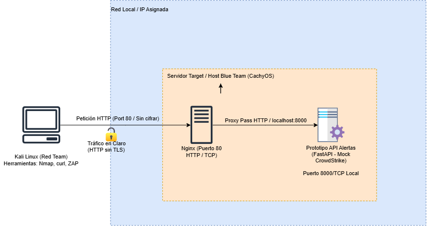
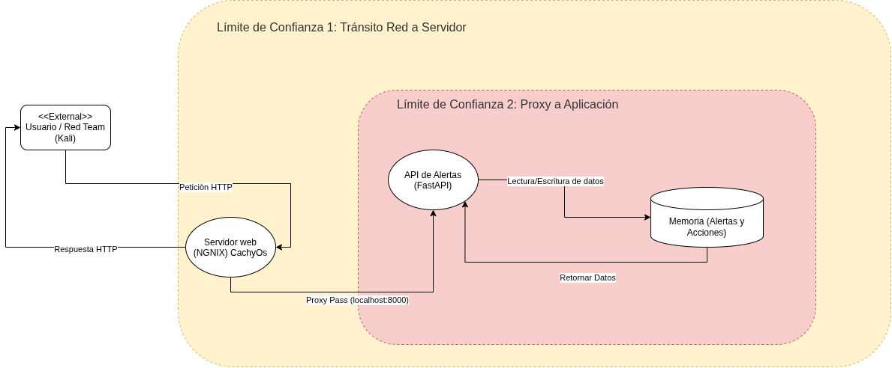
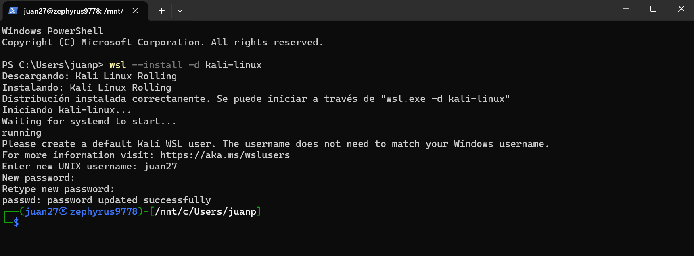
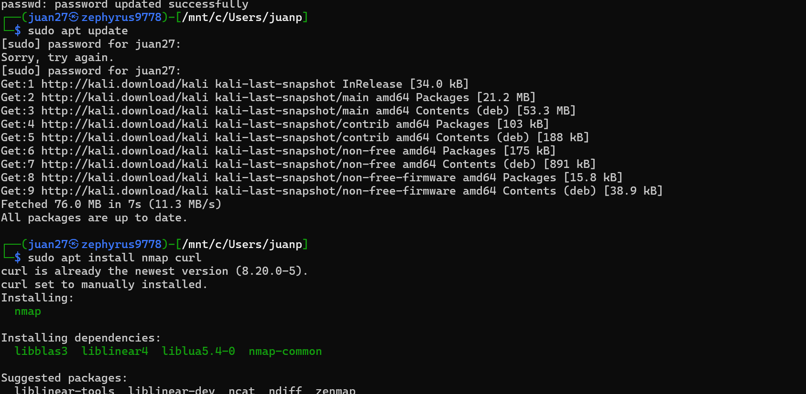
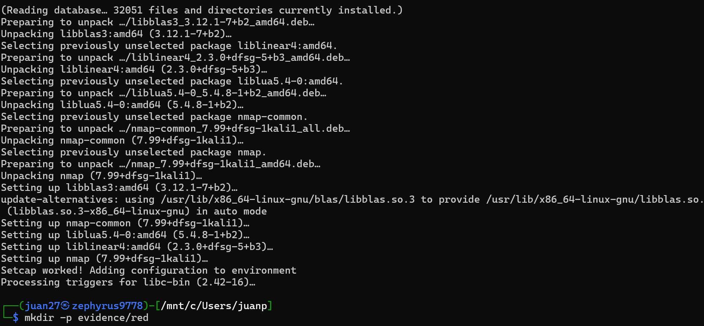

# MuvAutomation CrowdStrike API (LAB 3 - Red Team vs. Blue Team)

Nombres: Juan Pablo Caballero, Diego Fernando Chavarro

Prototipo de API vulnerable sin autenticación publicado sobre HTTP para la simulación de automatización de incidentes de seguridad de CrowdStrike Falcon. Proyecto desarrollado para la asignatura **FDSI**.

---

## 🏗️ Arquitectura del Sistema

La solución utiliza una arquitectura de Proxy Inverso donde **Nginx** escucha en el puerto `80` (HTTP) y reenvía el tráfico mediante `proxy_pass` hacia el servicio en segundo plano de **FastAPI** corriendo en el puerto `8000`.

* **Servidor (Blue Team):** CachyOS / Arch Linux (Nginx + FastAPI).
* **Cliente (Red Team):** Kali Linux / Windows (Nmap, Curl, OWASP ZAP).

---

# 🚀 Fase A: Construcción, Publicación y Hardening Inicial — Blue Team

**Responsable Blue Team / Servidor Target:** Diego Fernando Chavarro Castellanos (CachyOS / Arch Linux)  
**Contraparte Red Team:** Juan Pablo Caballero Castellanos (Kali Linux / WSL)  
**Asignatura:** FDSI — Laboratorio 3 (Red Team vs. Blue Team)

---

## 1. Verificación del Host y Línea Base

Antes de levantar los servicios, el equipo defensor validó el entorno operativo en la instancia autorizada con CachyOS, asegurando que cumple con la topología requerida para el laboratorio.

### Información del host

- **Hostname:** `cachyos-diego`
- **Sistema Operativo:** CachyOS (Kernel Linux 7.2.2-1-cachyos, Arch-based)
- **Dirección IP de red local:**
  - Interfaz `eno1`: `0.0.0.0`
  - Interfaz `wlan0`: `0.0.0.0`

---

## ⚙️ 2. Despliegue de Servicios

### 2.1 Servidor Web Nginx

Se instaló y habilitó **Nginx** como servidor web y proxy inverso, utilizando el puerto estándar HTTP `80/TCP`.

### Instalación y activación

```bash
sudo pacman -S nginx
sudo systemctl enable --now nginx
sudo systemctl status nginx
```

### Verificación

Se verificó mediante `ss` que Nginx se encuentra escuchando correctamente:

```text
0.0.0.0:80
[::]:80
```

Esto confirma que el servicio HTTP se encuentra activo y disponible en el host.

---

### 2.2 Prototipo API de Alertas

Se desplegó un servicio backend desarrollado en **Python utilizando FastAPI y Uvicorn**, con el objetivo de simular el mock de alertas utilizado durante el laboratorio.

### Configuración

- **Framework:** FastAPI
- **Servidor ASGI:** Uvicorn
- **Puerto local:** `127.0.0.1:8000`
- **Acceso externo:** mediante Nginx
- **Proxy:** Nginx `80/TCP` → FastAPI `127.0.0.1:8000`

La API permanece vinculada a `127.0.0.1`, evitando su exposición directa hacia la red.

### Flujo de comunicación

```text
Red Team / Cliente
       |
       | HTTP :80
       v
   ┌─────────┐
   │  Nginx  │
   └────┬────┘
        |
        | proxy_pass
        v
┌─────────────────┐
│ FastAPI/Uvicorn │
│ 127.0.0.1:8000  │
└─────────────────┘
```

---

## 🔒 3. Configuración del Cortafuegos / Firewall

Para aplicar el principio de **mínimo privilegio** y reducir la superficie de exposición del servidor, se configuró **UFW (Uncomplicated Firewall)** en CachyOS.

La política establecida restringe el tráfico entrante y permite únicamente las conexiones necesarias para el desarrollo del laboratorio.

### Configuración aplicada

```bash
sudo ufw default deny incoming
sudo ufw default allow outgoing
sudo ufw allow from "IP KALI-LINUX" to any port 80 proto tcp
sudo ufw allow 22/tcp
sudo ufw enable
sudo ufw status verbose
```

### Política de seguridad

- **Tráfico entrante:** denegado por defecto.
- **Tráfico saliente:** permitido.
- **HTTP `80/tcp`:** permitido únicamente desde `IP KALI-LINUX`.
- **SSH `22/tcp`:** permitido para administración del servidor.

### Estado verificado

```text
Status: active
Default: deny (incoming), allow (outgoing)
```

La regla correspondiente al puerto HTTP se encuentra restringida al host autorizado del Red Team:

```text
IP KALI-LINUX → TCP/80
```

---

### Requisitos previos
* Python 3.10+
* FastAPI & Uvicorn
* Nginx configurado sin cifrado (HTTP) para propósitos del laboratorio.

### Endpoints Disponibles (CrowdStrike Mock API)
* `GET /api/alerts`: Muestra la lista de alertas ficticias activas.
* `POST /api/alerts`: Simula la recepción de una nueva alerta de seguridad.
* `GET /api/actions`: Consulta el registro de acciones de respuesta/mitigación.
* `POST /api/actions`: Registra una nueva acción sobre una alerta.

### Diagrama de Arquitectura


---

## 🛡️ Fase B: Modelar antes de atacar

Antes de iniciar la ejecución ofensiva, se modeló el flujo de datos para identificar las fronteras de confianza y las posibles amenazas utilizando la metodología STRIDE.

### Fronteras de Confianza (Trust Boundaries)
1. **Frontera 1 (Red Externa / Usuario → Servidor Nginx):** Delimita el tráfico expuesto a la red pública o segmento de laboratorio sobre puerto 80 HTTP sin cifrar (TLS/SSL ausente).
2. **Frontera 2 (Proxy Nginx → Aplicación FastAPI):** Delimita el paso interno del proxy inverso hacia el proceso `localhost:8000` en memoria.

### Diagrama de Flujo de Datos (DFD)


### Modelo de Amenazas STRIDE

| ID | Categoría STRIDE | Hipótesis Técnica | Validación / Evidencia |
| :--- | :--- | :--- | :--- |
| **H1** | **Information Disclosure** | El tráfico transmitido por HTTP viaja en texto plano, permitiendo la captura de metadatos, alertas e IPs internas. | Captura de tráfico `.pcap` con Wireshark (`tcpdump`). |
| **H2** | **Information Disclosure** | Las respuestas HTTP y cabeceras por defecto de Nginx exponen versiones exactas del software y rutas del servidor. | Escaneo con `curl -I` y análisis pasivo con OWASP ZAP. |
| **H3** | **Repudiation** | La falta de correlación de tiempo y logs detallados impide atribuir peticiones maliciosas a una IP de origen específica. | Comparación entre comandos ejecutados y `access.log`. |
| **H4** | **Tampering** | Al no contar con autenticación ni cifrado TLS, un atacante en la red puede interceptar y manipular el cuerpo de las alertas/acciones enviadas a la API. | Demostración conceptual de ausencia de cifrado en tránsito. |

---

## 📁 Estructura del Repositorio

```text
.
├── diagra,s/
│   ├── da-lab3.png      # Diagrama de Arquitectura
│   └── dfd-lab3.png     # Diagrama de Flujo de Datos
├── evidence/              # Evidencias técnicas
│   ├── red/               # Capturas Nmap, Curl, ZAP
│   ├── blue/              # Logs, PCAPs, reglas de detección
│   └── retest/            # Pruebas posteriores al Hardening
├── main.py                # Código fuente de FastAPI (CrowdStrike Mock)
├── risk-register.md
└── README.md              # Documentación principal del proyecto
```

---

## ⚔️ Fase C: Atacar de manera controlada (Red Team)

### 1. Preparación del Entorno Ofensivo
Para la ejecución de las pruebas, el Red Team configuró un entorno local con **Kali Linux** utilizando WSL (Windows Subsystem for Linux). Se instalaron las herramientas de reconocimiento (`nmap`, `curl`) y se estructuraron los directorios para almacenar las evidencias.

**Evidencias de la preparación:**
* 
* 
* 

### 2. Reconocimiento y Superficie de Ataque

Una vez preparado el entorno, se ejecutaron las siguientes acciones ofensivas hacia el servidor Target (Blue Team) para validar la superficie de ataque expuesta:

**Paso 1: Configurar las variables de entorno**
Se definió la IP del objetivo (servidor Nginx en CachyOS) para estandarizar la ejecución de las pruebas:

```bash
export TARGET_IP="IP_DE_DIEGO"
export TARGET_URL="http://$TARGET_IP"
```

**Paso 2: Registrar el Timestamp (Hora de inicio)**

Se generó una marca de tiempo en formato UTC. Esto es un requisito fundamental para permitir al Blue Team correlacionar los eventos ofensivos con los registros (logs) del servidor:

```bash
date -u +%Y-%m-%dT%H:%M:%SZ | tee evidence/red/start.txt
```

**Paso 3: Escaneo pasivo con Nmap**
Se realizó un escaneo de puertos enfocado exclusivamente en el puerto 80 para identificar el estado del servicio y la versión exacta de la tecnología expuesta:

```bash
nmap -Pn -sV -p 80 "$TARGET_IP" -oA evidence/red/nmap_port80
```

**Paso 4: Extracción de cabeceras HTTP con Curl**

Se ejecutó una petición directa para evidenciar que el servidor responde peticiones HTTP en texto claro y expone información sensible (versiones, tokens) en sus cabeceras (headers):

```bash
curl -I "$TARGET_URL/" > evidence/red/curl_headers.txt
```


exporte el reporte HTML y registre cada header ausente como observación, no automáticamente 
como vulnerabilidad explotable

esta en reporteZAP/zap_report.html

Se realizó una inspección pasiva mediante OWASP ZAP (v2.17.0) sobre el objetivo [http://100.70.250.33/](http://100.70.250.33/) sin ejecutar escaneos activos de intrusión. Como resultado, se identificaron 5 observaciones correspondientes a la ausencia de cabeceras de seguridad y exposición menor de información informativa, las cuales se documentan a continuación como oportunidades de hardening y no como vectores de explotación directa:

Ausencia de Cabecera Content Security Policy (CSP)

Riesgo ZAP: Medio (Confianza Alta).

Descripción: El servidor no define una política de seguridad de contenido (CSP).

Clasificación / Conclusión: Observación de buenas prácticas. Su ausencia no permite una explotación directa inmediata, pero limita la mitigación complementaria ante inyecciones.

Falta de Cabecera Anti-Clickjacking (X-Frame-Options)

Riesgo ZAP: Medio (Confianza Media).

Descripción: La respuesta no incluye protecciones contra ataques de incrustación maliciosa en marcos (Clickjacking).

Clasificación / Conclusión: Observación de configuración. Se recomienda implementar X-Frame-Options: DENY o SAMEORIGIN en el servidor Nginx.

Exposición de Versión del Servidor Web (Server Header)

Riesgo ZAP: Bajo (Confianza Alta).

Descripción: El servidor expone explícitamente su versión exacta (nginx/1.30.4) en la cabecera HTTP de respuesta.

Clasificación / Conclusión: Información de huella digital (fingerprinting). Facilita que un atacante conozca la versión exacta del software, por lo que debe ocultarse mediante directivas de enmascaramiento.

Divulgación de IPs Privadas en Inventario Público

Riesgo ZAP: Bajo (Confianza Media).

Descripción: Al consultar la ruta estática /public-inventory.txt, el cuerpo de la respuesta revela direcciones IP internas (10.10.10.11, 10.10.10.12, 10.10.10.13).

Clasificación / Conclusión: Hallazgo informativo de diseño. Expone la topología de red interna de los laboratorios, por lo que se recomienda depurar o restringir este tipo de ficheros públicos.

Ausencia de Cabecera X-Content-Type-Options

Riesgo ZAP: Bajo (Confianza Media).

Descripción: Falta la directiva nosniff, lo que podría permitir que navegadores antiguos realicen interpretaciones erróneas del tipo de contenido (MIME-sniffing).

Clasificación / Conclusión: Observación menor de endurecimiento de cabeceras que el Blue Team debe corregir en Nginx.