# MuvAutomation CrowdStrike API (LAB 3 - Red Team vs. Blue Team)

Nombres: Juan Pablo Caballero, Diego Fernando Chavarro

Prototipo de API vulnerable sin autenticación publicado sobre HTTP para la simulación de automatización de incidentes de seguridad de CrowdStrike Falcon. Proyecto desarrollado para la asignatura **FDSI**.

---

## 🏗️ Arquitectura del Sistema

La solución utiliza una arquitectura de Proxy Inverso donde **Nginx** escucha en el puerto `80` (HTTP) y reenvía el tráfico mediante `proxy_pass` hacia el servicio en segundo plano de **FastAPI** corriendo en el puerto `8000`.

* **Servidor (Blue Team):** CachyOS / Arch Linux (Nginx + FastAPI).
* **Cliente (Red Team):** Kali Linux / Windows (Nmap, Curl, OWASP ZAP).

### Topología de red

Ambos equipos se encuentran en **redes domésticas distintas**, por lo que no existe adyacencia de capa 2 entre ellos. La conectividad se resolvió mediante una **red overlay Tailscale (WireGuard)**, que asigna direcciones estables en el rango `100.x.x.x`:

| Rol | Equipo | IP Tailscale |
| :--- | :--- | :--- |
| Blue Team / Target | CachyOS (Diego) | `100.70.250.33` |
| Red Team | Kali WSL2 (Juan Pablo) | `100.98.207.45` |

Esta decisión se documenta explícitamente porque **afecta la interpretación de la evidencia de red** (ver nota en la Fase C, Paso 11).

---

# 🚀 Fase A: Construcción, Publicación y Hardening Inicial — Blue Team

**Responsable Blue Team / Servidor Target:** Diego Fernando Chavarro Castillo (CachyOS / Arch Linux)
**Contraparte Red Team:** Juan Pablo Caballero Castellanos (Kali Linux / WSL)
**Asignatura:** FDSI — Laboratorio 3 (Red Team vs. Blue Team)

---

## 1. Verificación del Host y Línea Base

Antes de levantar los servicios, el equipo defensor validó el entorno operativo en la instancia autorizada con CachyOS, asegurando que cumple con la topología requerida para el laboratorio.

### Información del host

- **Hostname:** `cachyos-diego`
- **Sistema Operativo:** CachyOS (Kernel Linux 7.2.2-1-cachyos, Arch-based)
- **Dirección IP de red local:**
  - Interfaz `eno1`: `0.0.0.0`
  - Interfaz `wlan0`: `0.0.0.0`
- **Dirección Tailscale (usada como TARGET_IP):** `100.70.250.33`

### Nota de plataforma: Nginx en Arch/CachyOS

El paquete `nginx` de Arch **no** utiliza la convención `sites-available` / `sites-enabled` de Debian/Ubuntu — esa estructura de directorios no existe. Toda la configuración del bloque `server {}` reside directamente en:

```
/etc/nginx/nginx.conf
```

Cualquier cambio al virtual host (proxy, cabeceras de hardening, etc.) se edita en ese archivo único. Esta diferencia se documenta por reproducibilidad: seguir la guía al pie de la letra sobre Arch produce errores.

---

## ⚙️ 2. Despliegue de Servicios

### 2.1 Servidor Web Nginx

Se instaló y habilitó **Nginx** como servidor web y proxy inverso, utilizando el puerto estándar HTTP `80/TCP`.

### Instalación y activación

```bash
sudo pacman -S nginx
sudo systemctl enable --now nginx
sudo systemctl status nginx
```

### Verificación

Se verificó mediante `ss` que Nginx se encuentra escuchando correctamente:

```text
0.0.0.0:80
[::]:80
```

Esto confirma que el servicio HTTP se encuentra activo y disponible en el host.

---

### 2.2 Prototipo API de Alertas

Se desplegó un servicio backend desarrollado en **Python utilizando FastAPI y Uvicorn**, con el objetivo de simular el mock de alertas utilizado durante el laboratorio.

### Configuración

- **Framework:** FastAPI
- **Servidor ASGI:** Uvicorn
- **Puerto local:** `127.0.0.1:8000`
- **Acceso externo:** mediante Nginx
- **Proxy:** Nginx `80/TCP` → FastAPI `127.0.0.1:8000`

La API permanece vinculada a `127.0.0.1`, evitando su exposición directa hacia la red.

> **Nota sobre `proxy_pass`:** las rutas de FastAPI se registran internamente **con** el prefijo `/api/` (`@app.get("/api/alerts")`). Por ello el `proxy_pass` se configura **sin** barra final, de modo que Nginx reenvía la URI completa sin reescritura. Agregar la barra final produce `404` desde FastAPI.

### Flujo de comunicación

```text
Red Team / Cliente
       |
       | HTTP :80
       v
   ┌─────────┐
   │  Nginx  │
   └────┬────┘
        |
        | proxy_pass
        v
┌─────────────────┐
│ FastAPI/Uvicorn │
│ 127.0.0.1:8000  │
└─────────────────┘
```

---

## 🔒 3. Configuración del Cortafuegos / Firewall

Para aplicar el principio de **mínimo privilegio** y reducir la superficie de exposición del servidor, se configuró **UFW (Uncomplicated Firewall)** en CachyOS.

La política establecida restringe el tráfico entrante y permite únicamente las conexiones necesarias para el desarrollo del laboratorio.

### Configuración aplicada

```bash
sudo ufw default deny incoming
sudo ufw default allow outgoing
sudo ufw allow from "IP KALI-LINUX" to any port 80 proto tcp
sudo ufw allow 22/tcp
sudo ufw enable
sudo ufw status verbose
```

### Política de seguridad

- **Tráfico entrante:** denegado por defecto.
- **Tráfico saliente:** permitido.
- **HTTP `80/tcp`:** permitido únicamente desde `IP KALI-LINUX`.
- **SSH `22/tcp`:** permitido para administración del servidor.

### Estado verificado

```text
Status: active
Default: deny (incoming), allow (outgoing)
```

La regla correspondiente al puerto HTTP se encuentra restringida al host autorizado del Red Team:

```text
IP KALI-LINUX → TCP/80
```

---

### Requisitos previos
* Python 3.10+
* FastAPI & Uvicorn
* Nginx configurado sin cifrado (HTTP) para propósitos del laboratorio.

### Endpoints Disponibles (CrowdStrike Mock API)
* `GET /api/alerts`: Muestra la lista de alertas ficticias activas.
* `POST /api/alerts`: Simula la recepción de una nueva alerta de seguridad.
* `GET /api/actions`: Consulta el registro de acciones de respuesta/mitigación.
* `POST /api/actions`: Registra una nueva acción sobre una alerta.
* `GET /api/health`: Verificación de disponibilidad del servicio.

### Diagrama de Arquitectura


---

## 🛡️ Fase B: Modelar antes de atacar

Antes de iniciar la ejecución ofensiva, se modeló el flujo de datos para identificar las fronteras de confianza y las posibles amenazas utilizando la metodología STRIDE.

### Fronteras de Confianza (Trust Boundaries)
1. **Frontera 1 (Red Externa / Usuario → Servidor Nginx):** Delimita el tráfico expuesto a la red pública o segmento de laboratorio sobre puerto 80 HTTP sin cifrar (TLS/SSL ausente).
2. **Frontera 2 (Proxy Nginx → Aplicación FastAPI):** Delimita el paso interno del proxy inverso hacia el proceso `localhost:8000` en memoria.
3. **Frontera 3 (Evidencia → IA externa):** Delimita el punto en que la telemetría del laboratorio sale hacia un servicio de análisis externo, exigiendo anonimización previa.

### Diagrama de Flujo de Datos (DFD)


El DFD se mantiene también como fuente versionable en `diagrams/dfd-lab3.puml` (PlantUML), con 15 flujos numerados (F1–F15) que sirven de referencia cruzada para las hipótesis STRIDE y los hallazgos.

### Modelo de Amenazas STRIDE

| ID | Categoría STRIDE | Hipótesis Técnica | Flujo DFD | Validación / Evidencia |
| :--- | :--- | :--- | :--- | :--- |
| **H1** | **Information Disclosure** | El tráfico transmitido por HTTP viaja en texto plano, permitiendo la captura de metadatos, alertas e IPs internas. | F1, F9 | Captura de tráfico `.pcap` con Wireshark (`tcpdump`). |
| **H2** | **Information Disclosure** | Las respuestas HTTP y cabeceras por defecto de Nginx exponen versiones exactas del software y rutas del servidor. | F9 | Escaneo con `curl -I` y análisis pasivo con OWASP ZAP. |
| **H3** | **Repudiation** | La falta de correlación de tiempo y logs detallados impide atribuir peticiones maliciosas a una IP de origen específica. | F7, F10 | Comparación entre comandos ejecutados y `access.log`. |
| **H4** | **Tampering** | Al no contar con autenticación ni cifrado TLS, un atacante en la red puede interceptar y manipular el cuerpo de las alertas/acciones enviadas a la API. | F1, F7 | Demostración conceptual de ausencia de cifrado en tránsito (sin ejecutar MITM, por alcance). |

---

## 📁 Estructura del Repositorio

```text
.
├── diagrams/
│   ├── da-lab3.png        # Diagrama de Arquitectura
│   ├── dfd-lab3.png       # Diagrama de Flujo de Datos
│   └── dfd-lab3.puml      # Fuente PlantUML del DFD
├── docs/                  # Capturas de pantalla por fase
│   ├── FaseB/             # Preparación del entorno ofensivo
│   ├── FaseC/             # Reconocimiento, ZAP y captura de red
│   ├── FaseD/             # Telemetría y detección
│   ├── FaseE/             # Hardening aplicado
│   └── FaseF/             # Retest y comparación
├── evidence/              # Evidencias técnicas (salidas crudas)
│   ├── red/               # Nmap, curl, reporte ZAP
│   ├── blue/              # Logs, PCAPs, reglas de detección
│   └── retest/            # Pruebas posteriores al Hardening
├── nginx/
│   ├── nginx-before-hardening.conf
│   └── nginx-after-hardening.conf
├── reporteZAP/
│   └── zap_report.html
├── main.py                # Código fuente de FastAPI (CrowdStrike Mock)
├── requirements.txt
├── risk-register.md
└── README.md              # Documentación principal del proyecto
```

---

## ⚔️ Fase C: Atacar de manera controlada (Red Team)

### 1. Preparación del Entorno Ofensivo
Para la ejecución de las pruebas, el Red Team configuró un entorno local con **Kali Linux** utilizando WSL (Windows Subsystem for Linux). Se instalaron las herramientas de reconocimiento (`nmap`, `curl`) y se estructuraron los directorios para almacenar las evidencias.

**Evidencias de la preparación:**
* 
* 
* 

### 2. Reconocimiento y Superficie de Ataque

Una vez preparado el entorno, se ejecutaron las siguientes acciones ofensivas hacia el servidor Target (Blue Team) para validar la superficie de ataque expuesta:

**Paso 1: Configurar las variables de entorno**
Se definió la IP del objetivo (servidor Nginx en CachyOS) para estandarizar la ejecución de las pruebas:

```bash
export TARGET_IP="100.70.250.33"
export TARGET_URL="http://$TARGET_IP"
```

**Paso 2: Registrar el Timestamp (Hora de inicio)**

Se generó una marca de tiempo en formato UTC. Esto es un requisito fundamental para permitir al Blue Team correlacionar los eventos ofensivos con los registros (logs) del servidor:

```bash
date -u +%Y-%m-%dT%H:%M:%SZ | tee evidence/red/start.txt
```

**Paso 3: Escaneo de puerto y servicio con Nmap**
Se realizó un escaneo enfocado exclusivamente en el puerto 80 para identificar el estado del servicio y la versión exacta de la tecnología expuesta:

```bash
nmap -Pn -sV -p 80 "$TARGET_IP" -oA evidence/red/nmap_port80
```

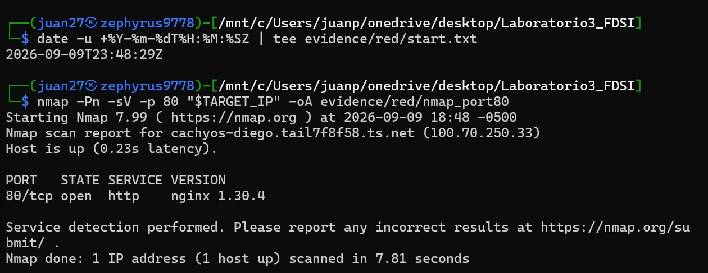

**Interpretación:** con marca de tiempo `2026-09-09T23:48:29Z`, Nmap confirma el puerto `80/tcp` en estado `open`, servicio `http`, y — lo más relevante — identifica la versión exacta del producto: **`nginx 1.30.4`**. Esta es la evidencia de línea base para la hipótesis **H2**: el banner del servidor revela la versión precisa del software, lo que facilita el *fingerprinting* y la búsqueda dirigida de vulnerabilidades conocidas. El escaneo se limitó a un único puerto conforme al alcance autorizado.

**Paso 4: Extracción de contenido y cabeceras HTTP con Curl**

Se ejecutaron peticiones directas para evidenciar que el servidor responde en texto claro y expone información en sus cabeceras y cuerpos de respuesta:

```bash
curl -i "$TARGET_URL/" | tee evidence/red/curl_home.txt
curl -I "$TARGET_URL/public-inventory.txt" | tee evidence/red/curl_headers.txt
```

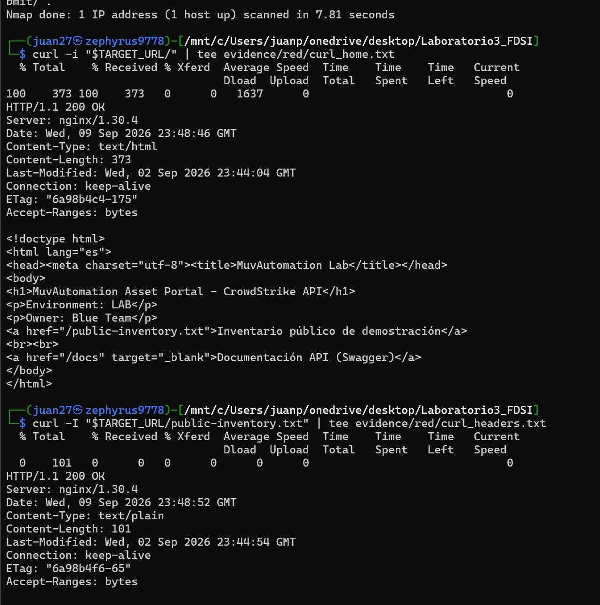

**Interpretación:** ambas respuestas devuelven `200 OK` con el encabezado `Server: nginx/1.30.4`, confirmando de nuevo **H2**. El cuerpo de la página principal revela la estructura completa del sitio en texto plano, incluyendo dos rutas no anunciadas previamente: `/public-inventory.txt` y `/docs` (documentación Swagger del API). Ninguna de estas rutas requirió técnicas de fuerza bruta ni descubrimiento de directorios: el propio HTML las entrega. Esto amplía la superficie de ataque conocida sin ejecutar una sola prueba intrusiva.

### 3. Inventario de Superficie de Ataque

| Elemento | Dato observado | Riesgo / pregunta |
| :--- | :--- | :--- |
| Host/IP | `100.70.250.33` (Tailscale) | Restringido por UFW al host autorizado del Red Team |
| Puerto | `80/TCP` abierto | El tráfico carece de confidencialidad e integridad en capa de aplicación |
| Servidor | `nginx/1.30.4` | Sí, la versión exacta se revela en el banner |
| Ruta `/` | `200 OK`, HTML | Expone enlaces a `/public-inventory.txt` y `/docs` |
| `/public-inventory.txt` | `200 OK`, `text/plain` | Entrega hostnames e IPs internas del laboratorio |
| `/api/alerts` | `200 OK`, `application/json` | Entrega `agent_id`, `internal_ip` y `analyst_email` |
| `/docs` | Swagger UI | Publica el contrato completo del API sin autenticación |

### 4. Inspección Pasiva con OWASP ZAP

Se realizó una inspección pasiva mediante **OWASP ZAP (v2.17.0)** sobre el objetivo `http://100.70.250.33/` **sin ejecutar escaneos activos de intrusión**, conforme al alcance del laboratorio.

**Navegación manual de la página principal:**

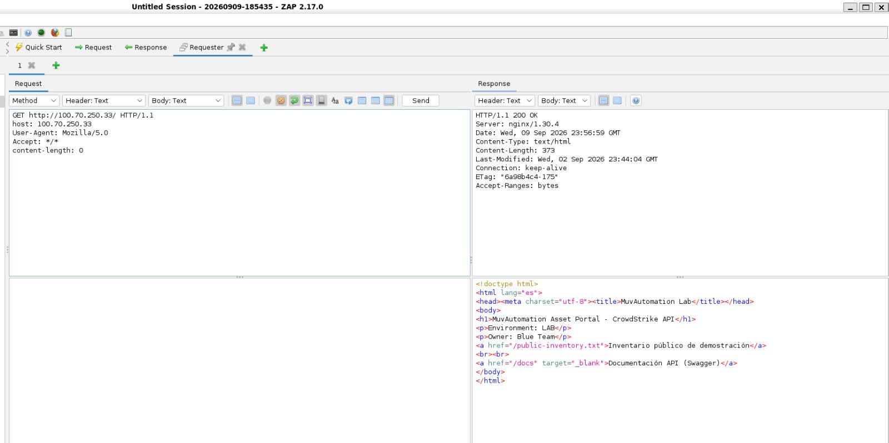

La vista Request/Response confirma lo observado con `curl`, pero desde un proxy de interceptación: la respuesta `200 OK` incluye `Server: nginx/1.30.4` y el cuerpo HTML íntegro. ZAP registra el intercambio sin modificarlo.

**Navegación del archivo de inventario público:**

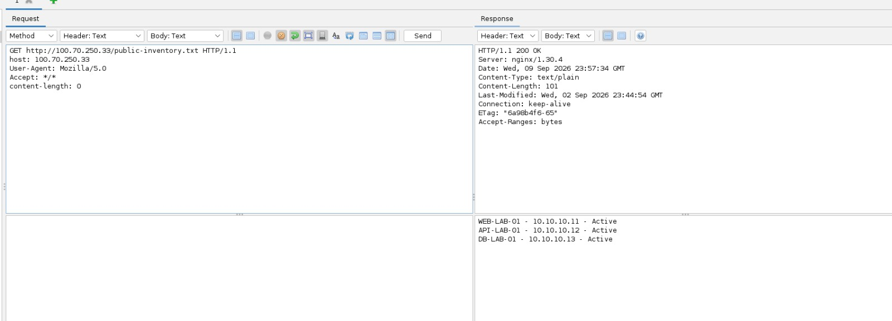

Este es el hallazgo de mayor densidad informativa de la fase. La respuesta a `GET /public-inventory.txt` entrega en texto plano:

```text
WEB-LAB-01 - 10.10.10.11 - Active
API-LAB-01 - 10.10.10.12 - Active
DB-LAB-01  - 10.10.10.13 - Active
```

Se revela así la **topología interna simulada**: nombres de host, direcciones IP privadas y estado operativo de tres activos. Aunque los datos son ficticios, el patrón corresponde exactamente al tipo de fuga que en un entorno real permitiría a un atacante planificar movimiento lateral sin haber comprometido nada todavía.

**Alertas pasivas identificadas:**

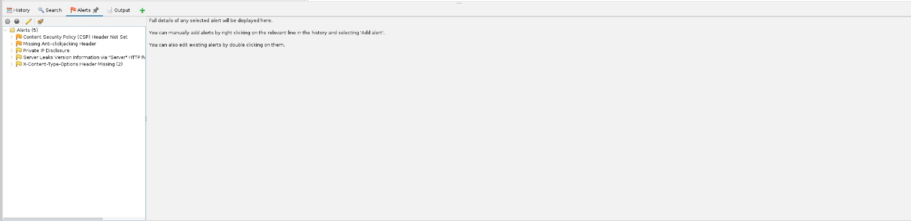

ZAP registró **5 alertas**, documentadas a continuación como oportunidades de hardening y **no** como vectores de explotación directa:

| # | Alerta | Riesgo ZAP | Clasificación |
| :--- | :--- | :--- | :--- |
| 1 | Content Security Policy (CSP) Header Not Set | Medio (Confianza Alta) | Observación de buenas prácticas. Su ausencia no permite explotación directa, pero limita la mitigación complementaria ante inyecciones. |
| 2 | Missing Anti-clickjacking Header (X-Frame-Options) | Medio (Confianza Media) | Observación de configuración. Se recomienda `X-Frame-Options: DENY` o `SAMEORIGIN`. |
| 3 | Server Leaks Version Information via "Server" HTTP Response Header | Bajo (Confianza Alta) | *Fingerprinting*. Expone `nginx/1.30.4`; debe enmascararse con `server_tokens off`. |
| 4 | Private IP Disclosure | Bajo (Confianza Media) | Hallazgo informativo de diseño. `/public-inventory.txt` revela `10.10.10.11`, `10.10.10.12` y `10.10.10.13`. |
| 5 | X-Content-Type-Options Header Missing (x2) | Bajo (Confianza Media) | Falta la directiva `nosniff`; posible MIME-sniffing en navegadores antiguos. |

Reporte HTML completo exportado en `reporteZAP/zap_report.html`.

> **Criterio aplicado:** cada cabecera ausente se registró como **observación**, no como vulnerabilidad explotable. Una cabecera faltante es una capa de defensa no desplegada, no una brecha en sí misma.

### 5. Demostración de Visibilidad de HTTP (Paso 11)

El Blue Team inició una captura limitada mientras el Red Team ejecutaba peticiones dentro de esa ventana, coordinando ambos extremos en tiempo real.

```bash
# Blue Team, en el servidor
sudo timeout 60 tcpdump -i any -nn -s0 -w evidence/blue/lab3-http.pcap 'tcp port 80'

# Red Team, durante esos 60 segundos
curl "$TARGET_URL/"
curl "$TARGET_URL/public-inventory.txt"
```

**Ejecución del Red Team durante la ventana de captura:**

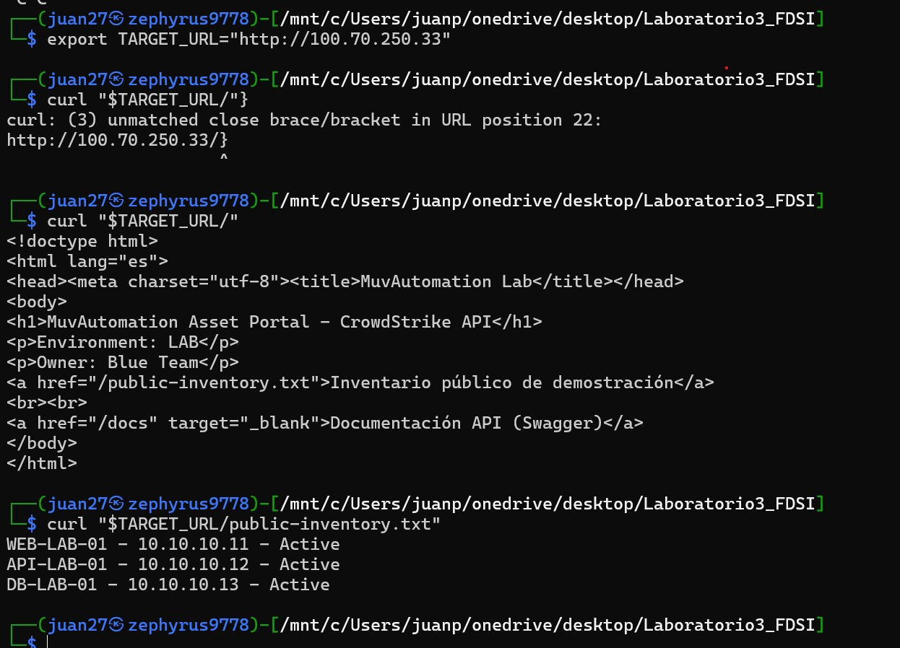

**Análisis del PCAP con el filtro `http`:**

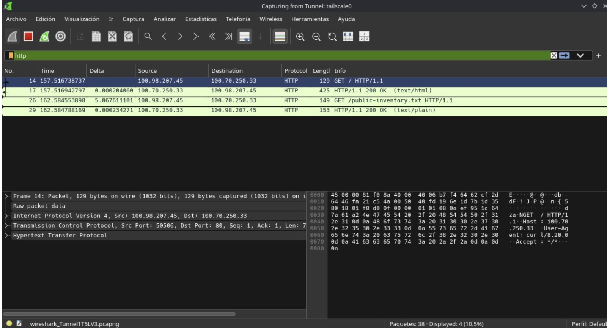

**Interpretación:** con el filtro `http` aplicado, de 38 paquetes capturados se muestran los 4 relevantes al intercambio. Es posible observar directamente:

- El método, la ruta y la versión del protocolo: `GET / HTTP/1.1` y `GET /public-inventory.txt HTTP/1.1`.
- Las direcciones de origen (`100.98.207.45`) y destino (`100.70.250.33`).
- El `User-Agent` del cliente (`curl/8.20.0`) legible en el panel hexadecimal.
- Los códigos de estado y tipos de contenido de las respuestas (`200 OK (text/html)`, `200 OK (text/plain)`).

Esto valida **H1**: sobre HTTP, tanto los metadatos como el contenido son observables por cualquier entidad con acceso al medio, sin necesidad de descifrar nada.

> **Limitación metodológica relevante.** La captura se realizó sobre la interfaz `tailscale0`, es decir, **dentro** del túnel WireGuard. Tailscale cifra el tráfico en tránsito por la red física, de modo que un observador situado en la red doméstica de cualquiera de los dos equipos **no** vería este contenido en claro. La demostración es válida para la capa de aplicación —HTTP no aporta confidencialidad por sí mismo— pero el cifrado observable proviene del overlay, no del protocolo. En un despliegue sin VPN, el contenido sería visible en todo el trayecto. Esta distinción se registra explícitamente para no sobreinterpretar la evidencia.

---

## 🔎 Fase D: Detectar y correlacionar (Blue Team)

### 1. Revisión de Telemetría del Servidor (Paso 12)

**Estado del servicio Nginx:**

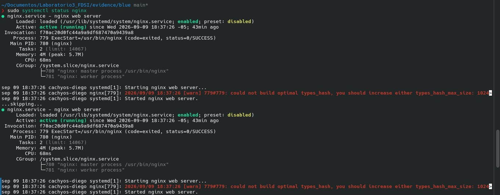

```bash
sudo systemctl status nginx
```

El servicio figura `active (running)` desde las 18:37:26, cargado desde `/usr/lib/systemd/system/nginx.service` y habilitado para arranque automático. Se observa un proceso maestro y un proceso trabajador. La advertencia recurrente sobre `types_hash_max_size` es una recomendación de rendimiento de Nginx, sin impacto en seguridad ni en el funcionamiento del laboratorio.

**Historial del servicio en el journal:**

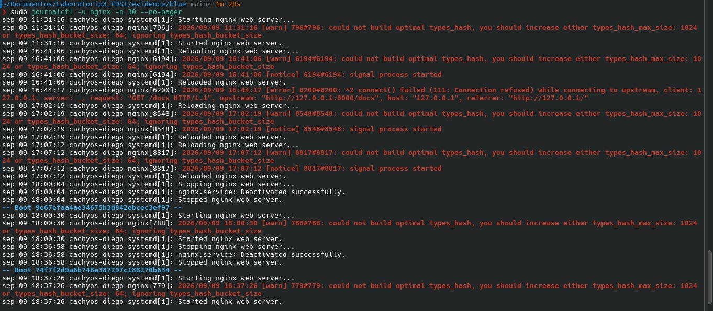

```bash
sudo journalctl -u nginx -n 30 --no-pager
```

Este registro documenta la cronología completa de la sesión de laboratorio: arranques, recargas de configuración (`Reloading nginx web server`) y reinicios del host. Destaca un evento de error a las 16:44:17:

```text
[error] connect() failed (111: Connection refused) while connecting to upstream,
client: 127.0.0.1, request: "GET /docs HTTP/1.1", upstream: "http://127.0.0.1:8000/docs"
```

**Interpretación defensiva:** este error corresponde a una petición recibida mientras el backend FastAPI no estaba en ejecución. Es valioso como telemetría porque distingue dos condiciones que un analista debe separar: un fallo de disponibilidad del *upstream* (502 / Connection refused) frente a una ruta inexistente (404). Confundirlas lleva a diagnósticos erróneos durante un incidente.

**Consulta acotada por ventana temporal:**

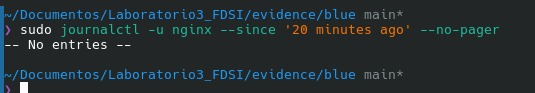

```bash
sudo journalctl -u nginx --since '20 minutes ago' --no-pager
```

**Resultado: `-- No entries --`.**

Este resultado se conserva deliberadamente como evidencia. La ausencia de entradas **no** indica un fallo del sistema de logs, sino una característica de su diseño: el journal de systemd registra eventos del *ciclo de vida del servicio* (arranque, parada, recarga), no las peticiones HTTP individuales. Durante esos 20 minutos no hubo reinicios ni recargas, por lo que no había nada que reportar. Las peticiones del Red Team se registran en `/var/log/nginx/access.log`, que es una fuente distinta.

**Lección para Blue Team:** consultar la fuente equivocada produce una falsa sensación de ausencia de actividad. Un analista que solo revisara el journal concluiría, erróneamente, que no ocurrió nada.

### 2. Regla de Detección Reproducible (Paso 13)

**Agregación de respuestas 404 por origen:**

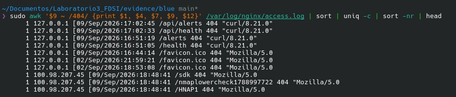

```bash
sudo awk '$9 ~ /404/ {print $1, $4, $7, $9, $12}' /var/log/nginx/access.log \
  | sort | uniq -c | sort -nr | head
```

La salida separa con claridad dos orígenes distintos:

- **`127.0.0.1`** — peticiones locales de verificación del propio Blue Team durante la construcción (`/api/alerts`, `/api/health`, `/alerts`, `/health`, `/favicon.ico`). Son ruido operativo conocido, no actividad hostil.
- **`100.98.207.45`** — el Red Team, con rutas inexistentes registradas a las 18:48:41: `/sdk`, `/nmaplowercheck1788997722` y `/HNAP1`.

**Búsqueda por herramienta y firma de agente:**

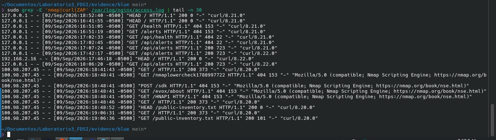

```bash
sudo grep -E 'nmap|curl|ZAP' /var/log/nginx/access.log | tail -n 30
```

Esta vista entrega la correlación completa y es la evidencia central de la fase. Se identifican con precisión:

**Actividad del Red Team desde `100.98.207.45`:**

| Hora (local) | Petición | Estado | User-Agent |
| :--- | :--- | :--- | :--- |
| 18:41:43 | `GET /` | 200 | `curl/8.20.0` |
| 18:48:41 | `GET /nmaplowercheck1788997722` | 404 | `Nmap Scripting Engine` |
| 18:48:41 | `POST /sdk` | 404 | `Nmap Scripting Engine` |
| 18:48:41 | `GET /evox/about` | 404 | `Nmap Scripting Engine` |
| 18:48:41 | `GET /HNAP1` | 404 | `Nmap Scripting Engine` |
| 18:48:46 | `GET /` | 200 | `curl/8.20.0` |
| 18:48:52 | `HEAD /public-inventory.txt` | 200 | `curl/8.20.0` |
| 19:06:31 | `GET /` | 200 | `curl/8.20.0` |
| 19:06:36 | `GET /public-inventory.txt` | 200 | `curl/8.20.0` |

**Hallazgo destacado:** el `User-Agent` de las cuatro peticiones de las 18:48:41 se identifica explícitamente como `Mozilla/5.0 (compatible; Nmap Scripting Engine; https://nmap.org/book/nse.html)`. Son las sondas del motor de scripts que `nmap -sV` ejecuta para confirmar el producto del servicio. **La detección aquí no provino de la regla de conteo, sino de la firma del agente**, que Nmap no oculta por defecto.

### 3. Regla de laboratorio y sus limitaciones

**Regla definida:** una misma IP que produzca **cinco o más respuestas 404 en cinco minutos** genera una señal de reconocimiento activo.

**Evaluación honesta contra la evidencia capturada:**

La ráfaga de Nmap generó **cuatro** respuestas 404 desde `100.98.207.45` dentro del mismo segundo (18:48:41). Con el umbral definido en cinco, **la regla no habría disparado**. La actividad se detectó por el `User-Agent`, no por el conteo.

Esto expone tres limitaciones concretas:

1. **Umbral mal calibrado para ráfagas cortas.** El escaneo de servicio de Nmap produce un número acotado y predecible de sondas. Un umbral de 5 en 5 minutos está diseñado para fuerza bruta de directorios, no para `-sV`. **Ajuste propuesto:** 3 o más respuestas 404 en 60 segundos desde una misma IP, que sí captura este patrón.
2. **Dependencia de un indicador evadible.** El `User-Agent` es trivialmente falsificable (`nmap --script-args http.useragent="..."`). Una detección que dependa de él falla ante un atacante mínimamente cuidadoso.
3. **Falsos positivos previsibles.** Las peticiones de `127.0.0.1` a `/favicon.ico` y a rutas mal escritas durante el desarrollo generan 404 legítimos. Sin una lista de exclusión para orígenes locales y rutas de bajo valor, la regla produciría ruido constante.

Conforme al alcance del laboratorio, **no se automatizó el bloqueo**. La regla se evalúa como capacidad de detección, no de respuesta.

### 4. Línea de Tiempo Purple Team (Paso 14)

| Hora UTC | Acción Red Team | Evidencia Blue Team | Conclusión |
| :--- | :--- | :--- | :--- |
| 23:48:29 | Registro de timestamp de inicio | `evidence/red/start.txt` | Marca de referencia para correlación |
| 23:48:29 | `nmap -Pn -sV -p 80` | **Escaneo de puerto sin registro en `access.log`** | El sondeo TCP ocurre en capa 4; Nginx solo registra peticiones HTTP completas |
| 23:48:41 | Sondas NSE de `-sV` | 4 × `404` en `access.log`, UA `Nmap Scripting Engine` | Estas sí son peticiones HTTP y quedan registradas |
| 23:48:46 | `curl "$TARGET_URL/"` | `GET / 200 373` en `access.log` | Correlación confirmada por IP, hora y agente |
| 23:48:52 | `curl -I .../public-inventory.txt` | `HEAD /public-inventory.txt 200 0` | Método `HEAD` visible; `bytes=0` por diseño del método |
| 23:52 aprox. | `curl` durante ventana de `tcpdump` | PCAP con 4 paquetes HTTP en claro | Contenido y metadatos observables |
| 00:06:36 | `curl .../public-inventory.txt` | `GET /public-inventory.txt 200 101` | Fuga de topología interna confirmada en log y en cuerpo |

**Conclusión metodológica:** la diferencia entre lo que aparece y no aparece en `access.log` es exactamente la frontera entre **capa de red** y **capa de aplicación**. Un Blue Team que solo instrumente el servidor web es ciego al reconocimiento de puertos.

---

## 🔧 Fase E: Corregir sin adelantar el Laboratorio 4

### 1. Hardening Inicial de Nginx (Paso 15)

Se aplicaron las directivas de endurecimiento dentro del bloque `server {}` de `/etc/nginx/nginx.conf`. Antes de editar se generó un respaldo del estado previo:

```bash
sudo cp /etc/nginx/nginx.conf /etc/nginx/nginx.conf.bak-pre-hardening
```

**Configuración versionada tras el hardening:**

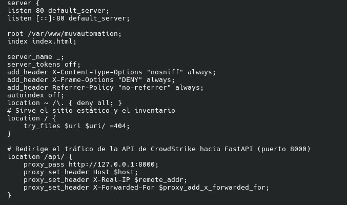

Directivas incorporadas:

```nginx
server_tokens off;
add_header X-Content-Type-Options "nosniff" always;
add_header X-Frame-Options "DENY" always;
add_header Referrer-Policy "no-referrer" always;
autoindex off;
location ~ /\. { deny all; }
```

**Justificación de cada control:**

| Directiva | Alerta ZAP que atiende | Efecto |
| :--- | :--- | :--- |
| `server_tokens off` | #3 Server Leaks Version Information | Suprime el número de versión del encabezado `Server` |
| `X-Content-Type-Options: nosniff` | #5 X-Content-Type-Options Missing | Impide que el navegador reinterprete el tipo MIME |
| `X-Frame-Options: DENY` | #2 Missing Anti-clickjacking Header | Bloquea la incrustación en marcos |
| `Referrer-Policy: no-referrer` | — (refuerzo adicional) | Evita filtrar la URL de origen a terceros |
| `autoindex off` | — (prevención) | Impide el listado automático de directorios |
| `location ~ /\.` | — (prevención) | Deniega el acceso a cualquier ruta oculta (`.git`, `.env`, etc.) |

> **Sobre el parámetro `always`:** garantiza que las cabeceras se emitan en **todas** las respuestas, incluidas las de error (4xx/5xx). Sin él, Nginx solo las añadiría en un conjunto limitado de códigos de estado, dejando las respuestas de error sin protección.

**Validación y recarga:**

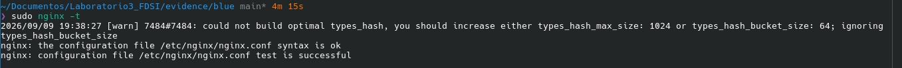

```bash
sudo nginx -t
sudo systemctl reload nginx
```

La validación devuelve `syntax is ok` y `test is successful`. Se utilizó `reload` en lugar de `restart` para aplicar los cambios sin interrumpir las conexiones activas.

### 2. Reducción de Exposición de Contenido (Paso 16)

Se identificó que la exposición de mayor sensibilidad residía en la **respuesta JSON del propio API**. El modelo `Alert` devolvía tres campos innecesarios para el consumidor público:

- `agent_id` — identificador del sensor Falcon
- `internal_ip` — dirección IP interna del activo
- `analyst_email` — dato personal del analista asignado

**Corrección aplicada en `main.py`:** se introdujo un modelo Pydantic reducido y se asignó como `response_model` de los endpoints públicos.

```python
class AlertPublic(BaseModel):
    id: str
    severity: str
    tactic: str
    technique: str
    hostname: str
    status: str

@app.get("/api/alerts", response_model=List[AlertPublic])
def get_alerts():
    return ALERTS
```

FastAPI filtra automáticamente los campos ausentes en el modelo al serializar, sin alterar la lógica interna ni la estructura de datos en memoria. El `POST /api/alerts` continúa **aceptando** el objeto `Alert` completo (simulando la ingesta real desde Falcon) pero **responde** con el modelo reducido.

Este cambio atiende directamente la hipótesis **H1** sobre el flujo **F8** del DFD.

### 3. Límite pedagógico declarado

HTTP continúa sin ofrecer confidencialidad ni integridad. Los controles aplicados **reducen la superficie de información expuesta**, pero no protegen el tráfico en tránsito. Este riesgo queda deliberadamente abierto para el Laboratorio 4, donde se abordará mediante certificados, HTTPS, identidad y roles.

---

## ✅ Fase F: Verificar y cerrar (Purple Team)

### 1. Repetición Exacta de las Pruebas (Paso 17)

Se ejecutaron nuevamente los mismos comandos de la Fase C, sin modificaciones, para permitir una comparación válida:

```bash
mkdir -p evidence/retest
nmap -Pn -sV -p 80 "$TARGET_IP" -oA evidence/retest/nmap_port80
curl -I "$TARGET_URL/" | tee evidence/retest/headers_after.txt
curl -i "$TARGET_URL/.git/config" | tee evidence/retest/hidden_path.txt
```

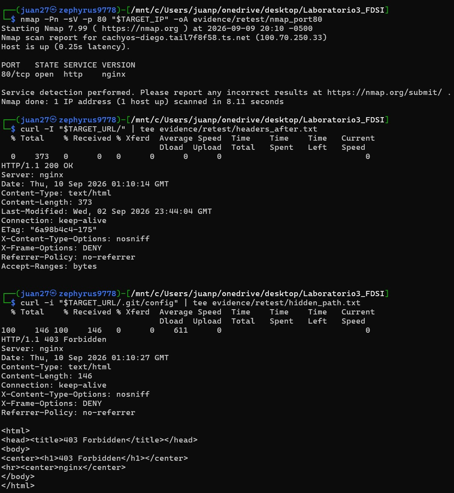

**Resultados del retest:**

1. **Nmap ya no revela la versión.** La salida pasó de `nginx 1.30.4` a simplemente `nginx`. El servicio sigue identificándose como HTTP —eso es inherente al protocolo— pero el banner ya no entrega el número de versión. **Alerta ZAP #3 corregida.**

2. **Las cabeceras de seguridad están presentes.** La respuesta a `GET /` incluye ahora `X-Content-Type-Options: nosniff`, `X-Frame-Options: DENY` y `Referrer-Policy: no-referrer`. **Alertas ZAP #2 y #5 corregidas.**

3. **La ruta oculta es denegada.** `GET /.git/config` devuelve `403 Forbidden` en lugar de exponer el archivo o devolver un 404 informativo. Nótese que las tres cabeceras de seguridad **también aparecen en esta respuesta de error**, lo que confirma el correcto funcionamiento del parámetro `always`.

### 2. Comparación Antes / Después de Cabeceras

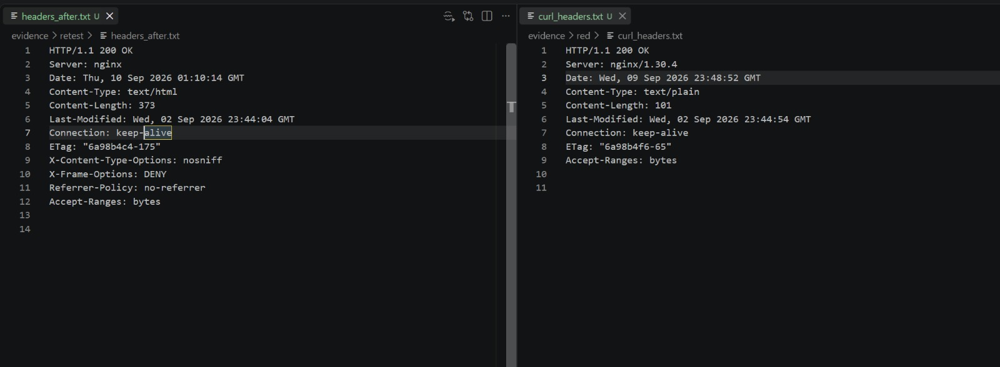

| Aspecto | Antes (`evidence/red/curl_headers.txt`) | Después (`evidence/retest/headers_after.txt`) |
| :--- | :--- | :--- |
| Encabezado `Server` | `nginx/1.30.4` | `nginx` |
| `X-Content-Type-Options` | Ausente | `nosniff` |
| `X-Frame-Options` | Ausente | `DENY` |
| `Referrer-Policy` | Ausente | `no-referrer` |
| Protocolo | HTTP sin cifrar | HTTP sin cifrar *(sin cambio — pendiente Lab 4)* |

### 3. Verificación de la Reducción de Datos en el API

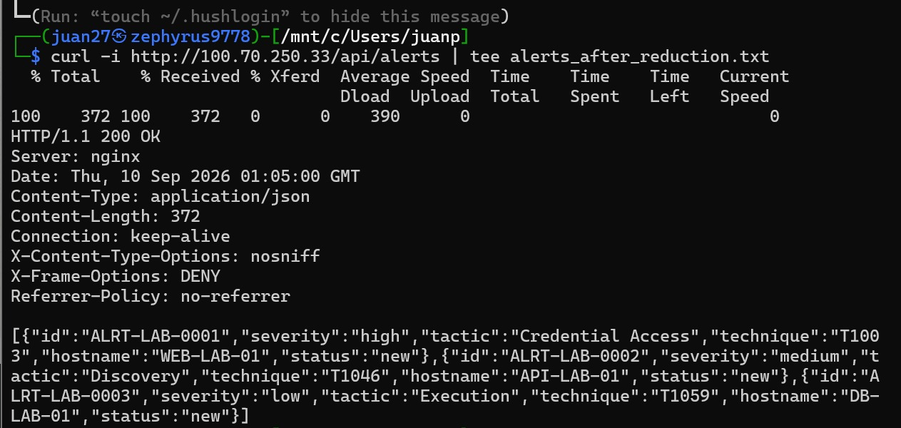

```bash
curl -i http://100.70.250.33/api/alerts | tee evidence/retest/alerts_after_reduction.txt
```

**Comparación del cuerpo de respuesta:**

*Antes:*
```json
{"id":"ALRT-LAB-0001","severity":"high","tactic":"Credential Access","technique":"T1003",
 "hostname":"WEB-LAB-01","agent_id":"aaaaaaaa-0000-0000-0000-000000000001",
 "internal_ip":"10.10.10.11","analyst_email":"analyst1@lab.invalid","status":"new"}
```

*Después:*
```json
{"id":"ALRT-LAB-0001","severity":"high","tactic":"Credential Access","technique":"T1003",
 "hostname":"WEB-LAB-01","status":"new"}
```

El `Content-Length` se redujo de 723 a 372 bytes. Los campos `agent_id`, `internal_ip` y `analyst_email` ya no se emiten. Las cabeceras de hardening acompañan también esta respuesta, confirmando que ambas correcciones coexisten sin interferencia.

### 4. Riesgo residual identificado durante el retest

El archivo estático `/public-inventory.txt` **continúa devolviendo `200 OK`** con las direcciones internas `10.10.10.11`, `10.10.10.12` y `10.10.10.13`, según se verifica en el `access.log` de la Fase D (registro de las 19:06:36). La reducción de exposición se aplicó al API pero no a este recurso estático.

Queda registrado en `risk-register.md` como **pendiente**, con la corrección propuesta: depurar el archivo para conservar únicamente identificadores de activo sin direccionamiento, o restringir su acceso.

### 5. Etiquetado de la Entrega (Paso 18)

```bash
git status
git add .
git commit -m "lab3: public HTTP baseline, telemetry and initial hardening"
git tag lab-3
git show --stat --oneline lab-3
```

---

## 🤖 7. Uso Responsable de IA

La IA se empleó como copiloto analítico, no como autoridad. Cada afirmación se verificó contra comandos, logs, PCAP o configuración real.

**Controles aplicados:**

- No se enviaron PCAP completos a servicios externos; únicamente fragmentos de log anonimizados.
- Los datos del laboratorio son ficticios por diseño (`*.invalid`, rangos RFC1918 no reales, identificadores inventados), lo que redujo la superficie de anonimización requerida.
- Toda conclusión propuesta por la IA se contrastó contra la evidencia antes de incorporarse a este documento.
- Las hipótesis no comprobadas se registran explícitamente en la sección 12.

**Prompt de referencia utilizado:**

> Analiza estos eventos Nginx anonimizados. Construye una línea de tiempo, separa hechos de inferencias, mapea cada observación a STRIDE, propone tres hipótesis defensivas y señala qué evidencia adicional falta. No inventes IP, CVE ni acciones ejecutadas.

---

## 📋 11. Checklist de Cierre

- [x] La IP objetivo fue autorizada
- [x] No se incluyeron datos reales
- [x] El servicio responde por HTTP desde el segmento permitido
- [x] Red Team conservó comandos y timestamps
- [x] Blue Team correlacionó al menos tres eventos
- [x] El PCAP solo contiene tráfico del laboratorio
- [x] Se aplicaron cabeceras y reducción de exposición
- [x] Se ejecutó el retest
- [x] Los riesgos pendientes quedaron registrados para Lab 4
- [x] El tag `lab-3` existe y apunta a la entrega final

---

## ❓ 12. Preguntas de Análisis

### ¿Qué pudo observar el Red Team sin explotar ninguna vulnerabilidad?

Todo el reconocimiento se realizó con peticiones `GET` y `HEAD` legítimas, sin inyección, fuerza bruta ni explotación de ningún tipo. Aun así, el Red Team obtuvo:

- **Estado y versión del servicio:** puerto `80/tcp` abierto, producto `nginx 1.30.4` identificado con precisión por el banner.
- **Estructura completa del sitio:** el HTML de la página principal enlaza directamente a `/public-inventory.txt` y a `/docs`, sin requerir descubrimiento de directorios.
- **Topología interna simulada:** tres hostnames (`WEB-LAB-01`, `API-LAB-01`, `DB-LAB-01`) con sus direcciones IP privadas y estado operativo.
- **Datos sensibles del API:** identificadores de sensor Falcon (`agent_id`), IPs internas y correos de analistas en la respuesta de `/api/alerts`.
- **Contrato completo del API:** la documentación Swagger en `/docs` publica todos los endpoints, métodos y esquemas de datos sin autenticación.
- **Postura de seguridad del servidor:** las cinco cabeceras ausentes detectadas por ZAP revelan qué defensas no están desplegadas.
- **Contenido y metadatos en tránsito:** el PCAP confirma que método, ruta, agente y cuerpo de respuesta son legibles en capa de aplicación.

La conclusión es que **la fase de reconocimiento por sí sola entregó suficiente información para planificar un ataque dirigido**, sin generar una sola alerta de intrusión.

### ¿Qué pruebas de red no aparecieron en access.log y por qué?

**El escaneo de puertos de Nmap no aparece.** La fase en que Nmap determina si el puerto `80/tcp` está abierto opera en la capa de transporte: envía paquetes TCP y evalúa la respuesta del *handshake*. Nginx solo escribe en `access.log` cuando recibe y procesa una **petición HTTP completa**. Un sondeo que no llega a formular una petición HTTP es, para el servidor web, invisible.

**Lo que sí quedó registrado** fueron las sondas del motor de scripts (`-sV`): `/nmaplowercheck1788997722`, `/sdk`, `/evox/about` y `/HNAP1`. Estas sí son peticiones HTTP reales, enviadas para confirmar el producto, y por tanto generan entradas `404` con el `User-Agent` característico de Nmap.

**Implicación defensiva:** un Blue Team que instrumente únicamente el servidor web tiene un punto ciego en toda la actividad de capa 3 y 4. Detectar reconocimiento de puertos exige telemetría de red (IDS, firewall con registro, `tcpdump`), no de aplicación. Esta es precisamente la distinción que el Paso 14 pide demostrar.

### ¿Qué control aplicado reduce exposición, pero no resuelve el riesgo de HTTP?

**Todos los controles de la Fase E**, sin excepción. Concretamente:

- `server_tokens off` oculta el número de versión, pero el atacante sigue sabiendo que es Nginx y puede inferir un rango de versiones por otros medios.
- Las tres cabeceras de seguridad protegen al **navegador del cliente** contra clases específicas de ataque (clickjacking, MIME-sniffing), pero no protegen el canal.
- El modelo `AlertPublic` reduce **qué** datos se transmiten, no **cómo** se transmiten. Los campos que quedan (`hostname`, `severity`, `technique`) siguen viajando en texto plano.
- `location ~ /\.` bloquea rutas ocultas, pero cualquier ruta legítima sigue siendo observable en tránsito.

**El riesgo que permanece intacto:** sin TLS no hay confidencialidad ni integridad en el canal. Un intermediario con acceso al medio puede leer todo el tráfico y, en principio, modificarlo. La reducción de exposición disminuye el *valor* de lo interceptado; no impide la intercepción.

Este límite es deliberado y corresponde al Laboratorio 4.

### ¿Qué datos necesitaría Blue Team para distinguir curl legítimo de una actividad sospechosa?

El `access.log` actual registra IP, timestamp, método, ruta, código de estado, bytes y `User-Agent`. Con eso **no alcanza**: durante este laboratorio, `curl` fue usado tanto por el Red Team como por el propio Blue Team en sus verificaciones locales. El binario es idéntico; la intención, no.

Datos adicionales necesarios, en orden de valor:

1. **Identidad autenticada.** Es el dato decisivo y hoy no existe. Sin autenticación, toda petición es anónima y cualquier atribución se basa en la IP de origen, que puede cambiar. Este es el fundamento de la hipótesis **H3** (Repudiation) y la razón por la que el Laboratorio 4 debe priorizar identidad.
2. **Patrón de secuencia de rutas.** Un cliente legítimo navega siguiendo enlaces; un escáner recorre rutas sin relación entre sí (`/sdk`, `/HNAP1`, `/evox/about`). La secuencia distingue mejor que cualquier petición individual.
3. **Ratio de códigos de estado por origen.** Una proporción alta de `404` respecto a `200` en una ventana corta sugiere enumeración. Requiere agregación con estado, que `awk` sobre el log plano no ofrece de forma nativa.
4. **Cadencia temporal.** Cuatro peticiones en el mismo segundo es comportamiento automatizado; un humano no sostiene ese ritmo.
5. **Ventana de autorización declarada.** Contrastar cada evento contra el horario y el alcance aprobados convierte "actividad inusual" en "actividad no autorizada", que es una afirmación mucho más fuerte.
6. **Correlación con telemetría de red.** El `access.log` no ve el escaneo de puertos; un IDS sí. Cruzar ambas fuentes reconstruye la secuencia completa del atacante.

El `User-Agent`, aunque útil en este ejercicio, **no debe considerarse fiable**: es un campo controlado por el cliente y trivialmente falsificable.

### ¿Qué amenaza STRIDE debe priorizarse en el Laboratorio 4?

**Spoofing**, por ser la amenaza raíz de la que dependen las demás.

La justificación es estructural: sin un mecanismo de identidad verificable, ninguna de las otras categorías puede tratarse adecuadamente.

- **No hay autorización sin autenticación.** No se puede restringir qué puede hacer un actor si no se sabe quién es.
- **No hay no-repudio sin identidad.** La hipótesis **H3** quedó demostrada precisamente por esto: el `POST /api/actions` acepta y registra cualquier acción sin vincularla a un actor verificado. El registro existe, pero no es atribuible.
- **El control de Tampering depende de identidad.** Verificar que un mensaje no fue alterado exige saber quién lo originó.

Además, la mitigación de Spoofing mediante TLS con certificados **resuelve de paso** los riesgos de Information Disclosure (H1) y Tampering (H4) en tránsito, ya que el canal cifrado aporta confidencialidad e integridad. Es la intervención con mayor retorno.

**Orden sugerido para el Laboratorio 4:** TLS/HTTPS → autenticación → autorización por roles → registro de auditoría con identidad.

### ¿Qué conclusión propuesta por la IA no pudo comprobarse directamente?

Se registran cuatro casos concretos en los que el apoyo de IA produjo afirmaciones que la evidencia posterior corrigió o no pudo validar:

**1. Se asumió que `public-inventory.txt` no existía en el proyecto.** Durante la planificación de la Fase E, la IA sostuvo que ese archivo pertenecía únicamente a la guía genérica del laboratorio y que la exposición real residía exclusivamente en los campos JSON del API. La evidencia de la Fase C (`docs/FaseC/OWASP-archivo.jpeg`) demuestra lo contrario: el archivo existe, responde `200 OK` y entrega tres direcciones IP internas. **Consecuencia:** la reducción de exposición se aplicó al API pero omitió el archivo estático, que quedó como riesgo residual.

**2. Se predijo que la regla de detección de 404 dispararía ante el escaneo.** El análisis previo asumía que el reconocimiento generaría suficientes respuestas `404` para superar el umbral de cinco en cinco minutos. El conteo real fue de **cuatro** en un mismo segundo. La detección efectiva provino del `User-Agent`, no de la regla diseñada. **Consecuencia:** se documentó la limitación y se propuso recalibrar el umbral.

**3. El diagnóstico inicial sobre la dirección `172.20.88.140`.** Se planteó como hipótesis que correspondía a una interfaz NAT interna del hipervisor. No pudo verificarse directamente —el `ping` simplemente falló— y la causa real resultó ser que ambos equipos estaban en redes domésticas distintas, sin ruta entre ellas. La hipótesis era plausible pero no comprobada; la solución (Tailscale) se adoptó por descarte, no por confirmación del diagnóstico.

**4. La hipótesis H4 (Tampering) permanece sin validación empírica.** Por restricción explícita de alcance, no se ejecutó ninguna intercepción de tipo *man-in-the-middle*. La conclusión de que un intermediario podría alterar el tráfico es un razonamiento válido derivado de la ausencia de TLS, pero **no una demostración**. Se documenta como inferencia, no como hecho verificado.

**Criterio general adoptado:** toda afirmación generada por IA se trató como hipótesis hasta contrastarla contra un comando, un log o una captura. Las que no resistieron la verificación se corrigieron y se dejaron registradas, por ser tan informativas como los aciertos.

---

## 🎯 13. Resultado Esperado

El equipo completó el ciclo **Diseñar → Construir → Atacar → Detectar → Corregir → Verificar** sobre un mismo artefacto, con trazabilidad en cada transición:

| Etapa | Realización | Evidencia |
| :--- | :--- | :--- |
| **Diseñar** | DFD con 3 fronteras de confianza y 15 flujos numerados; tabla STRIDE con 4 hipótesis vinculadas a flujos concretos | `diagrams/dfd-lab3.puml`, sección Fase B |
| **Construir** | API FastAPI tras proxy inverso Nginx sobre HTTP, con firewall restringido al host autorizado | `main.py`, `nginx/`, sección Fase A |
| **Atacar** | Reconocimiento con Nmap, curl y ZAP pasivo; captura de tráfico coordinada | `docs/FaseC/`, `evidence/red/` |
| **Detectar** | Correlación de `access.log` con cada acción ofensiva; regla de detección evaluada críticamente | `docs/FaseD/`, `evidence/blue/` |
| **Corregir** | Hardening de Nginx y reducción de campos sensibles en el API | `docs/FaseE/`, `nginx/nginx-after-hardening.conf` |
| **Verificar** | Repetición exacta de las pruebas originales y comparación antes/después documentada | `docs/FaseF/`, `evidence/retest/` |

### El producto permanece deliberadamente incompleto

Esto es un resultado esperado del diseño del laboratorio, no una deficiencia:

- **Sin HTTPS.** Todo el tráfico circula en texto plano en capa de aplicación. Las hipótesis **H1** e **H4** quedan mitigadas parcialmente —se redujo el volumen de datos expuestos— pero no resueltas.
- **Sin autenticación.** Cualquier cliente con acceso de red puede consultar y crear alertas y acciones. La hipótesis **H3** (Repudiation) permanece completamente abierta.
- **Sin autorización por roles.** No existe distinción entre un analista que consulta y uno que escala un incidente.
- **Sin identidad en el registro de acciones.** El modelo `Action` carece de cualquier campo de atribución, de modo que el registro es cronológico pero no imputable.

### Base técnica establecida para el Laboratorio 4

Los riesgos pendientes no son deuda accidental sino insumo planificado para la siguiente iteración:

| Riesgo abierto | Tratamiento previsto en Lab 4 |
| :--- | :--- |
| Tráfico sin cifrar (H1, H4) | Certificados TLS y migración a HTTPS |
| Ausencia de identidad (H3) | Autenticación de clientes y gestión de sesiones |
| Ausencia de autorización | Control de acceso basado en roles |
| Registro no imputable | Auditoría con identidad verificada del actor |
| Escenarios de Spoofing | Validación de certificados y protección de sesión |
| `/public-inventory.txt` expuesto | Depuración o restricción del recurso estático |

La solución es acumulativa: el Laboratorio 4 parte de este mismo repositorio, etiquetado como `lab-3`, y añade las capas de seguridad sin reconstruir el prototipo.