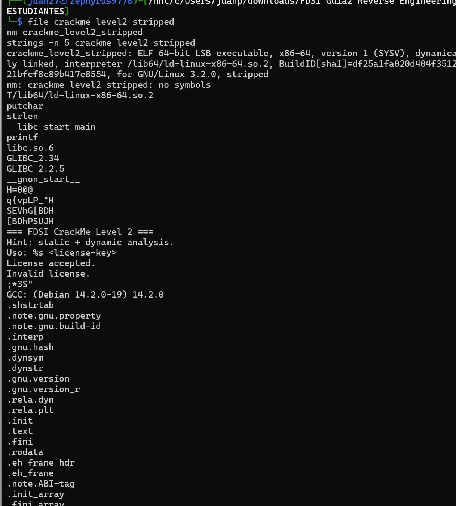

# Boss Level — binario sin símbolos

**Binario:** `crackme_level2_stripped` (SHA-256 `c8e63874…bb9aed3`, verificado en [`baseline.txt`](baseline.txt))
**Herramientas:** `file`, `nm`, `strings`, `readelf`, `objdump`, GDB 17.2 (sintaxis Intel)
**Salida cruda de todos los comandos:** [`boss-output.txt`](boss-output.txt), generada con [`boss-evidence.sh`](boss-evidence.sh)
**Resultado:** ✅ La lógica de validación se recuperó **sin un solo nombre de función**: es la función sin nombre en `0x401156`, la misma que en `crackme_level2` se llama `validate_key`. Con la clave `FDSI-REVERSE-2026` el binario imprime `FLAG{ghidra_plus_gdb}`.

> Volver al análisis consolidado: [`reverse-analysis.md`](../../reverse-analysis.md) · Nivel anterior: [`level2.md`](level2.md) · Confirmación dinámica con símbolos: [`gdb.md`](gdb.md)

> **Alcance de la evidencia.** La captura `5.1` es de la terminal del analista. El resto de los comandos se documenta en texto, en [`boss-output.txt`](boss-output.txt), producido por [`boss-evidence.sh`](boss-evidence.sh) sobre los binarios originales (SHA-256 verificados). El análisis del Boss Level se hizo con `objdump` y GDB; **no se incluye una sesión de Ghidra sobre el stripped**: el decompilador ya se usó sobre la misma lógica en el Level 2 ([`level2.md`](level2.md)).

---

## Metodología

En el Nivel 2 los nombres (`validate_key`, `reveal_flag`, `candidate`, `score`…) venían del DWARF y de `.symtab`, y Ghidra los mostraba ya puestos. Aquí esos nombres no existen. La pregunta cambia de *"¿cómo se llama la función que valida?"* a **"¿qué parte del binario no puede borrar `strip` y me lleva hasta ella?"**. Las anclas son tres: el punto de entrada, las cadenas de `.rodata` y las importaciones de la libc.

| Paso | Evidencia | Acción | Pregunta que responde |
| :--- | :---: | :--- | :--- |
| 1 | captura `5.1` | `file`, `nm`, `strings -n 5` | ¿Qué se nota a primera vista? |
| 2 | `boss-output.txt` §2 | `readelf -S`, comparación con `crackme_level2`, `nm -D` | ¿Qué información desapareció exactamente y cuál sobrevive? |
| 3 | `boss-output.txt` §3 | `objdump -d` del punto de entrada | ¿Dónde está `main` si no tiene nombre? |
| 4 | `boss-output.txt` §4–5 | `strings -t x` + búsqueda de referencias en `objdump` | ¿Qué código usa los mensajes y quién decide entre ellos? |
| 5 | `boss-output.txt` §6 | `objdump -d` de `0x401156` | ¿Qué hace la función que decide? |
| 6 | `boss-output.txt` §7 | GDB con `break *0x401162` y tres claves | ¿Se comporta como predice el análisis estático? |

---

## 1. Qué información desapareció al hacer strip

### 1.1 Primer contraste: `file`, `nm`, `strings` (captura 5.1)

```bash
file crackme_level2_stripped
nm crackme_level2_stripped
strings -n 5 crackme_level2_stripped
```

*Captura 5.1*



| Comando | Resultado | Lectura |
| :--- | :--- | :--- |
| `file` | `…, for GNU/Linux 3.2.0, stripped` | Ya no dice `with debug_info` y dice `stripped` (en `crackme_level2` decía `with debug_info, not stripped`) |
| `nm` | `nm: crackme_level2_stripped: no symbols` | La tabla de símbolos `.symtab` no existe |
| `strings -n 5` | Importaciones (`putchar`, `strlen`, `printf`, `__libc_start_main`), mensajes (`=== FDSI CrackMe Level 2 ===`, `Hint: static + dynamic analysis.`, `Uso: %s <license-key>`, `License accepted.`, `Invalid license.`), `GCC: (Debian 14.2.0-19) 14.2.0` y nombres de secciones | Los mensajes siguen, pero **no aparece** `validate_key`, `reveal_flag`, `candidate`, `score`, `expected` ni `crackme_level2.c`, que sí estaban en el Nivel 2 ([`level2.md`](level2.md) §1.1) |

### 1.2 Qué se eliminó y qué no (`boss-output.txt` §2)

```bash
readelf -S -W crackme_level2          | grep -c -E '^ +\[ *[0-9]+\]'     # 36
readelf -S -W crackme_level2_stripped | grep -c -E '^ +\[ *[0-9]+\]'     # 28
diff <(readelf -S -W crackme_level2 | sed -n 's/^ *\[ *[0-9]*\] \(\.[^ ]*\).*/\1/p') \
     <(readelf -S -W crackme_level2_stripped | sed -n 's/^ *\[ *[0-9]*\] \(\.[^ ]*\).*/\1/p')
nm -D crackme_level2_stripped
```

Pasa de **36 a 28 secciones**. Las 8 que desaparecen son exactamente:

```text
.debug_aranges  .debug_info  .debug_abbrev  .debug_line  .debug_str  .debug_line_str   (DWARF)
.symtab         .strtab                                                                  (símbolos)
```

**Lo que se perdió y su efecto concreto:**

| Eliminado | Qué contenía | Efecto observado |
| :--- | :--- | :--- |
| `.symtab` + `.strtab` | Nombres de funciones (`main`, `validate_key`, `reveal_flag`, `frame_dummy`…) y de objetos (`k.1`, `expected.0`) | `nm` → `no symbols`. En GDB, `break validate_key` responde `Function "validate_key" not defined.` (en `crackme_level2` ponía el breakpoint en `0x401162`). `info functions` sólo conoce los *stubs* de la PLT (`putchar@plt`, `puts@plt`, `strlen@plt`…) |
| `.debug_*` (DWARF) | Nombres y tipos de parámetros y variables locales (`candidate`, `score`, `transformed`, `i`), correspondencia con líneas del `.c`, nombre del fuente (`crackme_level2.c`), directorio de compilación y opciones del compilador (`-g -O0 -fno-inline`) | GDB deja de mostrar `validate_key (candidate=0x… "AAAA") at …crackme_level2.c:10` y muestra sólo `0x0000000000401162 in ?? ()`. Un decompilador ya no recibe nombres ni tipos para los locales |

**Lo que NO desapareció** (verificado con `objcopy -O binary --only-section=… ` + `cmp`, ver [`boss-output.txt`](boss-output.txt) §2):

| Sobrevive | Evidencia | Por qué importa |
| :--- | :--- | :--- |
| **Todo el código** (`.text`, 663 bytes) | `cmp` → **IDÉNTICO** a `crackme_level2` | `strip` no toca instrucciones: el algoritmo es el mismo, byte a byte |
| **Todos los datos** (`.rodata`, 161 bytes) | `cmp` → **IDÉNTICO** | `k`, `expected` y los mensajes siguen ahí. Sólo perdieron su nombre |
| **Las direcciones** | Mismo entry point `0x401070`; la función sin nombre está en `0x401156`, igual que `validate_key` | Es `EXEC` (no PIE) y el layout no cambió: lo visto en `objdump` es lo que verá GDB |
| **Importaciones dinámicas** (`.dynsym`) | `nm -D` → `strlen`, `printf`, `putchar`, `puts`, `__libc_start_main` | El cargador dinámico las necesita para enlazar en tiempo de ejecución; no se pueden borrar |
| **Cadenas de `.rodata`** | `strings` | Son datos, no símbolos |
| **`.comment`** | `GCC: (Debian 14.2.0-19) 14.2.0` | Sigue filtrando el compilador y su versión |

**Conclusión del paso:** `strip` elimina la **metadata que ayuda a leer** el programa, no su **lógica**. Es el mismo binario con menos etiquetas. Por eso lo que sigue es posible.

---

## 2. Encontrar de nuevo la lógica de validación

Sin nombres hay que buscar **anclas que `strip` no puede borrar**. Se usaron tres rutas independientes y las tres terminan en la misma dirección, `0x401156`, lo que da confianza en la conclusión.

> **Nota sobre `objdump` en un binario stripped.** Los comentarios del tipo `<printf@plt+0x123>` que aparecen junto a saltos y referencias **no significan que se llame a `printf`**: `objdump` etiqueta cada dirección con el símbolo *más cercano que conoce* (sólo conoce los de la PLT) y se queda ahí. Se ignoran; lo que cuenta son las direcciones.

### 2.1 Ruta A — Desde el punto de entrada: flujo de control (`boss-output.txt` §3)

```bash
readelf -h crackme_level2_stripped | grep -E 'Type|Entry'
objdump -d -M intel --start-address=0x401070 --stop-address=0x401092 crackme_level2_stripped
```

```asm
401070: xor    ebp,ebp
401072: mov    r9,rdx
401075: pop    rsi                       ; argc
401076: mov    rdx,rsp                   ; argv
401079: and    rsp,0xfffffffffffffff0
40107d: push   rax
40107e: push   rsp
40107f: xor    r8d,r8d
401082: xor    ecx,ecx
401084: mov    rdi,0x401267              ; <-- 1.er argumento de __libc_start_main = main
40108b: call   QWORD PTR [rip+0x2f47]    ; # 0x403fd8 = GOT de __libc_start_main
401091: hlt
```

Esto ya estaba previsto desde el baseline (`reverse-analysis.md` §1.3): el punto de entrada `0x401070` **no es `main`**, es `_start`, que prepara la pila y llama a `__libc_start_main(main, argc, argv, …)`. En x86-64 System V el primer argumento va en `rdi`, así que **`main` está en `0x401267`**. La dirección `0x403fd8` es la entrada de la GOT que `readelf -r` asocia a `__libc_start_main@GLIBC_2.34`, lo que confirma que lo llamado es esa función y no otra.

Leyendo `main` (`0x401267`–`0x401306`) sin nombres, el flujo es:

| Dirección | Instrucción / acción | Interpretación |
| :--- | :--- | :--- |
| `0x401276`, `0x401285` | `puts` de `0x402010` y `0x402030` | Banner y pista (`=== FDSI CrackMe Level 2 ===`, `Hint: …`) |
| `0x401294` | `cmp [rbp-0x4],0x2` / `je 0x4012bf` | `argc == 2`; si no, `printf("Uso: %s …")` (`0x402051`) y `return 1` |
| `0x4012bf`–`0x4012cd` | `rax = argv[1]`, `rdi = rax`, **`call 0x401156`** | Se le pasa la clave del usuario a una única función |
| `0x4012d2`, `0x4012d4` | **`test eax,eax` / `je 0x4012f1`** | **La decisión.** Si devolvió 0, salta a la rama de fallo |
| `0x4012d6`–`0x4012ef` | `puts("License accepted.")`, `call 0x4011f3`, `return 0` | Rama de éxito: imprime la FLAG con otra función |
| `0x4012f1`–`0x401300` | `puts("Invalid license.")`, `return 3` | Rama de fallo |

La función que recibe `argv[1]` y cuyo retorno decide el acceso es **`0x401156`**.

### 2.2 Ruta B — Desde las cadenas hacia el código: referencias (`boss-output.txt` §4)

```bash
strings -t x -n 5 crackme_level2_stripped | grep -E 'License|Invalid'
readelf -S -W crackme_level2_stripped | grep '\.rodata'
objdump -d -M intel crackme_level2_stripped | grep -nE '# (402068|40207a)'
```

1. `strings -t x` da el **desplazamiento en el archivo**: `Invalid license.` en `0x207a` y `License accepted.` en `0x2068`.
2. `readelf -S` muestra que `.rodata` está en el archivo en el desplazamiento `0x2000` y se carga en la dirección `0x402000`. Al ser un ejecutable no PIE, **dirección = desplazamiento + `0x400000`**, es decir `0x40207a` y `0x402068`.
3. Buscar esas direcciones en el desensamblado da una única referencia cada una:

   ```text
   4012d6: lea rax,[rip+0xd8b]   # 402068   "License accepted."
   4012f1: lea rax,[rip+0xd82]   # 40207a   "Invalid license."
   ```

4. Las dos están en `main`, en las ramas del salto `je 0x4012f1` de la sección anterior. Quien decide entre ellas es lo que hay justo antes: `test eax,eax` tras `call 0x401156`.

Es el equivalente manual de lo que Ghidra hace con **References → Show References to…**: partir de un dato conocido (un mensaje) y subir hasta el código que lo usa.

### 2.3 Ruta C — Por comportamiento: quién llama a cada función de libc (`boss-output.txt` §5)

```bash
objdump -d -M intel -j .plt crackme_level2_stripped | grep -E '^[0-9a-f]+ <'
objdump -d -M intel crackme_level2_stripped | grep -E 'call +(401030|401040|401050|401060)'
```

Las importaciones de `nm -D` sí tienen nombre, y `objdump` los asigna a cada *stub* de la PLT a partir de las relocalizaciones (`.rela.plt`). Con eso se sabe quién llama a qué:

| Stub PLT | Función libc | Se llama desde | Qué sugiere |
| :--- | :--- | :--- | :--- |
| `0x401050` | `strlen` | **sólo** `0x401171` (dentro de `0x401156`) | La única función que mide una cadena es la que valida: comprueba la **longitud** |
| `0x401030` | `putchar` | `0x401249`, `0x40125f` (dentro de `0x4011f3`) | La función que imprime carácter a carácter es la que construye la FLAG |
| `0x401040` | `puts` | `0x401280`, `0x40128f`, `0x4012e0`, `0x4012fb` (todas en `main`) | Mensajes de la interfaz |
| `0x401060` | `printf` | `0x4012b3` (en `main`) | Mensaje de uso con `argv[0]` |

`strlen` en `nm -D` ya había anticipado, desde el Nivel 2, que se comprobaba la longitud. Aquí se usa al revés: **la importación señala la función**.

### 2.4 La función `0x401156`, leída sin nombres (`boss-output.txt` §6)

```bash
objdump -d -M intel --start-address=0x401156 --stop-address=0x4011f3 crackme_level2_stripped
```

```asm
401156: push   rbp
401157: mov    rbp,rsp
40115a: sub    rsp,0x30
40115e: mov    QWORD PTR [rbp-0x28],rdi        ; arg1 = clave del usuario
401162: mov    QWORD PTR [rbp-0x18],0x11       ; n = 17
40116a: mov    rax,QWORD PTR [rbp-0x28]
40116e: mov    rdi,rax
401171: call   0x401050 <strlen@plt>           ; strlen(clave)
401176: cmp    QWORD PTR [rbp-0x18],rax        ; ¿17 == strlen?
40117a: je     0x401183                        ;   sí -> bucle
40117c: mov    eax,0x0                         ;   no -> return 0
401181: jmp    0x4011f1
401183: mov    DWORD PTR [rbp-0x4],0x0         ; score = 0
40118a: mov    QWORD PTR [rbp-0x10],0x0        ; i = 0
401192: jmp    0x4011dd
401194: ...                                    ; cuerpo del bucle
40119f: movzx  eax,BYTE PTR [rax]              ;   eax = clave[i]
4011a8: and    eax,0x3                         ;   i & 3
4011ae: lea    rax,[rip+0xed6]                 ;   0x40208b  (4 bytes: k)
4011b5: movzx  eax,BYTE PTR [rdx+rax*1]        ;   k[i & 3]
4011b9: xor    eax,ecx                         ;   clave[i] ^ k[i & 3]
4011be: lea    rdx,[rip+0xecb]                 ;   0x402090  (17 bytes: expected)
4011cc: movzx  eax,BYTE PTR [rax]              ;   expected[i]
4011cf: xor    al,BYTE PTR [rbp-0x19]          ;   expected[i] ^ (clave[i] ^ k[i & 3])
4011d5: or     DWORD PTR [rbp-0x4],eax         ;   score |= diferencia
4011d8: add    QWORD PTR [rbp-0x10],0x1        ;   i++
4011dd: mov    rax,QWORD PTR [rbp-0x10]
4011e1: cmp    rax,QWORD PTR [rbp-0x18]        ;   ¿i < 17?
4011e5: jb     0x401194                        ;   sí -> otra vuelta
4011e7: cmp    DWORD PTR [rbp-0x4],0x0         ; ¿score == 0?
4011eb: sete   al
4011ee: movzx  eax,al
4011f1: leave
4011f2: ret                                    ; return score == 0
```

**Renombrado manual** (el mismo ejercicio que se hace con la tecla `L` en Ghidra), basado sólo en comportamiento:

| Dirección / ubicación | Nombre que se le asigna | Evidencia que lo justifica |
| :--- | :--- | :--- |
| `0x401267` | `main` | Es el argumento de `__libc_start_main` (§2.1) |
| **`0x401156`** | **`validate_key`** | La llama `main` con `argv[1]`; su retorno decide aceptar/rechazar; usa `strlen` y un bucle de XOR |
| `0x4011f3` | `reveal_flag` | Sólo se llama en la rama de éxito; no usa `strlen`, copia 21 bytes inmediatos y los imprime con `putchar` tras un `xor` con `0x37` |
| `0x40208b` (4 bytes) | `k` | Se indexa con `i & 3` |
| `0x402090` (17 bytes) | `expected` | Se indexa con `i` |
| `[rbp-0x28]` | `candidate` | Copia de `rdi`, el primer argumento |
| `[rbp-0x18]` | `n` (= `0x11`) | Constante 17 usada en la comparación de longitud y como límite del bucle |
| `[rbp-0x10]` | `i` | Contador del bucle |
| `[rbp-0x19]` | `transformed` | `candidate[i] ^ k[i & 3]` |
| `[rbp-0x4]` | `score` | Acumula diferencias con `OR`; se compara con 0 al final |

**Pseudocódigo recuperado (propio):** el mismo del Nivel 2 ([`level2.md`](level2.md) §6.2), porque el código es idéntico:

```c
bool validate_key(const char *candidate) {
    if (strlen(candidate) != 17) return false;          // 0x401176 / 0x40117a
    uint32_t score = 0;
    for (size_t i = 0; i < 17; i++) {
        uint8_t transformed = candidate[i] ^ k[i & 3];  // k       @ 0x40208b
        score |= transformed ^ expected[i];             // expected @ 0x402090
    }
    return score == 0;                                  // 0x4011e7 / 0x4011eb
}
```

Con `k = 23 51 17 6a` y `expected` leídos de `.rodata` (`objdump -s -j .rodata`), invertir el XOR vuelve a dar `FDSI-REVERSE-2026` (tabla byte a byte en [`level2.md`](level2.md) §6.3).

### 2.5 Qué muestra esto sobre los nombres

Todo lo anterior se hizo leyendo instrucciones: **la lógica está en el código, no en los nombres**. Los nombres (`validate_key`, `candidate`, `score`) son comodidad para el analista; sin ellos el trabajo es más lento, no imposible. En Ghidra el mismo ejercicio consistiría en renombrar a mano las funciones que el programa nombra automáticamente por su dirección, exactamente como se hizo en la tabla anterior; esa sesión no se documenta aquí (ver alcance al inicio).

---

## 3. Confirmación dinámica sobre el stripped

```bash
gdb ./crackme_level2_stripped
```

```gdb
set disassembly-flavor intel
break validate_key          # falla: no hay símbolos
info functions              # sólo stubs de la PLT
break *0x401162             # por DIRECCIÓN
run FDSI-REVERSE-2025
x/6i $pc
x/s $rdi
```

Salida real de esa sesión (en [`boss-output.txt`](boss-output.txt) §7; la dirección de pila cambia entre ejecuciones y entre máquinas):

```text
(gdb) break validate_key
Function "validate_key" not defined.
(gdb) break *0x401162
Breakpoint 1 at 0x401162
(gdb) run FDSI-REVERSE-2025
Breakpoint 1, 0x0000000000401162 in ?? ()
(gdb) x/6i $pc
=> 0x401162:  mov    QWORD PTR [rbp-0x18],0x11
   0x40116a:  mov    rax,QWORD PTR [rbp-0x28]
   0x40116e:  mov    rdi,rax
   0x401171:  call   0x401050 <strlen@plt>
   0x401176:  cmp    QWORD PTR [rbp-0x18],rax
   0x40117a:  je     0x401183
(gdb) x/s $rdi
<dirección de pila>:  "FDSI-REVERSE-2025"
```

**Comparación con la captura 4.1** (`crackme_level2`, con símbolos):

| | `crackme_level2` (captura 4.1) | `crackme_level2_stripped` (`boss-output.txt` §7) |
| :--- | :--- | :--- |
| Cómo se pone el breakpoint | `break validate_key` | `break *0x401162` |
| Al detenerse | `validate_key (candidate=0x7fffffffd974 "AAAA") at …crackme_level2.c:10` | `0x0000000000401162 in ?? ()` |
| Instrucción en `rip` | `mov QWORD PTR [rbp-0x18],0x11` (`validate_key+12`) | **la misma**, en la misma dirección |
| Argumento | `candidate=…` lo muestra GDB gracias al DWARF | hay que leerlo a mano: `x/s $rdi` |

Las **direcciones de código** son las mismas porque el binario es `EXEC`. Las de **pila** cambian entre ejecuciones y entre máquinas, así que nunca se usan para un breakpoint.

### 3.1 Cinco puntos de observación, tres claves

Sin nombres, el comportamiento se observa con breakpoints sobre las direcciones que se identificaron en §2:

| Dirección | Instrucción | Qué se observa ahí |
| :--- | :--- | :--- |
| `0x401162` | `mov [rbp-0x18],0x11` | Entrada a la validación; `rdi` apunta a la clave |
| `0x401181` | `jmp 0x4011f1` (tras `mov eax,0`) | Se alcanza **sólo** si la **longitud** no es 17 |
| `0x4011e7` | `cmp [rbp-0x4],0` | Fin del bucle; `[rbp-0x4]` es `score` |
| `0x4011f1` | `leave` | Retorno de la función; `eax` es el valor devuelto |
| `0x4012d2` | `test eax,eax` (en `main`) | La decisión final; `eax` es lo que devolvió la validación |

Ejecutadas las tres claves ([`boss-output.txt`](boss-output.txt) §7):

```text
---------------- clave: AAAA ----------------
[bp 0x401162] entrada a la validacion   rdi -> "AAAA"
[bp 0x401181] puerta de longitud FALLA (strlen != 17)
[bp 0x4011f1] retorno de la funcion     eax = 0
[bp 0x4012d2] main: test eax,eax        eax = 0
Invalid license.                                   → exited with code 03

---------------- clave: FDSI-REVERSE-2025 ----------------
[bp 0x401162] entrada a la validacion   rdi -> "FDSI-REVERSE-2025"
[bp 0x4011e7] fin del bucle             score = 0x3
[bp 0x4011f1] retorno de la funcion     eax = 0
[bp 0x4012d2] main: test eax,eax        eax = 0
Invalid license.                                   → exited with code 03

---------------- clave: FDSI-REVERSE-2026 ----------------
[bp 0x401162] entrada a la validacion   rdi -> "FDSI-REVERSE-2026"
[bp 0x4011e7] fin del bucle             score = 0x0
[bp 0x4011f1] retorno de la funcion     eax = 1
[bp 0x4012d2] main: test eax,eax        eax = 1
License accepted.  FLAG{ghidra_plus_gdb}           → exited normally
```

| Clave | Largo | ¿Pasa la compuerta de longitud? | `score` | Retorno (`eax`) | Resultado | Código de salida |
| :--- | :---: | :---: | :---: | :---: | :--- | :---: |
| `AAAA` | 4 | ❌ se alcanza `0x401181` | — (el bucle no se ejecuta) | 0 | `Invalid license.` | 3 |
| `FDSI-REVERSE-2025` | 17 | ✅ no se alcanza `0x401181` | **`0x3`** | 0 | `Invalid license.` | 3 |
| `FDSI-REVERSE-2026` | 17 | ✅ | **`0x0`** | **1** | `License accepted.` + FLAG | 0 |

**Qué demuestra cada fila:**

- **`AAAA`** ejercita la **primera compuerta**: la longitud. El bucle ni siquiera se ejecuta.
- **`FDSI-REVERSE-2025`** es una clave **incorrecta de 17 caracteres**, la prueba que faltaba en [`gdb.md`](gdb.md) §2.2: supera la longitud, **entra al bucle** y falla en la **segunda compuerta**. `score = 0x3` es exactamente `'5' ^ '6'` = `0x35 ^ 0x36`: sólo difiere el último carácter, y `OR` acumula esa única diferencia. Cualquier otro carácter incorrecto activaría los bits que le correspondan en `score`.
- **`FDSI-REVERSE-2026`** lleva `score` a 0, la función devuelve 1, `main` toma la rama de éxito y se imprime la FLAG.

Es la misma evidencia que en `crackme_level2`, obtenida **sin ninguna ayuda de símbolos**: el análisis estático (§2) predijo las dos compuertas y el valor de retorno, y la ejecución las confirmó.

> **Cómo reproducir una de las pruebas a mano** (para la captura): `break *0x4011e7`, `run FDSI-REVERSE-2025`, `x/wx $rbp-4` → `0x00000003`. Con la clave válida el mismo comando da `0x00000000`.

---

## 4. Resumen para la sustentación

| Pregunta | Respuesta |
| :--- | :--- |
| **1. ¿Qué observamos?** | `file` dice `stripped`, `nm` dice `no symbols` y `strings` ya no muestra `validate_key`, `candidate` ni el nombre del `.c`. Pasa de 36 a 28 secciones: se pierden `.symtab`, `.strtab` y seis `.debug_*`. Pero los mensajes, las importaciones de la libc y el compilador (`.comment`) siguen visibles. |
| **2. ¿Qué hipótesis formulamos?** | **H-B1:** `strip` sólo quita metadata, así que el código y los datos deben ser idénticos a `crackme_level2`. La lógica se puede recuperar con anclas que `strip` no borra: el punto de entrada, las cadenas y las importaciones. |
| **3. ¿Qué función o condición encontramos?** | `main` en `0x401267` (argumento de `__libc_start_main` en `_start`). Dentro, `call 0x401156` seguido de `test eax,eax / je 0x4012f1`. Esa función sin nombre mide la clave con `strlen`, exige 17 caracteres y compara `candidate[i] ^ k[i & 3]` contra `expected[i]` acumulando con `OR`. Las tres rutas (entrada → `main`, cadena `Invalid license.` → referencia, `strlen` → único llamador) coinciden. |
| **4. ¿Cómo lo confirmamos?** | `cmp` byte a byte: `.text` (663 B) y `.rodata` (161 B) idénticos a `crackme_level2`. En GDB, `break *0x401162` y tres claves: `AAAA` sale por la compuerta de longitud, `FDSI-REVERSE-2025` entra al bucle y termina con `score = 0x3`, `FDSI-REVERSE-2026` termina con `score = 0x0`, retorno 1 y la FLAG. |
| **5. ¿Qué enseñanza de desarrollo seguro obtuvimos?** | Quitar símbolos es **higiene de release**, no un control de seguridad: no hizo falta nada más que `objdump`, `strings` y GDB, porque el algoritmo seguía intacto en las instrucciones. Lo que protege un secreto es no ponerlo en el binario (validar en servidor, comparar contra un hash lento con sal o verificar licencias firmadas). |

---

## 5. Lección de desarrollo seguro

| Observación | Por qué no basta | Qué sí aporta |
| :--- | :--- | :--- |
| `strip` quitó 8 secciones (símbolos y DWARF) | El código y los datos quedaron **idénticos**. La validación se recuperó por tres rutas independientes, cada una con herramientas básicas (`objdump`, `strings`, GDB) | Sí reduce la fuga de información: ya no se entregan nombres de funciones, variables, el nombre del fuente ni las opciones de compilación (`-g -O0`). Es parte de un build de release correcto |
| Siguen filtrándose los mensajes, las importaciones y `GCC: (Debian 14.2.0-19) 14.2.0` | Un solo `strlen` en `nm -D` ya orienta al analista hacia la comprobación de longitud | `strip --strip-all`, eliminar `.comment` (`objcopy --remove-section=.comment`) y `-ffile-prefix-map` reducen el *fingerprinting*, igual que `server_tokens off` en el Laboratorio 3 |
| Todas las direcciones coinciden entre análisis estático y GDB | El binario es `EXEC` (sin PIE): no hay ASLR para el código | Compilar con **PIE**, RELRO completo y *stack canaries*. Seguiría siendo analizable, pero obliga a trabajar con direcciones relativas |
| La clave sigue derivándose de los datos del binario | Es el problema de fondo del Nivel 2 ([`level2.md`](level2.md) §8) | **No embeber el secreto**: validación en servidor, comparación contra hash con sal (Argon2, bcrypt, PBKDF2) o licencias firmadas (Ed25519, RSA) donde el binario sólo conoce la clave pública |

**Idea central:** el *strip* sube el esfuerzo del atacante de "leer nombres" a "leer flujo", y eso lo cubre cualquier analista con `objdump` y paciencia. **Ofuscar no es proteger.** Para el defensor, la lección operativa es separar los símbolos de depuración del artefacto distribuido y guardarlos internamente para analizar fallos, como ya se planteó en el baseline (§1.6).

---

## ✅ Checklist del nivel (guía, sección 5)

- [x] **Expliqué qué información desapareció al hacer strip:** `.symtab`, `.strtab` y seis secciones `.debug_*` (36 → 28 secciones); consecuencias en `nm`, `strings` y GDB; lo que sobrevive (código, datos, `.dynsym`, `.comment`) (§1, captura 5.1 y `boss-output.txt` §2).
- [x] **Encontré de nuevo la lógica de validación usando referencias y flujo de control:** `_start` → `main` (`0x401267`) → `call 0x401156` + `test eax,eax`; cadena `Invalid license.` → referencia `0x4012f1`; `strlen@plt` → único llamador (§2, `boss-output.txt` §3–6), confirmada con GDB sobre el stripped (§3, `boss-output.txt` §7).

## Evidencias

| Evidencia | Comando | Resultado | Sección |
| :--- | :--- | :--- | :---: |
| [captura `5.1`](screenshots/5.1.jpeg) | `file`, `nm`, `strings -n 5` sobre el stripped | `stripped`, `no symbols`, sin `validate_key` | 1.1 |
| `boss-output.txt` §2 | `readelf -S` (36 vs 28), `diff` de secciones, `cmp` de `.text`/`.rodata`, `nm -D` | 8 secciones menos; código y datos idénticos; importaciones que sobreviven | 1.2 |
| `boss-output.txt` §3 | `objdump -d` de `0x401070` | `mov rdi,0x401267` + `call __libc_start_main` | 2.1 |
| `boss-output.txt` §4–5 | `strings -t x`, búsqueda de `40207a`/`402068`, stubs PLT | Referencias en `main`; `strlen` sólo en `0x401171` | 2.2, 2.3 |
| `boss-output.txt` §6 | `objdump -d` de `0x401156`–`0x4011f3` | Longitud 17, XOR con `k[i & 3]`, `score \|= …` | 2.4 |
| `boss-output.txt` §7 | `break *0x401162`, `x/6i $pc`, `x/s $rdi` y tres claves | `0x401162 in ?? ()`; `score` = `0x3` / `0x0`; retorno 0 / 1 | 3 |

Salida en texto de todos los comandos y de las tres claves bajo GDB: [`boss-output.txt`](boss-output.txt) (generada con [`boss-evidence.sh`](boss-evidence.sh) sobre los binarios originales).
