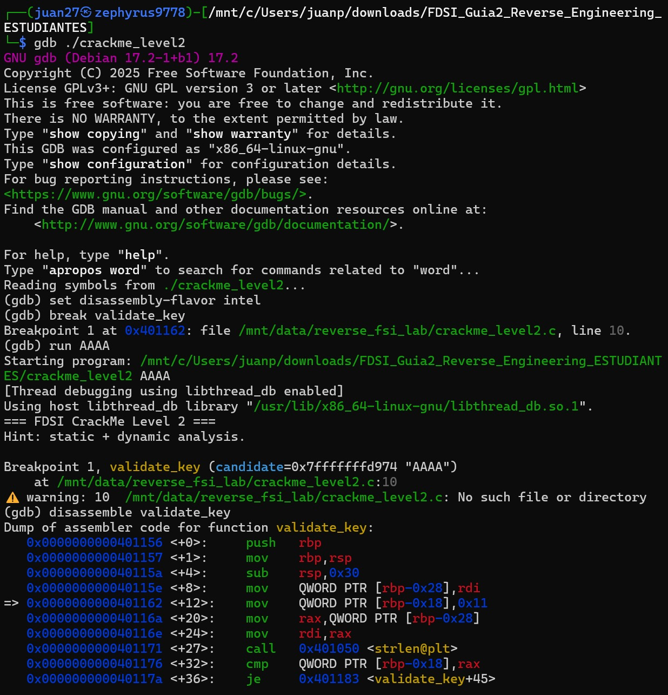
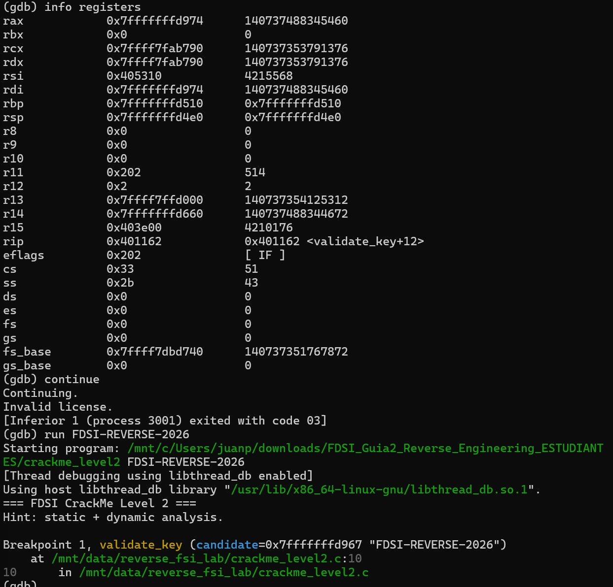

# Confirmación dinámica con GDB — `crackme_level2`

**Binario:** `crackme_level2` (SHA-256 `8dc5931d…b6f4e5`, verificado en [`baseline.txt`](baseline.txt))
**Herramientas:** GDB 17.2 (Debian), sintaxis Intel
**Objetivo:** demostrar **en ejecución** la hipótesis reconstruida en Ghidra ([`level2.md`](level2.md)): que `validate_key` exige longitud 17 y decide el acceso byte a byte.

> Volver al análisis consolidado: [`reverse-analysis.md`](../../reverse-analysis.md) · La misma confirmación sobre el binario sin símbolos: [`boss.md`](boss.md) §3

---

## Metodología

El análisis estático (Ghidra + `objdump`) ya había reconstruido el algoritmo y recuperado la clave. GDB no se usa aquí para *adivinar*, sino para **confirmar que el binario se comporta como predice el análisis estático**: detener la ejecución dentro de `validate_key`, leer registros e instrucciones reales, y contrastar una clave fallida contra la válida.

| Paso | Captura | Acción | Pregunta que responde |
| :--- | :---: | :--- | :--- |
| 1 | `4.1` | `break validate_key`, `run AAAA`, `disassemble validate_key` | ¿Se detiene en la rutina de validación? ¿El ensamblador coincide con el pseudocódigo de Ghidra? |
| 2 | `4.2` | `info registers`, `continue`, `run FDSI-REVERSE-2026` | ¿Qué hace el programa con una clave fallida y con la válida? |
| 3 | `3.9` | `./crackme_level2 FDSI-REVERSE-2026` | ¿El binario acepta la clave e imprime la FLAG? |

---

## 1. Detener la ejecución en la rutina de validación (Paso 4.1)

```bash
gdb ./crackme_level2
set disassembly-flavor intel
break validate_key
run AAAA
disassemble validate_key
```

*Captura 4.1*



**Qué ocurre:**

- GDB resuelve `validate_key` **por nombre** porque el binario conserva símbolos: `Breakpoint 1 at 0x401162`. Esta dirección es la misma que vimos en Ghidra, porque el binario es `EXEC` (no PIE): sin ASLR, las direcciones del análisis estático y del dinámico coinciden exactamente.
- Al ejecutar con `AAAA`, el programa imprime el banner y se detiene en el breakpoint: `validate_key (candidate=0x7fffffffd974 "AAAA")`. El parámetro `candidate` ya trae la cadena del usuario: GDB lo muestra porque el DWARF conserva el nombre y el tipo del argumento.

**Relación instrucciones ↔ pseudocódigo de Ghidra.** El `disassemble` entrega el prólogo de la función, que corresponde línea a línea con el decompilado de [`level2.md`](level2.md) (`§4.1`):

```asm
<+0>:  push   rbp
<+1>:  mov    rbp,rsp
<+4>:  sub    rsp,0x30
<+8>:  mov    QWORD PTR [rbp-0x28],rdi     ; candidate = argv[1]
<+12>: mov    QWORD PTR [rbp-0x18],0x11    ; n = 17            <- RIP detenido aquí
<+20>: mov    rax,QWORD PTR [rbp-0x28]
<+24>: mov    rdi,rax
<+27>: call   0x401050 <strlen@plt>        ; strlen(candidate)
<+32>: cmp    QWORD PTR [rbp-0x18],rax     ; ¿17 == strlen(candidate)?
<+36>: je     0x401183 <validate_key+45>   ; sí -> bucle ; no -> return 0
```

| Ensamblador (GDB) | Pseudocódigo (Ghidra) |
| :--- | :--- |
| `mov [rbp-0x18],0x11` | `n = 0x11;` (la longitud exigida, **17**) |
| `call strlen@plt` + `cmp [rbp-0x18],rax` | `sVar2 = strlen(candidate); if (sVar2 == 0x11)` |
| `je validate_key+45` | entrada al bucle `for (i = 0; i < 0x11; …)` |

El salto condicional `je` es la primera compuerta: cualquier clave cuya longitud no sea 17 ni siquiera entra al bucle de comparación.

---

## 2. Registros y comparación clave fallida vs. válida (Paso 4.2)

```gdb
info registers
continue
run FDSI-REVERSE-2026
```

*Captura 4.2*



### 2.1 Registros en el punto de parada

`info registers` con la ejecución detenida en `validate_key+12`:

- **`rip = 0x401162 <validate_key+12>`** confirma que el breakpoint cayó justo en la entrada de la función, en la instrucción `mov [rbp-0x18],0x11`.
- **`rdi = 0x7fffffffd974`** es el puntero a `candidate` (`"AAAA"`): coincide con `rax` y con el argumento que GDB mostró al parar. En la convención System V, el primer argumento llega en `rdi`, exactamente como describe el análisis estático.
- `eflags = 0x202 [ IF ]`: todavía no se ha evaluado ninguna comparación, así que no hay flags de resultado activos.

> **Detalle útil para el Boss Level:** las direcciones de **código** (`0x401162`) son fijas por ser `EXEC`/no-PIE, pero las de **pila** (`rdi`, `rbp` = `0x7fffffff…`) cambian entre ejecuciones (de hecho con `AAAA` el puntero fue `…d974` y con la clave de 17 bytes fue `…d967`, porque el largo de `argv` corre la pila). Por eso, sin símbolos, un breakpoint se pone por **dirección de código** (`break *0x401162`), nunca por dirección de pila. Esto se comprobó en el Boss Level: el mismo `break *0x401162` funciona sobre `crackme_level2_stripped` y se detiene en la misma instrucción ([`boss.md`](boss.md) §3).

### 2.2 Clave fallida: `AAAA`

```text
(gdb) continue
Invalid license.
[Inferior 1 (process 3001) exited with code 03]
```

El programa rechaza `AAAA` y sale con **código 3**, que es justo el valor que `main` asigna cuando `validate_key` devuelve 0 (`iVar1 = 3;` en el decompilado). Confirmación dinámica del camino de fallo.

> **Limitación de esta prueba y cómo se cerró.** `AAAA` tiene 4 caracteres, así que falla en la compuerta de longitud (`strlen != 17`) y **el bucle XOR nunca se ejecuta**. Es decir, esta corrida demuestra la verificación de longitud, no la comparación byte a byte. Para ejercitar el bucle hace falta una clave **incorrecta pero de 17 caracteres**. Esa prueba se hizo en el Boss Level, sobre `crackme_level2_stripped` (mismo código, mismas direcciones): con `FDSI-REVERSE-2025` la ejecución **no** pasa por la rama de longitud (`0x401181`), entra al bucle, `score` vale `0x3` al terminar (`'5' ^ '6'`), la función devuelve 0 y el programa sale con código 3. Detalle y comparación de las tres claves en [`boss.md`](boss.md) §3.1.

### 2.3 Clave válida: `FDSI-REVERSE-2026`

```text
(gdb) run FDSI-REVERSE-2026
...
Breakpoint 1, validate_key (candidate=0x7fffffffd967 "FDSI-REVERSE-2026")
```

Con la clave reconstruida (17 caracteres), el programa vuelve a detenerse en `validate_key`, esta vez con `candidate = "FDSI-REVERSE-2026"`. La cadena de 17 bytes supera la compuerta de longitud y entra a la validación.

---

## 3. Confirmación de la aceptación (Paso 4.3)

La aceptación final y la impresión de la FLAG se comprueban ejecutando el binario directamente (misma evidencia que [`level2.md`](level2.md) §7):

```bash
./crackme_level2 FDSI-REVERSE-2026
```

*Captura 3.9*

```text
=== FDSI CrackMe Level 2 ===
Hint: static + dynamic analysis.
License accepted.
FLAG{ghidra_plus_gdb}
```

La clave que el análisis estático predijo es aceptada en ejecución: **hipótesis confirmada de extremo a extremo**. Dentro de GDB se demostró que la clave fallida sale con código 3 y que la válida alcanza la validación; la ejecución directa cierra el ciclo mostrando `License accepted.` y la FLAG.

---

## 4. Lección de desarrollo seguro

- **El análisis dinámico confirma, no reemplaza, al estático.** Ghidra reconstruyó el algoritmo; GDB demostró que el binario se comporta como se dedujo (la compuerta de longitud, el valor de retorno, el código de salida). En la sustentación, poder *mostrar en ejecución* la hipótesis es más fuerte que solo leer pseudocódigo.
- **Las protecciones de hardening ausentes facilitan el análisis.** Que el binario sea `EXEC`/no-PIE y conserve símbolos permitió poner breakpoints por nombre y relacionar direcciones estáticas con dinámicas sin esfuerzo. En software de producción, PIE + strip obligan a trabajar por dirección y comportamiento — precisamente lo que exige el Boss Level.
- **Una sola condición decide el acceso.** `validate_key` devuelve un entero que `main` convierte en “aceptar / rechazar”. Un atacante con el binario podría parchear ese retorno o el salto. Por eso la validación de secretos no debe vivir en el cliente (ver [`level2.md`](level2.md) §8).

---

## ✅ Checklist del nivel (guía, sección 4)

- [x] **Detuve la ejecución en la rutina de validación:** `break validate_key`, parada en `0x401162` con `AAAA` y con `FDSI-REVERSE-2026` (§1, §2.3, capturas 4.1–4.2).
- [x] **Relacioné registros/instrucciones con el pseudocódigo de Ghidra:** `disassemble validate_key` + `info registers`, mapeados a `strlen(candidate) == 0x11` (§1, captura 4.1).
- [x] **Confirmé dinámicamente una clave fallida y una válida:** `AAAA` → `Invalid license.` + código 3 (§2.2); `FDSI-REVERSE-2026` → alcanza la validación (§2.3) y es aceptada con FLAG en ejecución (§3). *Nota: en esta sesión la clave fallida (`AAAA`) se rechaza en la compuerta de longitud; la clave incorrecta de 17 caracteres que sí ejercita el bucle XOR se documenta en [`boss.md`](boss.md) §3.1 (§2.2).*

## Evidencias

| Captura | Comando | Resultado | Sección |
| :--- | :--- | :--- | :---: |
| [`4.1`](screenshots/4.1.jpeg) | `break validate_key`, `run AAAA`, `disassemble validate_key` | Parada en `0x401162`; prólogo de la función | 1 |
| [`4.2`](screenshots/4.2.jpeg) | `info registers`, `continue`, `run FDSI-REVERSE-2026` | `AAAA` → código 3; clave válida alcanza `validate_key` | 2 |
| [`3.9`](screenshots/3.9.jpeg) | `./crackme_level2 FDSI-REVERSE-2026` | `License accepted.` + `FLAG{ghidra_plus_gdb}` | 3 |
