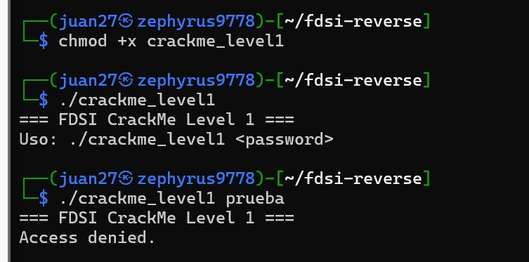
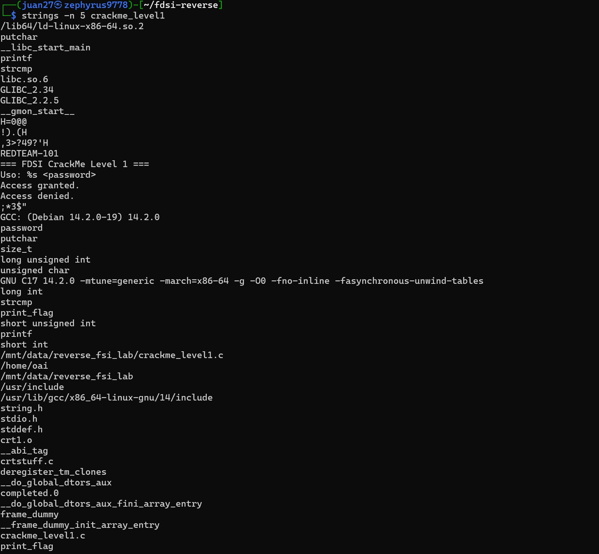
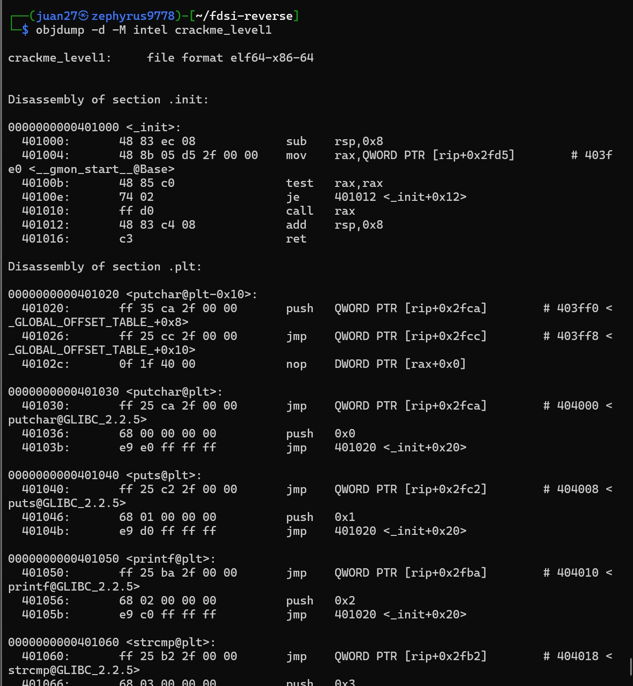
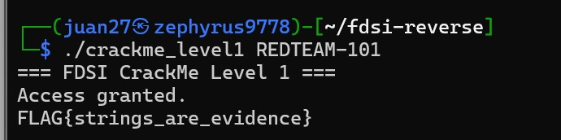

# Level 1 — Recon: "Strings are evidence"

**Binario:** `crackme_level1` (SHA-256 `61e980fe…f88c68c`, verificado en [`baseline.txt`](baseline.txt))
**Herramientas:** ejecución directa, `strings`, `objdump`
**Resultado:** ✅ FLAG obtenida — `FLAG{strings_are_evidence}`

> Volver al análisis consolidado: [`reverse-analysis.md`](../../reverse-analysis.md)

---

## Metodología

La guía pide **ejecutar primero con datos falsos y después observar sin asumir**. El nivel se trabajó en ciclos de **observación → hipótesis → prueba**, en el mismo orden de las capturas:

| Paso | Captura | Acción | Pregunta que responde |
| :--- | :---: | :--- | :--- |
| 1 | `2.1` | Ejecutar sin argumentos y con una clave falsa | ¿Qué espera el programa y cómo responde al fallar? |
| 2 | `2.2` | `strings -n 5` | ¿Qué texto legible trae embebido el binario? |
| 3 | `2.3` | `objdump -d -M intel` | ¿Dónde y cómo se compara la clave? |
| 4 | — | Formular la hipótesis | ¿Cuál es la clave y qué pasa si coincide? |
| 5 | `2.4` | Ejecutar con la clave candidata | ¿Se confirma la hipótesis? |

---

## 1. Ejecución con datos falsos

```bash
chmod +x crackme_level1
./crackme_level1
./crackme_level1 prueba
```

*Captura 2.1*



**Salida:**

```text
$ ./crackme_level1
=== FDSI CrackMe Level 1 ===
Uso: ./crackme_level1 <password>

$ ./crackme_level1 prueba
=== FDSI CrackMe Level 1 ===
Access denied.
```

**Observaciones:**

- `chmod +x` es necesario porque los permisos de ejecución no siempre se conservan al descomprimir el `.zip`.
- **Sin argumentos**, el programa imprime un mensaje de uso: espera **exactamente un argumento** por línea de comandos, llamado `<password>`. No lee la clave desde el teclado (`stdin`), sino desde `argv[1]`.
- **Con una clave falsa** (`prueba`) responde `Access denied.` sin dar más detalles. No dice si falló la longitud, el formato o el contenido, así que tratando el programa como caja negra no se puede deducir nada sobre la clave.

**Conclusión del paso:** ya conocemos la **entrada** (`argv[1]`) y una de las **salidas** (`Access denied.`). Falta saber qué ocurre en medio.

---

## 2. Análisis estático con `strings`

```bash
strings -n 5 crackme_level1 | less
```

`strings` recorre el archivo byte a byte y muestra toda secuencia de caracteres imprimibles de al menos *n* bytes (aquí, 5). No entiende el formato ELF ni ejecuta nada: solo busca texto. Por eso es el primer paso de cualquier triaje de un binario.

*Captura 2.2*



**Cadenas relevantes encontradas**, agrupadas por categoría:

| Categoría | Cadenas | Qué revelan |
| :--- | :--- | :--- |
| **Funciones importadas de la libc** | `strcmp`, `printf`, `putchar`, `puts`, `__libc_start_main` | `strcmp` es la pista más fuerte: el programa **compara dos cadenas**. `putchar` también llama la atención: imprimir carácter por carácter sugiere que algún texto se **construye en tiempo de ejecución**. |
| **Mensajes de la interfaz** | `=== FDSI CrackMe Level 1 ===`, `Uso: %s <password>`, `Access granted.`, `Access denied.` | Los dos caminos del programa: éxito y fallo. `Access granted.` todavía no lo hemos visto en pantalla. |
| **Candidata a contraseña** | **`REDTEAM-101`** | Cadena aislada, sin espacios ni formato de mensaje, ubicada justo antes de los mensajes de la interfaz. No se imprimió en ninguna de las ejecuciones anteriores. |
| **Información de compilación** | `GCC: (Debian 14.2.0-19) 14.2.0`, `GNU C17 14.2.0 … -g -O0 -fno-inline` | Compilador, versión y opciones: `-g` (con depuración), `-O0` (sin optimizar). |
| **Rutas y nombres del código fuente** | `crackme_level1.c`, `/mnt/data/reverse_fsi_lab/…`, `string.h`, `stdio.h` | Nombre del archivo fuente y la ruta del equipo donde se compiló. |
| **Símbolos internos** | `print_flag`, `password`, `main` | Nombres de funciones y variables locales, porque el binario no está stripped y tiene DWARF. |
| **Fragmentos ilegibles** | `!).(H`, `,3>?49?'H` | Se explican en la sección 3.2. |

**Lo que NO aparece:** ninguna cadena con el formato `FLAG{…}`. La bandera **no está guardada en texto plano**.

**Primera sospecha:** `REDTEAM-101` es la única cadena que no es un mensaje, y el programa importa `strcmp`. Antes de probarla, se revisa el desensamblado para entender **cómo** se usa.

---

## 3. Desensamblado con `objdump`

```bash
objdump -d -M intel crackme_level1 | less
```

`objdump -d` traduce el código máquina de la sección `.text` a instrucciones en ensamblador. `-M intel` usa la sintaxis Intel (`destino, origen`), más legible que la sintaxis AT&T por defecto. Como el binario conserva símbolos, cada función aparece con su nombre (`<main>`, `<print_flag>`), así que basta con buscarlas dentro de `less` (`/main>`).

*Captura 2.3*



### 3.1 `main`: el punto de decisión

```asm
00000000004011d8 <main>:
  4011e0: mov    DWORD PTR [rbp-0x14],edi        ; argc
  4011e3: mov    QWORD PTR [rbp-0x20],rsi        ; argv
  4011e7: lea    rax,[rip+0xe16]                 ; 0x402004 -> "REDTEAM-101"
  4011ee: mov    QWORD PTR [rbp-0x8],rax         ; password = "REDTEAM-101"
  4011fc: call   puts@plt                        ; banner
  401201: cmp    DWORD PTR [rbp-0x14],0x2        ; ¿argc == 2?
  401205: je     40122c                          ;   sí -> validar
  ...                                            ;   no -> printf("Uso: ...") ; return 1
  40122c: mov    rax,QWORD PTR [rbp-0x20]
  401230: add    rax,0x8
  401234: mov    rax,QWORD PTR [rax]             ; rax = argv[1]
  401237: mov    rdx,QWORD PTR [rbp-0x8]         ; rdx = password
  40123b: mov    rsi,rdx                         ; 2.º argumento
  40123e: mov    rdi,rax                         ; 1.er argumento
  401241: call   strcmp@plt                      ; strcmp(argv[1], password)
  401246: test   eax,eax                         ; ¿resultado == 0?
  401248: jne    401265                          ;   distinto -> "Access denied." ; return 2
  40124a: ...    puts("Access granted.")
  401259: call   print_flag                      ; imprime la FLAG
  40125e: mov    eax,0x0                         ; return 0
```

**Cómo se lee:**

- En la convención de llamadas System V de x86-64, los dos primeros argumentos de una función van en `rdi` y `rsi`. Justo antes de `call strcmp` se carga `rdi = argv[1]` (lo que escribe el usuario) y `rsi = password`.
- `password` se inicializa con la dirección `0x402004`. Esa dirección cae en `.rodata`, la sección de constantes. Se comprueba qué hay ahí con un volcado de esa sección:

  ```text
  $ objdump -s -j .rodata crackme_level1
   402000 01000200 52454454 45414d2d 31303100  ....REDTEAM-101.
  ```

  Los bytes `52 45 44 54 45 41 4d 2d 31 30 31 00` son `REDTEAM-101` en ASCII, con el terminador nulo `00` de C. **La cadena vista con `strings` es exactamente la que se pasa a `strcmp`.**
- `strcmp` devuelve 0 cuando las cadenas son iguales. `test eax,eax` + `jne` es la **condición que decide todo el programa**: un único salto condicional separa `Access denied.` de la FLAG.
- Los valores de retorno también quedan claros: **1** si falta el argumento, **2** si la clave es incorrecta y **0** si es correcta.

**Pseudocódigo reconstruido (propio):**

```c
int main(int argc, char **argv) {
    char *password = "REDTEAM-101";        // embebida en .rodata
    puts("=== FDSI CrackMe Level 1 ===");
    if (argc != 2) {
        printf("Uso: %s <password>\n", argv[0]);
        return 1;
    }
    if (strcmp(argv[1], password) == 0) {   // comparación directa, en claro
        puts("Access granted.");
        print_flag();
        return 0;
    }
    puts("Access denied.");
    return 2;
}
```

### 3.2 `print_flag`: por qué la FLAG no salía en `strings`

```asm
0000000000401156 <print_flag>:
  40115e: movabs rax,0x282e29211d1b161c          ; bytes cifrados, como inmediatos
  401168: movabs rdx,0x3f283b05293d3433
  ...                                             ; se copian a la pila (26 bytes)
  401196: mov    BYTE PTR [rbp-0x9],0x5a          ; clave XOR = 0x5a
  ...
  4011af: movzx  eax,BYTE PTR [rax]               ; byte i cifrado
  4011b2: xor    al,BYTE PTR [rbp-0x9]            ; byte ^ 0x5a
  4011ba: call   putchar@plt                      ; imprime 1 carácter
  4011bf: add    QWORD PTR [rbp-0x8],0x1          ; i++
  4011c4: cmp    QWORD PTR [rbp-0x8],0x19         ; mientras i <= 25
  4011c9: jbe    4011a4
```

La bandera está **ofuscada con XOR de un solo byte (`0x5a`)**:

- Los 26 bytes cifrados no están en `.rodata`, sino **incrustados como valores inmediatos dentro de las propias instrucciones** (`movabs`). Por eso `strings` no muestra `FLAG{`.
- Un bucle recorre los 26 bytes (`i = 0 … 0x19`), aplica `^ 0x5a` a cada uno y lo imprime con `putchar`. Eso explica por qué el programa importa `putchar`.
- Comprobación del primer carácter: `0x1c ^ 0x5a = 0x46` = `'F'`.

**Los fragmentos ilegibles de `strings` ya tienen explicación:** `!).(H` corresponde a los bytes `21 29 2e 28` de la constante `0x282e29211d1b161c` (en little endian), seguidos de `0x48` (`'H'`), que es el prefijo `REX.W` de la siguiente instrucción `movabs`. `strings` estaba mostrando, sin saberlo, **trozos de la bandera cifrada mezclados con código máquina**.

**Pseudocódigo reconstruido:**

```c
void print_flag(void) {
    unsigned char enc[26] = { 0x1c, 0x16, 0x1b, 0x1d, 0x21, ... };  // cifrado
    unsigned char key = 0x5a;
    for (size_t i = 0; i <= 25; i++)
        putchar(enc[i] ^ key);
    putchar('\n');
}
```

**Observación crítica:** como la clave XOR y los datos cifrados están **dentro del mismo binario**, la FLAG también se podría recuperar **sin ejecutarlo**, aplicando `^ 0x5a` a los bytes del desensamblado. Ofuscar no es cifrar: si la clave viaja con el dato, la protección es solo una molestia.

---

## 4. Hipótesis

> **H-L1.** El programa compara `argv[1]` con la cadena embebida `REDTEAM-101` usando `strcmp`. Si son iguales, imprime `Access granted.` y llama a `print_flag`, que descifra la bandera (XOR `0x5a`) y la imprime carácter a carácter.

En qué se apoya:

| Evidencia | Fuente |
| :--- | :--- |
| `strcmp` es la única función de comparación importada | `strings` (2.2) |
| `REDTEAM-101` es la única cadena de `.rodata` que no es un mensaje | `strings` (2.2) |
| La variable local se llama `password` | `strings` (2.2), gracias al DWARF |
| `password` apunta a `0x402004` = `"REDTEAM-101"` y se pasa como 2.º argumento de `strcmp` | `objdump` (2.3) |
| Si `strcmp` devuelve 0, se llama a `print_flag` | `objdump` (2.3) |

---

## 5. Confirmación por ejecución

```bash
./crackme_level1 REDTEAM-101
```

*Captura 2.4*



```text
=== FDSI CrackMe Level 1 ===
Access granted.
FLAG{strings_are_evidence}
```

**H-L1 confirmada.** El programa acepta la clave e imprime la FLAG del nivel 1:

```text
FLAG{strings_are_evidence}
```

Se obtuvo **sin consultar el código fuente** y sin modificar el binario. El análisis estático predijo el resultado (mensaje, llamada a `print_flag` y bandera impresa) antes de ejecutar el programa con la clave.

---

## 6. ¿Por qué `strings` puede revelar secretos embebidos?

1. **Un literal de C se copia tal cual al binario.** Cuando el código contiene `char *password = "REDTEAM-101";`, el compilador guarda esos bytes ASCII, terminados en `\0`, en la sección `.rodata`. Compilar **no cifra ni oculta** nada: traduce instrucciones a código máquina, pero los datos constantes viajan intactos.
2. **`strings` no necesita entender el programa.** Solo busca secuencias imprimibles, así que no lo frenan ni la arquitectura ni el formato ni la falta de símbolos. Funcionaría igual sobre un binario stripped.
3. **El binario es público para quien lo tiene.** Todo lo que el programa necesita para validar una clave tiene que estar dentro del ejecutable o ser accesible desde él. Si la comparación es directa contra un valor fijo, ese valor está en el archivo que se entrega a cada usuario.
4. **No solo se filtran contraseñas.** En este mismo binario `strings` también reveló la versión del compilador y sus opciones, el nombre del archivo fuente, la ruta del equipo donde se compiló y los nombres de funciones y variables internas. En un caso real eso equivale a **fingerprinting** del entorno de desarrollo: el mismo tipo de fuga que el banner `nginx/1.30.4` en el Laboratorio 3 (hipótesis H2), pero en un binario.

---

## 7. Lección de desarrollo seguro

| Problema observado | Por qué es inseguro | Control recomendado |
| :--- | :--- | :--- |
| Contraseña compilada como literal (`REDTEAM-101`) | Cualquiera con el binario la extrae en segundos con `strings`. Además es **la misma para todos los usuarios** y no se puede cambiar sin recompilar y redistribuir. | No validar secretos en el cliente. Si hace falta verificar localmente, comparar contra un **hash con sal y función lenta** (bcrypt, Argon2), nunca contra el valor en claro. Lo ideal es validar en un servidor que el usuario no controle. |
| Comparación con `strcmp` | Una sola condición (`test eax,eax` / `jne`) decide el acceso. Basta con parchear ese salto para saltarse la validación. Además, `strcmp` se detiene en el primer byte distinto, lo que en otros contextos permite ataques de *timing*. | Lógica de autorización del lado del servidor; comparaciones en **tiempo constante** cuando se comparan secretos. |
| FLAG "protegida" con XOR de un byte | La clave (`0x5a`) está en el mismo binario. Es ofuscación, no cifrado. | Si un dato es sensible, **no debe estar en el binario**. Si tiene que estarlo, la clave no puede viajar con él. |
| Binario con `-g`, sin strip y con rutas de compilación | Entrega nombres de funciones, variables, archivo fuente y rutas del equipo de compilación. | Hacer *strip* en los artefactos de release, separar los símbolos de depuración y usar `-ffile-prefix-map` para no filtrar rutas. **Ninguno de estos pasos sustituye a no embeber secretos.** |
| Secretos en el código fuente | Si un secreto está en el binario, también está en el repositorio. | Escáneres de secretos en el pipeline (gitleaks, trufflehog) y gestores de secretos (variables de entorno, Vault). Esto conecta con el Laboratorio 5 (DevSecOps). |

**Idea central:** todo lo que se compila dentro de un programa debe considerarse **público** para quien tenga el ejecutable. La seguridad no puede depender de que el atacante no mire.

---

## ✅ Checklist del nivel (guía, sección 2)

- [x] Identifiqué mensajes relevantes del binario: banner, uso, `Access granted.` / `Access denied.` (secciones 1 y 2).
- [x] Localicé una cadena que parece relacionada con autenticación/validación: `REDTEAM-101`, pasada a `strcmp` (secciones 2 y 3).
- [x] Probé mi hipótesis ejecutando el binario: `./crackme_level1 REDTEAM-101` (sección 5).
- [x] Obtuve la FLAG del Nivel 1 sin consultar el código fuente: `FLAG{strings_are_evidence}`.
- [x] Documenté por qué `strings` puede revelar secretos embebidos (sección 6).

## Evidencias

| Captura | Comando | Resultado | Sección |
| :--- | :--- | :--- | :---: |
| [`2.1`](screenshots/2.1.jpeg) | `chmod +x crackme_level1`, `./crackme_level1`, `./crackme_level1 prueba` | Mensaje de uso y `Access denied.` | 1 |
| [`2.2`](screenshots/2.2.jpeg) | `strings -n 5 crackme_level1 \| less` | `strcmp`, mensajes y `REDTEAM-101` | 2 |
| [`2.3`](screenshots/2.3.jpeg) | `objdump -d -M intel crackme_level1 \| less` | `strcmp(argv[1], password)` en `main` | 3 |
| [`2.4`](screenshots/2.4.jpeg) | `./crackme_level1 REDTEAM-101` | `Access granted.` + `FLAG{strings_are_evidence}` | 5 |
