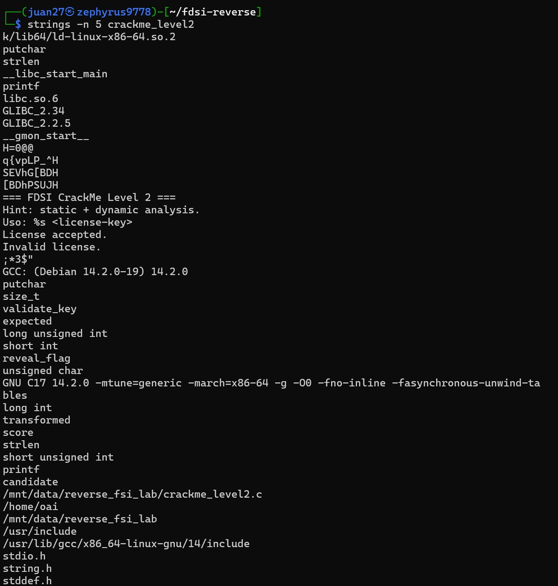
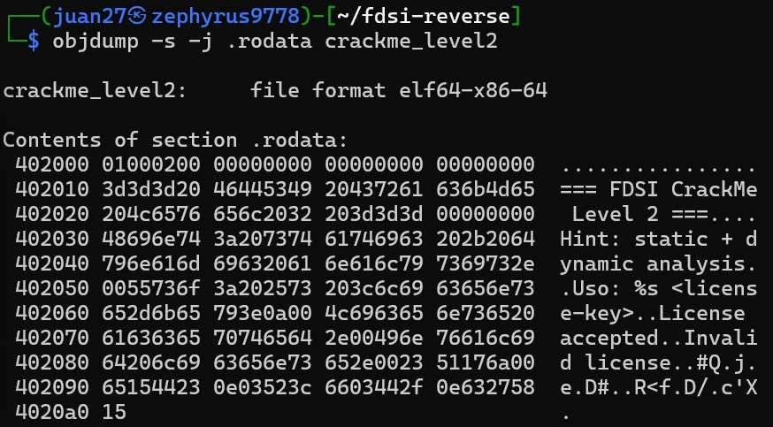
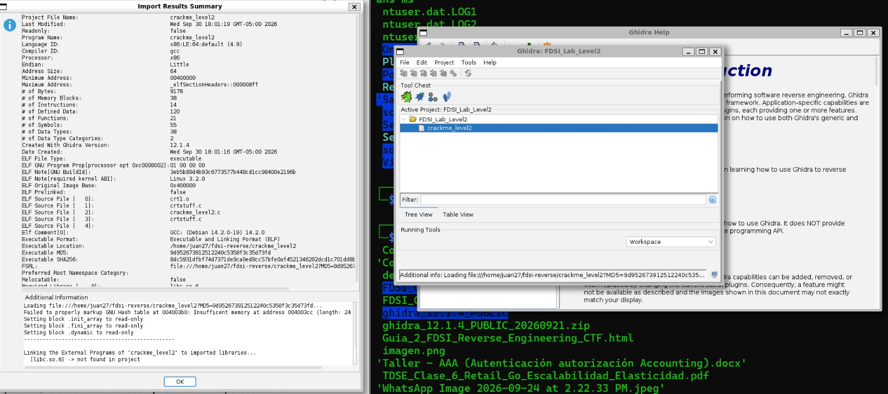
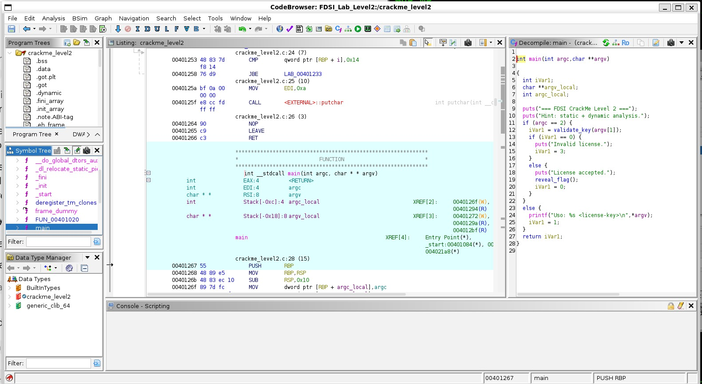
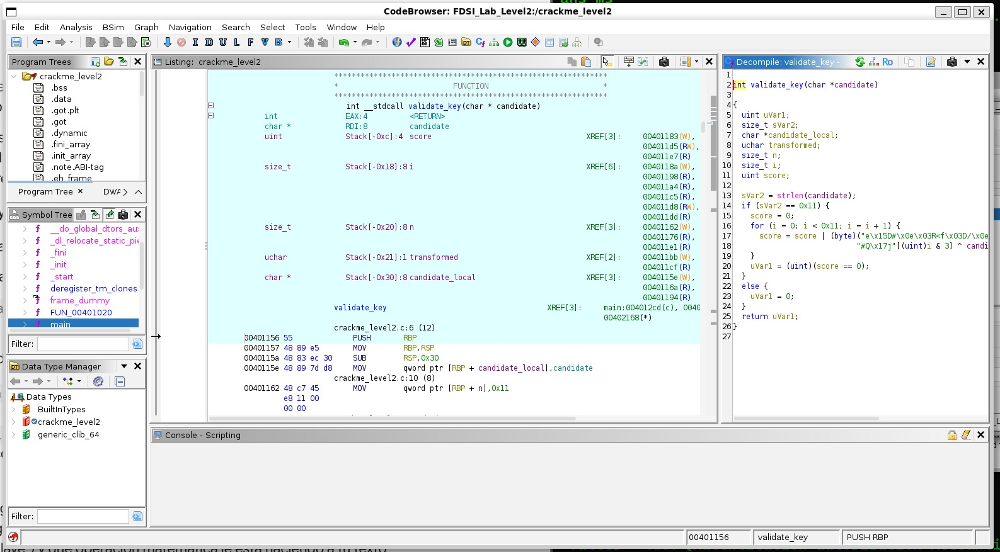
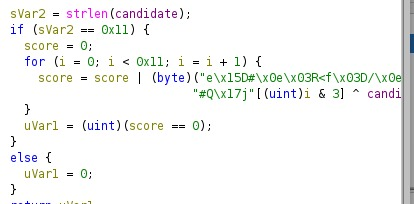
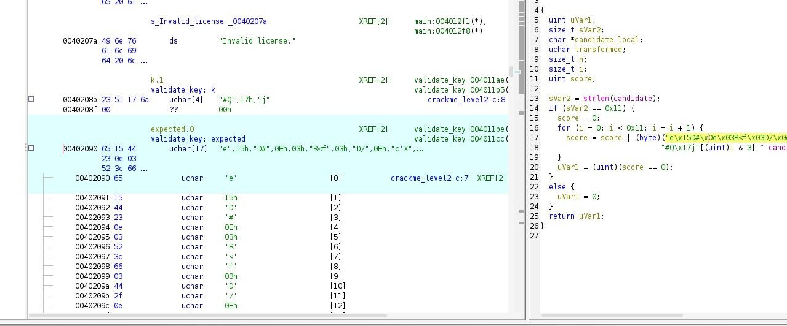
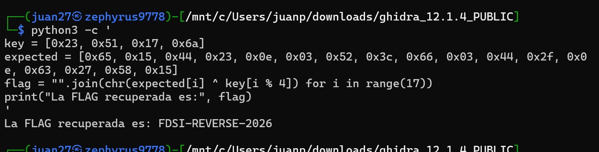
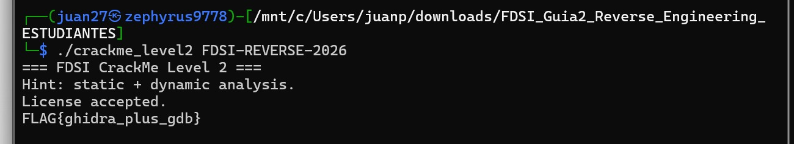

# Level 2 — Ghidra: reconstruir la validación

**Binario:** `crackme_level2` (SHA-256 `8dc5931d…b6f4e5`, verificado en [`baseline.txt`](baseline.txt) y en el resumen de importación de Ghidra)
**Herramientas:** `strings`, `objdump`, **Ghidra 12.1.4**, Python 3
**Resultado:** ✅ Clave `FDSI-REVERSE-2026` → FLAG `FLAG{ghidra_plus_gdb}`

> Volver al análisis consolidado: [`reverse-analysis.md`](../../reverse-analysis.md)

---

## Metodología

En el nivel 1 la clave aparecía en claro con `strings`. Aquí la guía advierte que eso ya no funciona: hay que **reconstruir el algoritmo** de validación. El trabajo siguió el mismo ciclo de observación → hipótesis → prueba:

| Paso | Capturas | Acción | Pregunta que responde |
| :--- | :---: | :--- | :--- |
| 1 | `3.1`, `3.2` | Triaje con `strings` y `objdump -s -j .rodata` | ¿La técnica del nivel 1 sigue sirviendo? |
| 2 | `3.3` | Importar el binario en Ghidra | ¿Qué reconoce Ghidra del archivo? |
| 3 | `3.4` | Decompilar `main` | ¿Qué función decide si la licencia es válida? |
| 4 | `3.5`, `3.6` | Decompilar `validate_key` | ¿Qué longitud y qué transformación exige? |
| 5 | `3.7` | Localizar los datos en `.rodata` | ¿Cuáles son los valores que se comparan? |
| 6 | `3.8` | Invertir el algoritmo con Python | ¿Cuál es la clave correcta? |
| 7 | `3.9` | Ejecutar el binario con la clave | ¿Se confirma la hipótesis? |

---

## 1. Triaje: `strings` ya no basta

### 1.1 `strings`

```bash
strings -n 5 crackme_level2
```

*Captura 3.1*



| Observación | Comparación con el nivel 1 |
| :--- | :--- |
| Mensajes: `License accepted.`, `Invalid license.`, `Uso: %s <license-key>` | Mismo esquema de éxito / fallo |
| **Pista del docente:** `Hint: static + dynamic analysis.` | Anuncia que hará falta combinar Ghidra y GDB |
| Importaciones: `strlen`, `printf`, `putchar` | **Ya no aparece `strcmp`**: no hay comparación directa de cadenas. `strlen` sugiere que se comprueba la longitud |
| Símbolos: `validate_key`, `reveal_flag`, `expected`, `transformed`, `score`, `candidate` | El DWARF sigue presente: anticipa los nombres que veremos en Ghidra |
| Fragmentos ilegibles: `q{vpLP_^H`, `SEVhG[BDH` | Igual que en el nivel 1: trozos de datos cifrados incrustados en instrucciones (ver §7) |
| **Ninguna cadena con aspecto de clave** | A diferencia de `REDTEAM-101` en el nivel 1 |

### 1.2 Sección `.rodata`

```bash
objdump -s -j .rodata crackme_level2
```

*Captura 3.2*



Después de los mensajes, a partir de `0x40208b`, aparecen **21 bytes que no forman texto**:

```text
 402080 64206c69 63656e73 652e0023 51176a00  d license..#Q.j.
 402090 65154423 0e03523c 6603442f 0e632758  e.D#..R<f.D/.c'X
 4020a0 15                                   .
```

**Hipótesis inicial:** la clave no se guarda en claro; lo que hay en `.rodata` son datos **transformados** contra los que se compara la entrada. Para saber qué transformación se aplica hay que leer el código, y para eso sirve Ghidra.

---

## 2. Importación en Ghidra

Proyecto **Non-Shared** `FDSI_Lab_Level2`, importación de `crackme_level2` y análisis automático aceptado.

*Captura 3.3*



**Datos relevantes del resumen de importación:**

| Campo | Valor | Interpretación |
| :--- | :--- | :--- |
| Language ID | `x86:LE:64:default` | x86-64, little endian: coincide con `file` y `readelf` |
| Compiler ID | `gcc` | Coincide con la cadena `GCC: (Debian 14.2.0-19)` |
| ELF Original Image Base | `0x400000` | Base fija: confirma que **no es PIE** (las direcciones de Ghidra serán las mismas en GDB) |
| ELF Source File [2] | `crackme_level2.c` | El nombre del fuente se filtra desde el DWARF |
| # of Functions / Symbols | `21` / `55` | Binario pequeño, con símbolos |
| Executable SHA256 | `8dc5931d…` | **Mismo hash que el de la guía**: Ghidra analiza el binario original |

**Avisos de la importación (no afectan al análisis):**

- `Failed to properly markup GNU Hash table…`: Ghidra no pudo anotar del todo una tabla interna del cargador dinámico. Es un aviso cosmético, frecuente en binarios ELF modernos.
- `[libc.so.6] -> not found in project`: la libc no se importó al proyecto. Las llamadas a `strlen`, `puts` o `printf` se ven igual como `<EXTERNAL>`; solo no se puede navegar dentro de ellas, cosa que no hace falta.

---

## 3. `main`: localizar la función de validación

En el **Symbol Tree** → `Functions` → `main`, el panel *Decompile* muestra:

*Captura 3.4*



```c
int main(int argc, char **argv)
{
  int iVar1;

  puts("=== FDSI CrackMe Level 2 ===");
  puts("Hint: static + dynamic analysis.");
  if (argc == 2) {
    iVar1 = validate_key(argv[1]);
    if (iVar1 == 0) {
      puts("Invalid license.");
      iVar1 = 3;
    }
    else {
      puts("License accepted.");
      reveal_flag();
      iVar1 = 0;
    }
  }
  else {
    printf("Uso: %s <license-key>\n", *argv);
    iVar1 = 1;
  }
  return iVar1;
}
```

**Lectura:**

- La clave entra por `argv[1]`, igual que en el nivel 1.
- **Toda la decisión depende de `validate_key(argv[1])`**: si devuelve 0, la licencia es inválida (código de salida 3); si devuelve otro valor, se llama a `reveal_flag()` (código 0).
- `main` no contiene ninguna lógica de comparación. Está delegada a `validate_key`, lo que confirma la hipótesis **H-R1** del baseline: la validación está aislada en una función con nombre descriptivo.

---

## 4. `validate_key`: longitud y transformación

Doble clic sobre `validate_key` en el decompilador de `main`.

*Captura 3.5*



*Captura 3.6 (detalle de la transformación)*



```c
int validate_key(char *candidate)
{
  uint uVar1;
  size_t sVar2;
  ...
  sVar2 = strlen(candidate);
  if (sVar2 == 0x11) {
    score = 0;
    for (i = 0; i < 0x11; i = i + 1) {
      score = score | (byte)("e\x15D#\x0e\x03R<f\x03D/\x0e..."[i] ^
                             "#Q\x17j"[(uint)i & 3] ^ candidate[i]);
    }
    uVar1 = (uint)(score == 0);
  }
  else {
    uVar1 = 0;
  }
  return uVar1;
}
```

> Ghidra muestra los arreglos `expected` y `k` como literales de cadena (`"e\x15D#…"`, `"#Q\x17j"`) porque son bytes constantes. No son textos: son los mismos 21 bytes vistos en `.rodata` (§1.2).

### 4.1 Longitud esperada de la clave

```c
sVar2 = strlen(candidate);
if (sVar2 == 0x11) { ... } else { uVar1 = 0; }
```

**`0x11` = 17 caracteres.** Cualquier clave de otra longitud se rechaza de inmediato sin entrar al bucle. Por eso el binario importa `strlen`.

En ensamblador (`objdump -d -M intel crackme_level2`):

```asm
401162: mov    QWORD PTR [rbp-0x18],0x11    ; n = 17
401171: call   strlen@plt
401176: cmp    QWORD PTR [rbp-0x18],rax     ; ¿strlen(candidate) == 17?
40117a: je     401183                       ;   sí -> bucle
40117c: mov    eax,0x0                      ;   no -> return 0
```

### 4.2 Transformación aplicada a cada byte

Por cada posición `i` de 0 a 16:

```text
transformed = candidate[i] XOR k[i & 3]
diferencia  = transformed  XOR expected[i]
score       = score OR diferencia
```

| Elemento | Qué es |
| :--- | :--- |
| `candidate[i]` | Carácter `i` de la clave introducida |
| `k[i & 3]` | Clave XOR de **4 bytes** reutilizada de forma **cíclica**. `i & 3` equivale a `i % 4` (índices 0, 1, 2, 3, 0, 1…). Es la "pequeña tabla que se reutiliza cíclicamente" de la pista 1 de la guía |
| `^` (XOR) | La **operación reversible byte a byte** de la pista 2 |
| `expected[i]` | Valor que debe producir la transformación |
| `score \|= …` | Acumula cualquier diferencia. Si **todos** los bytes coinciden, `score` queda en 0 |
| `return score == 0` | Devuelve 1 (válida) solo si no hubo ninguna diferencia |

En ensamblador, el núcleo del bucle es:

```asm
40119f: movzx  eax,BYTE PTR [rax]           ; eax = candidate[i]
4011a8: and    eax,0x3                      ; i & 3
4011ae: lea    rax,[rip+0xed6]              ; 0x40208b <k.1>
4011b5: movzx  eax,BYTE PTR [rdx+rax*1]     ; k[i & 3]
4011b9: xor    eax,ecx                      ; transformed = candidate[i] ^ k[i&3]
4011be: lea    rdx,[rip+0xecb]              ; 0x402090 <expected.0>
4011cf: xor    al,BYTE PTR [rbp-0x19]       ; expected[i] ^ transformed
4011d5: or     DWORD PTR [rbp-0x4],eax      ; score |= diferencia
4011e7: cmp    DWORD PTR [rbp-0x4],0x0
4011eb: sete   al                           ; return score == 0
```

**Detalle de diseño interesante:** la función **no sale del bucle en el primer byte incorrecto**, como haría `strcmp`. Recorre siempre los 17 bytes y acumula las diferencias con `OR`. Es una comparación en **tiempo constante**: el tiempo de ejecución no revela cuántos caracteres iniciales son correctos, lo que evita ataques de *timing*. Es una mejora real respecto al nivel 1, aunque no resuelve el problema de fondo (§8).

---

## 5. Los datos: `k` y `expected` en `.rodata`

Doble clic sobre los literales en el decompilador lleva a su definición en el *Listing*:

*Captura 3.7*



| Símbolo | Dirección | Tipo | Bytes |
| :--- | :--- | :--- | :--- |
| `validate_key::k` | `0x40208b` | `uchar[4]` | `23 51 17 6a` |
| `validate_key::expected` | `0x402090` | `uchar[17]` | `65 15 44 23 0e 03 52 3c 66 03 44 2f 0e 63 27 58 15` |

Las referencias cruzadas (`XREF`) de ambos símbolos apuntan a `validate_key` (`0x4011ae` / `0x4011b5` para `k`, `0x4011be` / `0x4011cc` para `expected`), lo que confirma que son los datos que usa la validación. Son exactamente los bytes "ilegibles" que se vieron en la captura 3.2.

---

## 6. Reconstrucción de la clave

### 6.1 Inversión del algoritmo

La condición de éxito es que, para cada `i`:

```text
candidate[i] ^ k[i % 4] == expected[i]
```

XOR es **su propia inversa** (`a ^ b ^ b = a`). Aplicando `^ k[i % 4]` a ambos lados:

```text
candidate[i] = expected[i] ^ k[i % 4]
```

No hace falta fuerza bruta: la clave se obtiene directamente de los datos del binario.

### 6.2 Pseudocódigo propio

```c
// Reconstrucción propia de validate_key (crackme_level2)
#define KEY_LEN 17

static const uint8_t K[4]              = { 0x23, 0x51, 0x17, 0x6a };
static const uint8_t EXPECTED[KEY_LEN] = { 0x65, 0x15, 0x44, 0x23, 0x0e, 0x03,
                                           0x52, 0x3c, 0x66, 0x03, 0x44, 0x2f,
                                           0x0e, 0x63, 0x27, 0x58, 0x15 };

bool is_valid_license(const char *key) {
    if (strlen(key) != KEY_LEN)              // 1. longitud exacta: 17
        return false;

    uint32_t diff = 0;
    for (size_t i = 0; i < KEY_LEN; i++) {
        uint8_t t = key[i] ^ K[i % 4];       // 2. XOR con clave cíclica de 4 bytes
        diff |= t ^ EXPECTED[i];             // 3. acumula diferencias (sin salir antes)
    }
    return diff == 0;                        // 4. válida solo si nada difiere
}
```

### 6.3 Script de recuperación

*Captura 3.8*



```python
key = [0x23, 0x51, 0x17, 0x6a]
expected = [0x65, 0x15, 0x44, 0x23, 0x0e, 0x03, 0x52, 0x3c, 0x66,
            0x03, 0x44, 0x2f, 0x0e, 0x63, 0x27, 0x58, 0x15]
flag = "".join(chr(expected[i] ^ key[i % 4]) for i in range(17))
print("La FLAG recuperada es:", flag)
```

```text
La FLAG recuperada es: FDSI-REVERSE-2026
```

> En el script la variable se llama `flag`, pero el resultado es la **clave de licencia**, no la FLAG. La FLAG la imprime el propio binario al aceptar la clave (§7).

**Comprobación byte a byte:**

| i | `expected[i]` | `i % 4` | `k[i % 4]` | XOR | Carácter |
| :---: | :---: | :---: | :---: | :---: | :---: |
| 0 | `0x65` | 0 | `0x23` | `0x46` | `F` |
| 1 | `0x15` | 1 | `0x51` | `0x44` | `D` |
| 2 | `0x44` | 2 | `0x17` | `0x53` | `S` |
| 3 | `0x23` | 3 | `0x6a` | `0x49` | `I` |
| 4 | `0x0e` | 0 | `0x23` | `0x2d` | `-` |
| 5 | `0x03` | 1 | `0x51` | `0x52` | `R` |
| 6 | `0x52` | 2 | `0x17` | `0x45` | `E` |
| 7 | `0x3c` | 3 | `0x6a` | `0x56` | `V` |
| 8 | `0x66` | 0 | `0x23` | `0x45` | `E` |
| 9 | `0x03` | 1 | `0x51` | `0x52` | `R` |
| 10 | `0x44` | 2 | `0x17` | `0x53` | `S` |
| 11 | `0x2f` | 3 | `0x6a` | `0x45` | `E` |
| 12 | `0x0e` | 0 | `0x23` | `0x2d` | `-` |
| 13 | `0x63` | 1 | `0x51` | `0x32` | `2` |
| 14 | `0x27` | 2 | `0x17` | `0x30` | `0` |
| 15 | `0x58` | 3 | `0x6a` | `0x32` | `2` |
| 16 | `0x15` | 0 | `0x23` | `0x36` | `6` |

**Clave reconstruida: `FDSI-REVERSE-2026`** (17 caracteres, cumple la condición de longitud).

---

## 7. Confirmación por ejecución

```bash
./crackme_level2 FDSI-REVERSE-2026
```

*Captura 3.9*



```text
=== FDSI CrackMe Level 2 ===
Hint: static + dynamic analysis.
License accepted.
FLAG{ghidra_plus_gdb}
```

**Hipótesis confirmada.** El binario acepta la clave e imprime la FLAG del nivel 2:

```text
FLAG{ghidra_plus_gdb}
```

**Sobre `reveal_flag`:** sigue el mismo patrón que `print_flag` en el nivel 1, pero con otra clave: 21 bytes incrustados como inmediatos (`movabs`) y descifrados con **XOR `0x37`** antes de imprimirse con `putchar`. Por eso `strings` mostraba fragmentos como `q{vpLP_^H`: `0x71 ^ 0x37 = 'F'`, `0x7b ^ 0x37 = 'L'`…

> La confirmación **dinámica** del comportamiento interno (detener la ejecución en `validate_key`, observar registros y comparar una clave fallida con la válida) se documenta en [`gdb.md`](gdb.md), como pide la sección 4 de la guía.

---

## 8. Lección de desarrollo seguro

| Mejora respecto al nivel 1 | Por qué no basta |
| :--- | :--- |
| La clave ya no está en claro: `strings` no la revela | Se guarda la clave **transformada** junto con la transformación (`k`). Quien tenga el binario tiene todo lo necesario para invertirla |
| Se valida la longitud antes de comparar | La longitud esperada (`0x11`) también está en el código: reduce el espacio de búsqueda en vez de protegerlo |
| Comparación en tiempo constante (`score \|= …`) | Protege contra *timing*, pero no contra el análisis estático: el atacante no necesita adivinar, puede leer |
| XOR con clave de 4 bytes | XOR con clave conocida es **ofuscación reversible**, no cifrado. Se invierte con una línea de Python |

**Idea central:** si el programa puede comprobar la clave sin ayuda externa, el programa **contiene la respuesta**. Cambiar el formato de la respuesta (texto → XOR) solo aumenta el tiempo de análisis: de segundos con `strings` a minutos con Ghidra.

**Controles que sí cambian el resultado:**

1. **Validar en el servidor.** La clave se envía a un servicio que el usuario no controla; el binario nunca conoce el valor correcto.
2. **Si la validación debe ser local, usar funciones de un solo sentido.** Comparar `hash(clave)` con un hash almacenado (Argon2, bcrypt, PBKDF2 con sal). Conocer el hash no permite reconstruir la clave, a diferencia de un XOR.
3. **Licencias firmadas.** Para licencias de software, el estándar es una firma digital (Ed25519, RSA): el binario solo contiene la **clave pública**, que sirve para verificar pero no para generar licencias válidas.
4. **No confiar en el strip ni en la ofuscación como control principal.** Retrasan el análisis, como veremos en el Boss Level, pero no lo impiden.

---

## ✅ Checklist del nivel (guía, sección 3)

- [x] Localicé la función de validación desde `main`: `validate_key(argv[1])` (§3, captura 3.4).
- [x] Identifiqué la longitud esperada de la clave: `strlen(candidate) == 0x11` → 17 caracteres (§4.1, captura 3.5).
- [x] Identifiqué la transformación aplicada a cada byte: `candidate[i] ^ k[i & 3]`, comparada contra `expected[i]` (§4.2, captura 3.6).
- [x] Reconstruí la clave correcta y obtuve la FLAG: `FDSI-REVERSE-2026` → `FLAG{ghidra_plus_gdb}` (§6–7, capturas 3.7–3.9).
- [ ] Guardé captura del decompilador con mis anotaciones/renombres → ver nota.

> **Nota sobre los renombres.** Los nombres que aparecen en las capturas 3.4–3.6 (`candidate`, `score`, `transformed`, `i`, `n`) **no los puso el equipo**: Ghidra los toma del DWARF que trae el binario. Las variables que Ghidra no pudo nombrar siguen como `uVar1` y `sVar2`. Para cumplir este punto hay que renombrarlas a mano (tecla `L`), por ejemplo `uVar1 → is_valid` y `sVar2 → key_len`, añadir comentarios (tecla `;`) como `// longitud exacta: 17` y `// XOR con clave cíclica de 4 bytes`, y guardar una captura **3.10**.

## Evidencias

| Captura | Contenido | Sección |
| :--- | :--- | :---: |
| [`3.1`](screenshots/3.1.jpeg) | `strings -n 5 crackme_level2` | 1.1 |
| [`3.2`](screenshots/3.2.jpeg) | `objdump -s -j .rodata crackme_level2` | 1.2 |
| [`3.3`](screenshots/3.3.jpeg) | Ghidra: resumen de importación (Import Results Summary) | 2 |
| [`3.4`](screenshots/3.4.jpeg) | Ghidra: `main` decompilada | 3 |
| [`3.5`](screenshots/3.5.jpeg) | Ghidra: `validate_key` decompilada (longitud `0x11`) | 4.1 |
| [`3.6`](screenshots/3.6.jpeg) | Ghidra: detalle de la transformación XOR | 4.2 |
| [`3.7`](screenshots/3.7.jpeg) | Ghidra: arreglos `k` y `expected` en `.rodata` | 5 |
| [`3.8`](screenshots/3.8.jpeg) | Script Python → `FDSI-REVERSE-2026` | 6.3 |
| [`3.9`](screenshots/3.9.jpeg) | `./crackme_level2 FDSI-REVERSE-2026` → FLAG | 7 |
| *`3.10` (pendiente)* | Decompilador con renombres y comentarios propios | Checklist |
