# Laboratorio 3 — Parte II: Mejoras y Mitigaciones de Seguridad

**Asignatura:** FDSI — Secure Product Challenge
**Equipo E07:** Diego Fernando Chavarro Castillo · Juan Pablo Caballero Castellanos
**Rama:** `Mejoras` · **Base:** `main` en el tag `lab-3`
**Documento anterior:** [`README.md`](README.md) — Parte I (Fases A–F)

---

## 1. Propósito

La Parte I del laboratorio cerró con las cuatro hipótesis del modelo STRIDE en estado parcial o abierto. El hardening de la Fase E atendió la superficie más visible —banner de versión y cabeceras faltantes— pero dejó sin tratar la validación de entrada, la atribución de acciones, la correlación de trazas y varios recursos que seguían exponiendo información.

Esta segunda parte aplica un **ciclo completo de remediación verificable** sobre esa misma línea base: seis mejoras (M1–M6), cada una vinculada a una hipótesis concreta, con su cambio, su prueba y su evidencia.

### Por qué una rama separada

| Motivo | Explicación |
| :--- | :--- |
| Preservar la entrega evaluada | El tag `lab-3` sobre `main` debe seguir apuntando al estado exacto de la Parte I |
| Comparabilidad | `git diff main..Mejoras` documenta por sí mismo el alcance de la remediación |
| Trazabilidad | Un commit por mejora deja el historial alineado con la tabla hipótesis → corrección |

### Alcance declarado

| Dentro del alcance | Fuera del alcance (Laboratorio 4) |
| :--- | :--- |
| Reducción de datos expuestos en respuestas | TLS / HTTPS |
| Validación estricta de entrada | Autenticación verificada |
| Atribución técnica de acciones | Autorización por roles |
| Correlación de trazas entre capas | Gestión de sesiones |
| Cierre de superficie documental | Certificados y escenarios de Spoofing |
| Limitación de tasa y detección recalibrada | |

**Límite explícito:** esta rama no implementa cifrado ni identidad verificada. Ninguna hipótesis queda resuelta por completo — se maximiza lo alcanzable sin invadir el temario del Laboratorio 4.

---

## 2. Mapa de mitigaciones

| Mejora | Hipótesis STRIDE | Flujo DFD | Componente modificado | Estado resultante |
| :--- | :--- | :--- | :--- | :--- |
| **M1** | H1 Information Disclosure · H4 Tampering | F7, F8 | `main.py` | Mitigado |
| **M2** | H3 Repudiation | F7 | `main.py` | Mitigado parcialmente |
| **M3** | H3 Repudiation | F10 | `nginx.conf` + `main.py` | Mitigado |
| **M4** | H2 Information Disclosure | F9 | `nginx.conf` + `main.py` | Corregido |
| **M5** | H1 Information Disclosure | F9 | `public-inventory.txt` | Corregido |
| **M6** | Capacidad de detección | F10 | `nginx.conf` + regla `awk` | Mejorado |

---

## 3. Preparación del entorno

### 3.1 Creación de la rama y línea base

```bash
git checkout main && git pull
git checkout -b Mejoras
mkdir -p docs/Mejoras evidence/mejoras

sudo cp /etc/nginx/nginx.conf evidence/mejoras/nginx-antes.conf
cp main.py evidence/mejoras/main-antes.py
```

Desde **Kali (Red Team)**, captura del estado previo a cualquier cambio:

```bash
curl -i http://100.70.250.33/api/alerts           | tee M0-alerts.txt
curl -I http://100.70.250.33/docs                 | tee M0-docs.txt
curl -i http://100.70.250.33/public-inventory.txt | tee M0-inventory.txt
```

**Evidencia — Línea base antes de las mejoras:**

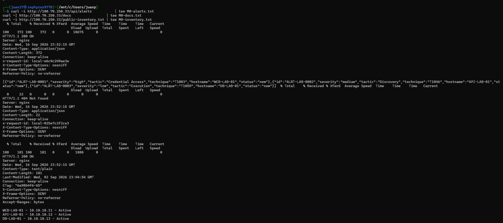

Esta captura es la referencia contra la que se compara todo lo demás. Muestra el estado del prototipo tal como quedó al cierre de la Parte I: el JSON de alertas con los nueve campos, Swagger accesible en `/docs` y el inventario público devolviendo las direcciones internas.

### 3.2 Servicio systemd para el backend

Durante la Parte I el backend se ejecutaba manualmente con `uvicorn`, lo que impedía disponer de `journalctl -u incident-hub` como fuente de telemetría y provocaba que el servicio muriera al cerrar la terminal o reiniciar el host. La mejora **M3** depende de ese log, por lo que se formalizó el servicio:

```bash
sudo tee /etc/systemd/system/incident-hub.service > /dev/null <<EOF
[Unit]
Description=CrowdStrike Incident Hub (LAB)
After=network.target

[Service]
User=$USER
WorkingDirectory=$HOME/Documentos/Laboratorio3_FDSI
ExecStart=$HOME/Documentos/Laboratorio3_FDSI/.venv/bin/uvicorn main:app --host 127.0.0.1 --port 8000
Restart=on-failure

[Install]
WantedBy=multi-user.target
EOF

sudo systemctl daemon-reload
sudo systemctl enable --now incident-hub
```

Esto convierte el backend en un componente reproducible y observable, cerrando además el pendiente de "Construcción reproducible" señalado en la Parte I.

---

## 4. M1 — Reducción de exposición y validación estricta

**Hipótesis:** H1 (Information Disclosure) · H4 (Tampering)
**Flujos DFD:** F7 (entrada de datos), F8 (respuesta de la API)

### Problema

Dos debilidades independientes en el mismo componente:

1. **Salida.** `GET /api/alerts` devolvía `agent_id`, `internal_ip` y `analyst_email` — identificador de sensor Falcon, topología interna y dato personal del analista. Detectado por OWASP ZAP en la Fase C.
2. **Entrada.** Los modelos Pydantic aceptaban cualquier cadena en cualquier campo y **descartaban en silencio** los campos no declarados. Un cliente podía enviar `severity: "<script>"` o inyectar campos adicionales sin recibir error alguno.

### Cambio aplicado

Separación entre el modelo interno y la proyección pública, más restricción del dominio de valores aceptados:

```python
class Severity(str, Enum):
    low = "low"; medium = "medium"; high = "high"; critical = "critical"

class AlertPublic(BaseModel):
    """Proyección pública — excluye los tres campos sensibles."""
    id: str
    severity: Severity
    tactic: str
    technique: str
    hostname: str
    status: AlertStatus

class Alert(BaseModel):
    model_config = ConfigDict(extra="forbid")   # rechaza campos no declarados
    id: str = Field(pattern=r"^ALRT-[A-Z0-9]+-\d{4}$")
    severity: Severity                           # enum cerrado
    technique: str = Field(pattern=r"^T\d{4}(\.\d{3})?$")   # formato MITRE ATT&CK
    hostname: str = Field(min_length=1, max_length=64)
    status: AlertStatus

@app.get("/api/alerts", response_model=List[AlertPublic])
def get_alerts(severity: Optional[Severity] = None):
    return ALERTS
```

Tres controles distintos operan aquí:

| Control | Efecto |
| :--- | :--- |
| `response_model=AlertPublic` | FastAPI filtra los campos sensibles al serializar, sin tocar la lógica interna |
| `extra="forbid"` | Rechaza con `422` cualquier campo no declarado — mitiga asignación masiva |
| `Field(pattern=...)` y enums | Restringe el dominio de valores aceptados en la entrada |

### Prueba de verificación

```bash
# Salida reducida
curl -s http://100.70.250.33/api/alerts | python3 -m json.tool

# Entrada con enum inválido y campo no declarado
curl -i -X POST http://100.70.250.33/api/alerts \
  -H 'Content-Type: application/json' \
  -d '{"id":"ALRT-LAB-0009","severity":"ultra","tactic":"T","technique":"T1059",
       "hostname":"X","agent_id":"aaaaaaaa-1","internal_ip":"10.0.0.1",
       "analyst_email":"a@lab.invalid","status":"new","campo_extra":"x"}'
```

**Resultado esperado:** seis campos por alerta en lugar de nueve; el `POST` responde `422 Unprocessable Entity` señalando tanto el valor fuera del enum como el campo no declarado.

### Evidencia

**Desde Kali (Red Team):**

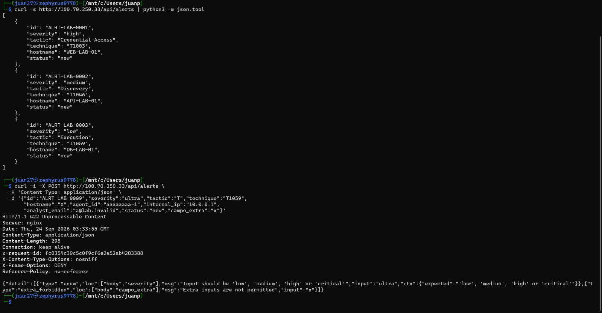

**Desde CachyOS (Blue Team):**

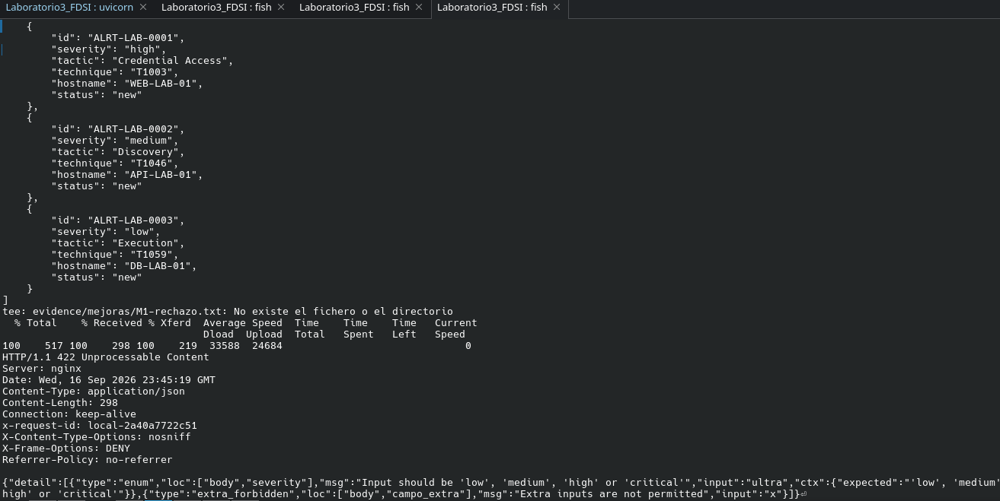

---

## 5. M2 — Atribución en el registro de acciones

**Hipótesis:** H3 (Repudiation)
**Flujo DFD:** F7

### Problema

El modelo `Action` de la Parte I registraba únicamente `alert_id`, `action_type` y `description`. **No existía ningún campo que vinculara la acción con quien la ejecutó.**

Un registro sin atribución es un registro cronológico, no un registro de auditoría: permite saber *qué* pasó y *cuándo*, nunca *quién* lo hizo. Esta era la demostración práctica de H3 en el prototipo, y quedó completamente abierta al cierre de la Parte I.

### Cambio aplicado

Se separan el modelo de entrada y el registro almacenado. El servidor añade metadata que el cliente no controla:

```python
class ActionIn(BaseModel):
    model_config = ConfigDict(extra="forbid")
    alert_id: str
    action_type: ActionType
    description: str = Field(max_length=500)
    actor: str = Field(min_length=1, max_length=64)   # autodeclarado

class ActionRecord(BaseModel):
    action_id: str        # servidor — UUID v4
    alert_id: str
    action_type: ActionType
    description: str
    actor: str            # lo que declaró el cliente
    actor_verified: bool  # SIEMPRE False hasta el Lab 4
    source_ip: str        # servidor — desde X-Real-IP
    request_id: str       # servidor — desde Nginx (ver M3)
    ts_utc: str           # servidor — reloj del host
```

Se añade además validación de integridad referencial: una acción sobre un `alert_id` inexistente devuelve `404` en lugar de almacenarse huérfana.

### Por qué es mitigación parcial y no resolución

| Campo | Lo asigna | Falsificable por el cliente |
| :--- | :--- | :--- |
| `action_id` | Servidor (UUID v4) | No |
| `source_ip` | Servidor (`X-Real-IP` de Nginx) | No |
| `request_id` | Servidor (Nginx) | No |
| `ts_utc` | Servidor (reloj del host) | No |
| `actor` | **Cliente** | **Sí** |

El campo `actor` se registra pero **no se verifica** — cualquiera puede declararse `analyst1`. Por eso `actor_verified` se almacena explícitamente como `false`: el propio registro documenta el límite de su confianza, en lugar de proyectar una trazabilidad que no tiene.

Lo que sí se consigue: aunque `actor` sea falso, la combinación `source_ip` + `ts_utc` + `request_id` permite reconstruir el origen técnico de cada acción y correlacionarla con el `access.log`. La verificación de identidad requiere autenticación, que corresponde al Laboratorio 4.

### Prueba de verificación

```bash
curl -i -X POST http://100.70.250.33/api/actions \
  -H 'Content-Type: application/json' \
  -d '{"alert_id":"ALRT-LAB-0001","action_type":"escalate",
       "description":"Escalado a nivel 2","actor":"analyst1"}'

curl -s http://100.70.250.33/api/actions | python3 -m json.tool
```

**Resultado esperado:** `201 Created` con `source_ip` mostrando la dirección Tailscale del Red Team, un `request_id` inyectado por Nginx, `ts_utc` en formato ISO 8601 UTC y `actor_verified: false`.

> La prueba se ejecuta **desde Kali**, no en local: así `source_ip` registra la IP real del Red Team (`100.98.207.45`) y no `127.0.0.1`, demostrando que el servidor captura el origen correcto.

### Evidencia

**Desde Kali (Red Team) — origen real registrado:**

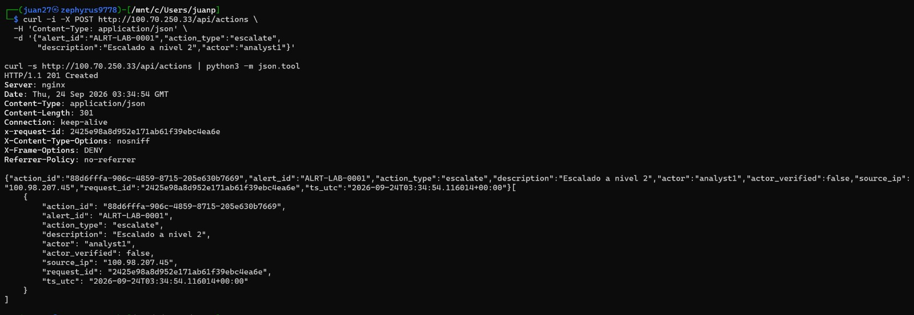

**Desde CachyOS (Blue Team) — verificación del registro almacenado:**

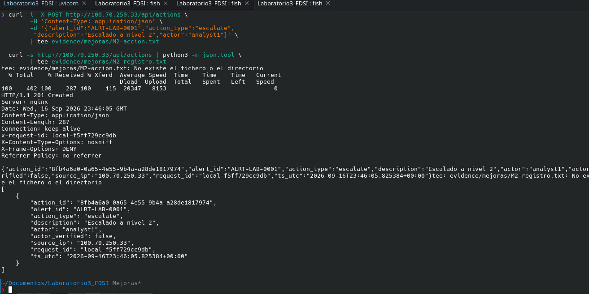

---

## 6. M3 — Correlación por `request_id`

**Hipótesis:** H3 (Repudiation)
**Flujo DFD:** F10

### Problema

Durante la Fase D, correlacionar una petición entre el `access.log` de Nginx y el comportamiento del backend exigía cotejar manualmente IP y marca de tiempo. Con peticiones concurrentes o en el mismo segundo —como las cuatro sondas de Nmap registradas todas a las 18:48:41— esa correlación se vuelve ambigua: no hay forma de saber qué entrada del log corresponde a qué evento del backend.

### Cambio aplicado

**En `/etc/nginx/nginx.conf`, bloque `http {}`:**

```nginx
log_format lab3 '$remote_addr - $remote_user [$time_iso8601] "$request" '
                '$status $body_bytes_sent "$http_user_agent" '
                'rid=$request_id rt=$request_time';

access_log /var/log/nginx/access.log lab3;
```

**En el bloque `location /api/`:**

```nginx
proxy_set_header X-Request-ID $request_id;
```

**En `main.py`, middleware que propaga el identificador:**

```python
@app.middleware("http")
async def request_id_middleware(request: Request, call_next):
    request_id = request.headers.get("X-Request-ID", f"local-{uuid.uuid4().hex[:12]}")
    request.state.request_id = request_id
    response = await call_next(request)
    response.headers["X-Request-ID"] = request_id
    logger.info("rid=%s src=%s method=%s path=%s status=%s", ...)
    return response
```

### Efecto

Un mismo identificador aparece ahora en cuatro lugares:

1. La cabecera `X-Request-ID` de la respuesta HTTP
2. El campo `rid=` del `access.log` de Nginx
3. El log de aplicación de FastAPI (`journalctl -u incident-hub`)
4. El campo `request_id` de cada acción almacenada (ver M2)

Tres fuentes independientes se convierten en una sola traza reconstruible. El cambio adicional de `$time_local` a `$time_iso8601` normaliza las marcas de tiempo a formato ISO con zona horaria explícita, eliminando la ambigüedad al correlacionar con los timestamps UTC que registra el Red Team.

### Prueba de verificación

Los tres comandos se ejecutan seguidos, sin peticiones intermedias, para que compartan el mismo identificador:

```bash
# Kali
curl -i http://100.70.250.33/api/alerts | grep -i x-request-id

# CachyOS
sudo tail -n 3 /var/log/nginx/access.log
sudo journalctl -u incident-hub -n 5 --no-pager
```

**Resultado esperado:** el mismo valor de `rid` visible en las tres salidas.

### Evidencia

**Desde Kali (Red Team) — cabecera de respuesta:**

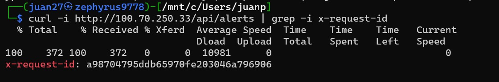

**Desde CachyOS (Blue Team) — `access.log` y log de aplicación:**

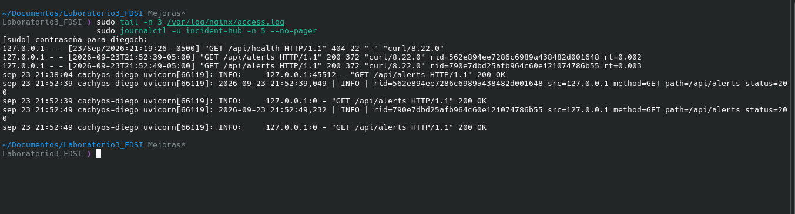

---

## 7. M4 — CSP y cierre de la superficie documental

**Hipótesis:** H2 (Information Disclosure)
**Flujo DFD:** F9

### Problema

Dos hallazgos de la Fase C que el hardening de la Fase E no atendió:

1. **La alerta ZAP #1 (Content Security Policy Header Not Set) quedó sin corregir.** Era la alerta de mayor riesgo reportada por ZAP (Medio / Confianza Alta), y sin embargo el hardening incorporó `X-Content-Type-Options`, `X-Frame-Options` y `Referrer-Policy` pero omitió CSP.
2. **Swagger UI estaba publicado sin autenticación en `/docs`,** con el enlace visible en el HTML de la página principal. Entregaba el contrato completo del API —endpoints, métodos aceptados, esquemas de datos y campos requeridos— sin que el atacante ejecutara una sola prueba.

### Cambio aplicado

**Cabecera CSP en `nginx.conf`:**

```nginx
add_header Content-Security-Policy "default-src 'none'; frame-ancestors 'none'; base-uri 'none'" always;
```

**Cierre de la documentación en `main.py`:**

```python
app = FastAPI(..., docs_url=None, redoc_url=None, openapi_url=None)
```

**Eliminación de los bloques correspondientes en Nginx** (`location /docs` y `location /openapi.json`) y retirada del enlace en el HTML.

### Nota técnica: la interacción entre ambos controles

Una política `default-src 'none'` es incompatible con Swagger UI, que carga hojas de estilo y scripts desde una CDN externa. Mantener ambos habilitados habría obligado a relajar la CSP con excepciones para dominios de terceros — precisamente lo que una política restrictiva busca evitar.

Cerrar la documentación resuelve la tensión y, de paso, elimina una fuente de reconocimiento. En un entorno productivo la práctica equivalente es publicar el contrato del API únicamente a consumidores autenticados.

### Prueba de verificación

```bash
curl -I http://100.70.250.33/
curl -i http://100.70.250.33/docs
```

**Resultado esperado:** la primera respuesta incluye `Content-Security-Policy`; la segunda devuelve `404`, ya que ni Nginx ni FastAPI exponen esa ruta.

### Evidencia

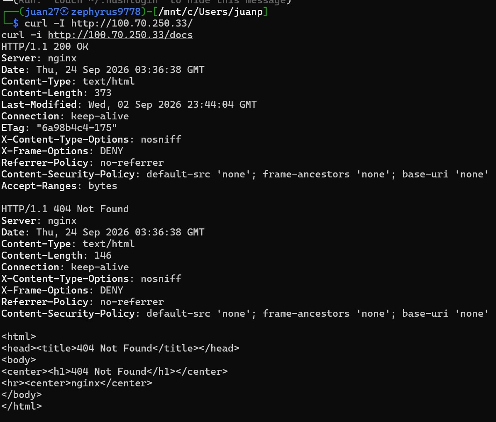

---

## 8. M5 — Depuración del inventario público

**Hipótesis:** H1 (Information Disclosure)
**Flujo DFD:** F9

### Problema

Riesgo residual detectado durante el retest de la Fase F y registrado como pendiente en el `risk-register.md`. El archivo `/public-inventory.txt` seguía devolviendo `200 OK` con la topología interna simulada:

```text
WEB-LAB-01 - 10.10.10.11 - Active
API-LAB-01 - 10.10.10.12 - Active
DB-LAB-01  - 10.10.10.13 - Active
```

Corresponde a la alerta ZAP #4 (Private IP Disclosure). La reducción de exposición del Paso 16 se aplicó al API pero omitió este recurso estático, que era en realidad el hallazgo original de ZAP.

### Cambio aplicado

```bash
sudo tee /var/www/muvautomation/public-inventory.txt > /dev/null <<'EOF'
# Inventario publico de demostracion - MuvAutomation LAB
WEB-LAB-01
API-LAB-01
DB-LAB-01
EOF
```

**Criterio.** Se conservan los identificadores de activo, que cumplen la función demostrativa del archivo, y se elimina todo lo que aporta valor a un atacante: direccionamiento interno y estado operativo. La alternativa —denegar la ruta por completo— se descartó para conservar el recurso como superficie legítima de cara al Laboratorio 4.

### Prueba de verificación

```bash
curl -i http://100.70.250.33/public-inventory.txt
```

**Resultado esperado:** `200 OK` sin direcciones IP en el cuerpo, con un `Content-Length` menor al de la línea base M0.

### Evidencia

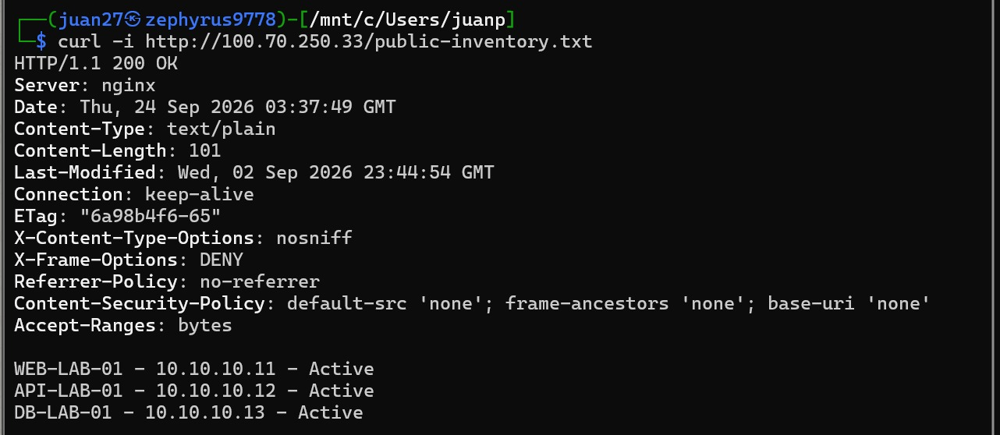

---

## 9. M6 — Limitación de tasa y regla de detección recalibrada

**Capacidad atendida:** detección y respuesta ante reconocimiento
**Flujo DFD:** F10

### Problema

La evaluación honesta de la Fase D estableció que **la regla de detección no habría disparado**. El escaneo de Nmap generó cuatro respuestas `404` en un mismo segundo, por debajo del umbral definido de cinco en cinco minutos. La detección efectiva provino del `User-Agent`, un indicador que el atacante controla y puede falsificar con un solo parámetro.

Adicionalmente, no existía ningún control de respuesta: nada limitaba la tasa de peticiones desde un mismo origen.

### Cambio aplicado

**Limitación de tasa en `nginx.conf`, bloque `http {}`:**

```nginx
limit_req_zone $binary_remote_addr zone=apilimit:10m rate=10r/s;
limit_req_status 429;
```

**En el bloque `server {}`:**

```nginx
limit_req zone=apilimit burst=20 nodelay;
client_max_body_size 64k;
```

**Regla recalibrada** — señal con 3 o más respuestas `404` desde una misma IP en una ventana de 60 segundos:

```bash
sudo awk '$9 == 404 {
    split($4, t, ":"); clave = $1 " " t[2] ":" t[3]
    conteo[clave]++
    if (conteo[clave] >= 3) alerta[clave] = conteo[clave]
  }
  END {
    if (length(alerta) == 0) print "Sin señales en la ventana analizada."
    else { print "SEÑAL - 3+ respuestas 404 por minuto:"
           for (k in alerta) printf "  %s -> %d eventos\n", k, alerta[k] }
  }' /var/log/nginx/access.log
```

### Justificación de los parámetros

| Parámetro | Valor | Razón |
| :--- | :--- | :--- |
| Umbral de detección | 3 × 404 / 60 s | La ráfaga real fue de 4 en un segundo; con umbral 3 la regla dispara |
| `rate` | 10 r/s | Holgado para uso legítimo, restrictivo para automatización |
| `burst` | 20 | Absorbe picos normales de navegación sin penalizar al usuario |
| `limit_req_status` | 429 | Semánticamente correcto y distinguible de `404` en el log |
| `client_max_body_size` | 64k | El `POST` más grande del API es de pocos cientos de bytes |

### Limitaciones que persisten

Se documentan explícitamente, en continuidad con el criterio aplicado en la Fase D:

1. **La limitación por IP se evade con rotación de origen.** En este laboratorio la dirección es estable por Tailscale, pero un atacante distribuido la sortea.
2. **Un escaneo lento sigue siendo indetectable.** Nmap con `-T2` o `--scan-delay` reduce la cadencia por debajo de cualquier umbral razonable.
3. **La regla no ve el reconocimiento de capa 4.** El escaneo de puertos no genera entradas en `access.log`; detectarlo exige telemetría de red.
4. **Riesgo de falsos positivos.** Las peticiones locales de verificación desde `127.0.0.1` pueden disparar la señal; en un despliegue real convendría excluir ese origen.

### Prueba de verificación

```bash
# Kali — ráfaga de rutas inexistentes
for i in $(seq 1 6); do
  curl -s -o /dev/null -w "%{http_code} " "http://100.70.250.33/ruta-falsa-$i"
done; echo

# Kali — ráfaga para provocar la limitación de tasa
for i in $(seq 1 40); do
  curl -s -o /dev/null -w "%{http_code} " "http://100.70.250.33/api/alerts"
done; echo

# CachyOS — ejecución de la regla
bash evidence/mejoras/deteccion-recalibrada.sh
```

**Resultado esperado:** la primera ráfaga produce `404`; la segunda muestra códigos `429` una vez agotado el `burst`; la regla reporta la señal de reconocimiento para la IP del Red Team.

### Evidencia

**Desde Kali (Red Team) — ráfagas y códigos de respuesta:**

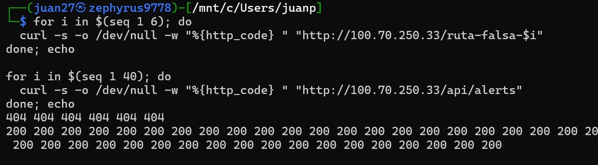

**Desde CachyOS (Blue Team) — regla de detección disparando:**

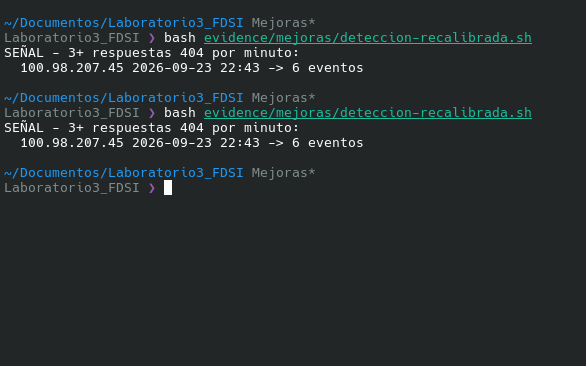

---

## 10. Retest y comparación

Con las seis mejoras aplicadas se repitieron las pruebas originales del Red Team, sin modificación alguna respecto a la Parte I:

```bash
nmap -Pn -sV -p 80 100.70.250.33 -oA evidence/mejoras/retest/nmap
curl -I http://100.70.250.33/
curl -i http://100.70.250.33/api/alerts
```

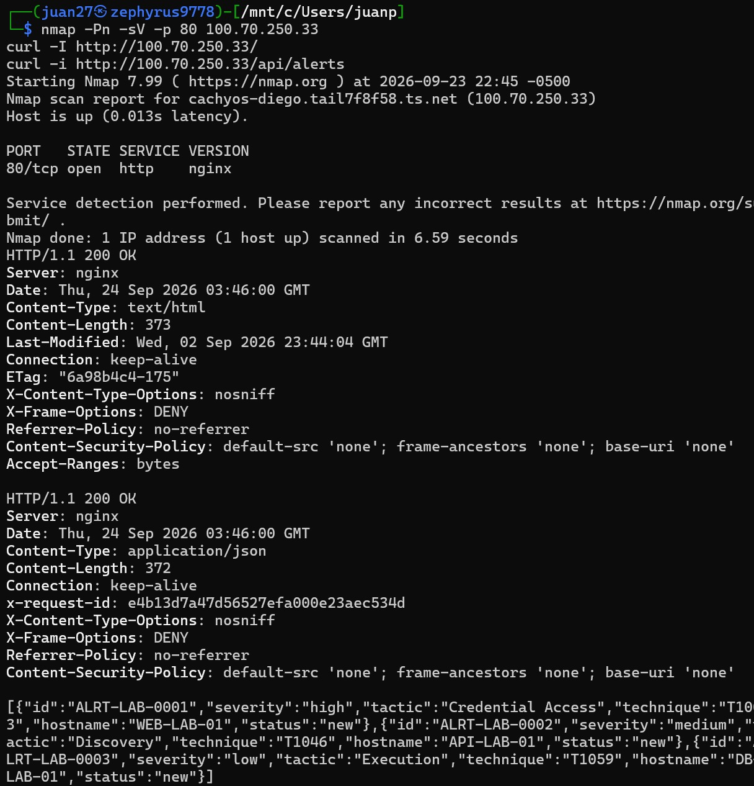

### Tabla comparativa `lab-3` vs `Mejoras`

| Aspecto | `main` (tag `lab-3`) | Rama `Mejoras` |
| :--- | :--- | :--- |
| Campos sensibles en `/api/alerts` | 3 expuestos | 0 |
| Campos no declarados en el `POST` | Descartados en silencio | Rechazados con `422` |
| Valores fuera de dominio | Aceptados | Rechazados con `422` |
| Atribución de acciones | Ninguna | IP, timestamp y `request_id` de servidor |
| Correlación entre logs | Manual, por IP y hora | Automática, por `request_id` |
| Formato de timestamp en logs | `$time_local` | `$time_iso8601` |
| Cabecera CSP | Ausente | Presente |
| Swagger UI en `/docs` | Público | `404` |
| IPs internas en el inventario | Expuestas | Eliminadas |
| Limitación de tasa | Ninguna | 10 r/s con `burst` 20 |
| Regla de detección | No dispara (4 < 5) | Dispara (4 ≥ 3) |
| Backend como servicio | Manual (`uvicorn`) | `systemd` con `journalctl` |
| **Cifrado en tránsito** | **Ausente** | **Ausente — Lab 4** |
| **Identidad verificada** | **Ausente** | **Ausente — Lab 4** |

---

## 11. Estado final de las hipótesis STRIDE

| ID | Categoría | Tras Parte I | Tras Parte II | Pendiente |
| :--- | :--- | :--- | :--- | :--- |
| **H1** | Information Disclosure | Mitigado parcialmente | **Mitigado** — sin datos sensibles en respuestas ni recursos estáticos | Cifrado del canal (Lab 4) |
| **H2** | Information Disclosure | Mitigado | **Corregido** — versión oculta, CSP presente, contrato del API cerrado | — |
| **H3** | Repudiation | Abierto | **Mitigado parcialmente** — atribución técnica verificable y trazas correlacionadas | Autenticación (Lab 4) |
| **H4** | Tampering | Abierto | **Mitigado parcialmente** — validación estricta de entrada | Integridad del canal vía TLS (Lab 4) |

**Conclusión.** Tres de las cuatro hipótesis mejoran su estado y una queda corregida por completo. Las que permanecen parciales lo hacen por una razón estructural y no por omisión: H1 y H4 dependen del cifrado del canal, y H3 depende de identidad verificada. Ambos controles pertenecen al Laboratorio 4, donde se abordarán mediante certificados, HTTPS, sesiones y roles.

---

## 12. Índice de evidencias

Todas las capturas se encuentran en `docs/Mejoras/`. Donde existen dos archivos con el mismo nombre, la extensión indica la máquina desde la que se tomó: **`.jpeg` = Kali (Red Team)**, **`.png` = CachyOS (Blue Team)**.

| Mejora | Archivo | Máquina | Qué demuestra |
| :--- | :--- | :--- | :--- |
| M0 | `M0-LineaBase.jpeg` | Kali | Estado previo: 9 campos en el JSON, `/docs` accesible, IPs en el inventario |
| M1 | `M1-ReduccionYValidacion.jpeg` | Kali | JSON reducido a 6 campos y rechazo `422` del `POST` inválido |
| M1 | `M1-ReduccionYValidacion.png` | CachyOS | Verificación local del mismo comportamiento |
| M2 | `M2-AtribucionAcciones.jpeg` | Kali | Acción registrada con `source_ip` real del Red Team |
| M2 | `M2-AtribucionAcciones.png` | CachyOS | Registro almacenado con todos los campos de atribución |
| M3 | `M3-CorrelacionRequestId.jpeg` | Kali | Cabecera `X-Request-ID` en la respuesta |
| M3 | `M3-CorrelacionRequestId.png` | CachyOS | El mismo `rid` en `access.log` y en el log de aplicación |
| M4 | `M4-CSPySwagger.jpeg` | Kali | Cabecera CSP presente y `404` en `/docs` |
| M5 | `M5-InventarioDepurado.jpeg` | Kali | Inventario sin direcciones IP internas |
| M6 | `M6-DeteccionYRateLimit.jpeg` | Kali | Ráfaga con códigos `429` por limitación de tasa |
| M6 | `M6-DeteccionYRateLimit.png` | CachyOS | Regla recalibrada reportando la señal de reconocimiento |
| Retest | `Retest-Comparativo.jpeg` | Kali | Nmap y cabeceras finales con todas las mejoras aplicadas |

Las salidas crudas de cada comando se conservan en `evidence/mejoras/`.

---

## 13. Reproducción

```bash
git checkout Mejoras

# Backend
python3 -m venv .venv
.venv/bin/pip install -r requirements.txt
sudo systemctl enable --now incident-hub

# Nginx
sudo cp nginx/nginx-mejoras.conf /etc/nginx/nginx.conf
sudo nginx -t
sudo systemctl reload nginx

# Verificación
curl -i http://127.0.0.1/api/health
curl -i http://127.0.0.1/api/alerts
```

---

## 14. Historial de commits

Un commit por mejora, de modo que el historial documente la trazabilidad hipótesis → corrección:

```text
M1(H1,H4): proyeccion AlertPublic y validacion estricta de entrada
M3(H3):    correlacion por request_id entre Nginx y FastAPI
M2(H3):    atribucion de acciones con IP, timestamp y request_id
M4(H2):    cabecera CSP y cierre de Swagger y openapi.json
M5(H1):    depuracion de IPs internas en public-inventory.txt
M6:        limitacion de tasa y regla de deteccion recalibrada a 3x404/60s
docs:      evidencias y documentacion de la rama Mejoras
```

> **Nota sobre el orden.** M3 se aplicó antes que M2 porque la evidencia de atribución debe mostrar un `request_id` real inyectado por Nginx; en orden inverso, ese campo habría mostrado el valor de respaldo generado por la propia aplicación.
