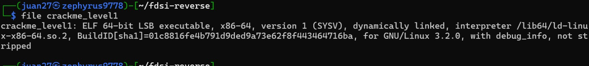
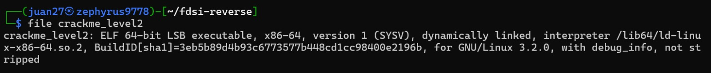
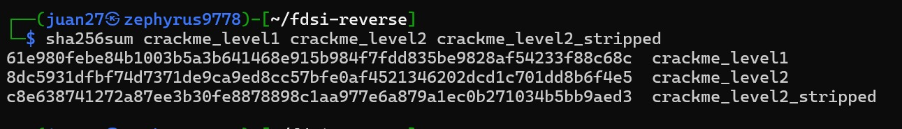
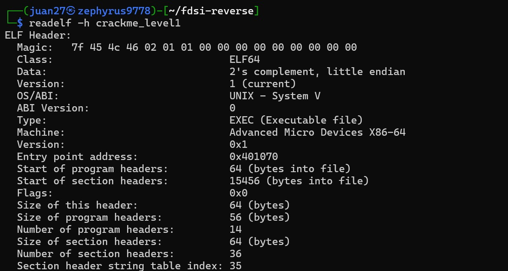
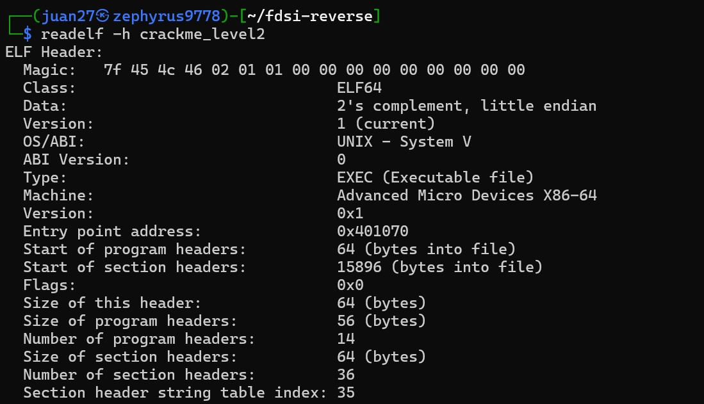
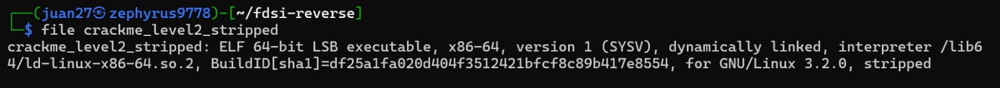

# Laboratorio 4 — Parte 2: Reverse Engineering Challenge

**Equipo:** E07 — Diego Fernando Chavarro Castillo · Juan Pablo Caballero Castellanos
**Asignatura:** FDSI — Fundamentos de Seguridad / Secure Product Challenge
**Docente:** Fabián Eduardo Sierra Sánchez
**Ruta:** alternativa local (CTF de ingeniería inversa, sin publicar servicios)

> **Estado del documento:** avance parcial. Cubre **0. Preparación**, **1. Baseline forense** y **2. Level 1**. Los niveles siguientes se agregarán a medida que se completen.

---

## 📑 Índice

| Sección | Contenido | Estado |
| :--- | :--- | :--- |
| [0. Preparación](#0-preparación) | Entorno, herramientas y estructura de evidencias | ✅ Completado |
| [1. Baseline forense](#1-baseline-forense) | `file`, `sha256sum`, `readelf -h` sobre los tres binarios | ✅ Completado |
| [2. Level 1 — Recon](#2-level-1--recon-strings-are-evidence) | `strings`, `objdump`, primera FLAG → detalle en [`level1.md`](evidence/reverse/level1.md) | ✅ Completado |
| 3. Level 2 — Ghidra | Reconstrucción de la función de validación | ⏳ Pendiente |
| 4. Confirmación con GDB | Validación dinámica de la hipótesis | ⏳ Pendiente |
| 5. Boss Level — Stripped | Análisis sin símbolos | ⏳ Pendiente |

---

## 🎯 Alcance y reglas

- Los binarios son **crackmes académicos** entregados por el docente para ser analizados. No se analizó ningún otro ejecutable.
- **No se abrió ni se solicitó el código fuente.** Todo lo que aquí se afirma sale de la inspección del binario.
- El ejercicio es **completamente local**: no usa Nginx, Tailscale, UFW ni el API del Incident Hub del Laboratorio 3. Esa infraestructura queda en reposo.

---

## 0. Preparación

### Entorno

| Dato | Valor |
| :--- | :--- |
| Analista | Juan Pablo Caballero Castellanos |
| Sistema | Kali Linux (x86-64) |
| Formato esperado de los binarios | ELF Linux x86-64 |
| Herramientas | `file`, `sha256sum`, `readelf`, `strings`, `objdump` (binutils), `gdb`, Ghidra |

La arquitectura del equipo de análisis coincide con la de los binarios (x86-64), por lo que pueden **ejecutarse de forma nativa**, sin emulación. Esto es requisito para la fase dinámica con GDB.

### Instalación de herramientas

```bash
sudo apt update
sudo apt install -y binutils gdb file
# Ghidra: distribución oficial (NSA / ghidra-sre.org)
```

### Material recibido

El paquete `FDSI_Guia2_Reverse_Engineering_ESTUDIANTES.zip` contiene únicamente:

```text
crackme_level1
crackme_level2
crackme_level2_stripped
Guia_2_FDSI_Reverse_Engineering_CTF.html
README_ESTUDIANTE.md
```

### Estructura de evidencias

Las evidencias de este laboratorio se guardan dentro del mismo repositorio, bajo `evidence/reverse/`:

```text
evidence/
└── reverse/
    ├── baseline.txt        # salida cruda de file, sha256sum y readelf
    ├── level1.md
    ├── level2.md
    ├── gdb.md
    └── screenshots/        # capturas de cada comando
```

> **Nota sobre la ruta.** El enunciado propone `docs/evidence/reverse/`. En este repositorio se mantiene la convención ya establecida en el Laboratorio 3, donde `evidence/` agrupa las salidas técnicas (`red/`, `blue/`, `retest/`, `mejoras/`). Se agregó `reverse/` como una carpeta hermana para no mezclar dos convenciones en el mismo proyecto. El contenido es exactamente el que pide la guía.

---

## 1. Baseline forense

**Objetivo:** antes de ejecutar o desensamblar nada, fijar qué es cada archivo (formato, arquitectura, enlazado, símbolos) y demostrar que es el mismo material que entregó el docente.

Comandos ejecutados, en este orden:

```bash
file crackme_level1
file crackme_level2
file crackme_level2_stripped

sha256sum crackme_level1 crackme_level2 crackme_level2_stripped

readelf -h crackme_level1
readelf -h crackme_level2
readelf -h crackme_level2_stripped   # complementario
```

Cada comando tiene su captura en `evidence/reverse/screenshots/`, numerada de `1.1` a `1.7` (ver tabla de evidencias en la sección 1.7).

### 1.1 Identificación del formato con `file`

`file` no confía en la extensión del archivo (los tres binarios no tienen ninguna). Lee los primeros bytes —el *magic number*— y la cabecera, y a partir de ellos describe el tipo real del archivo.

**`crackme_level1`**

*Captura 1.1*



**`crackme_level2`**

*Captura 1.2*



**`crackme_level2_stripped`**

*Captura 1.3*


**Salida resumida:**

```text
crackme_level1:          ELF 64-bit LSB executable, x86-64, version 1 (SYSV), dynamically linked,
                         interpreter /lib64/ld-linux-x86-64.so.2, BuildID[sha1]=01c8816f...,
                         for GNU/Linux 3.2.0, with debug_info, not stripped
crackme_level2:          ELF 64-bit LSB executable, x86-64, ... BuildID[sha1]=3eb5b89d...,
                         for GNU/Linux 3.2.0, with debug_info, not stripped
crackme_level2_stripped: ELF 64-bit LSB executable, x86-64, ... BuildID[sha1]=df25a1fa...,
                         for GNU/Linux 3.2.0, stripped
```

**Interpretación campo por campo:**

| Campo | Valor observado | Qué significa para el análisis |
| :--- | :--- | :--- |
| Formato | `ELF 64-bit` | Ejecutable nativo de Linux, formato de 64 bits |
| Orden de bytes | `LSB` | *Little endian*: los valores multibyte se almacenan con el byte menos significativo primero. Hay que tenerlo presente al leer constantes en el volcado hexadecimal |
| Arquitectura | `x86-64` | Se desensambla con el juego de instrucciones AMD64; se ejecuta de forma nativa en Kali |
| Tipo | `executable` | Ejecutable de direcciones fijas (no PIE). Se confirma en `readelf` más abajo |
| Enlazado | `dynamically linked` | Depende de bibliotecas compartidas (`libc.so.6`) cargadas en tiempo de ejecución por el intérprete `/lib64/ld-linux-x86-64.so.2`. Las llamadas a funciones de la libc (p. ej., `strlen`, `printf`, `puts`) aparecen por su nombre en la tabla de importaciones, **incluso en la versión stripped** |
| `BuildID` | distinto en los tres | Identificador único de cada compilación. Que `level2` y `level2_stripped` tengan BuildID distinto indica que no son byte a byte el mismo archivo con una sección borrada, sino artefactos generados por separado |
| Depuración | `with debug_info` (level1, level2) | Contienen secciones DWARF (`.debug_info`, `.debug_line`, etc.): nombres de funciones, variables locales, tipos y hasta líneas de código fuente. Esto facilita mucho el trabajo en Ghidra y GDB |
| Símbolos | `not stripped` / `stripped` | **Diferencia clave del reto.** Los dos primeros conservan la tabla de símbolos (`.symtab`); el tercero no |

**Primera conclusión:** los tres son del mismo tipo y arquitectura. Lo único que cambia es **cuánta información de ayuda trae cada uno**. `crackme_level2_stripped` es el caso realista: el software comercial y el malware casi nunca se distribuyen con símbolos ni información de depuración. Esto anticipa el Boss Level: allí habrá que identificar las funciones por su comportamiento, no por su nombre.

### 1.2 Integridad con `sha256sum`

*Captura 1.4*



**Comparación contra los hashes publicados por el docente** (guía, sección 1, y `README_ESTUDIANTE.md`):

| Archivo | SHA-256 obtenido | SHA-256 esperado | Coincide |
| :--- | :--- | :--- | :---: |
| `crackme_level1` | `61e980febe84b1003b5a3b641468e915b984f7fdd835be9828af54233f88c68c` | `61e980febe84b1003b5a3b641468e915b984f7fdd835be9828af54233f88c68c` | ✅ |
| `crackme_level2` | `8dc5931dfbf74d7371de9ca9ed8cc57bfe0af4521346202dcd1c701dd8b6f4e5` | `8dc5931dfbf74d7371de9ca9ed8cc57bfe0af4521346202dcd1c701dd8b6f4e5` | ✅ |
| `crackme_level2_stripped` | `c8e638741272a87ee3b30fe8878898c1aa977e6a879a1ec0b271034b5bb9aed3` | `c8e638741272a87ee3b30fe8878898c1aa977e6a879a1ec0b271034b5bb9aed3` | ✅ |

Los tres coinciden: **el material analizado es exactamente el entregado**.

**¿Por qué un hash garantiza que todos analizan el mismo binario?**

SHA-256 produce una huella de 256 bits que cambia por completo si se altera **un solo bit** del archivo (efecto avalancha). Además, es computacionalmente inviable fabricar otro archivo distinto con el mismo hash (resistencia a colisiones y a segunda preimagen). En la práctica esto aporta tres garantías:

1. **Integridad.** El archivo no se corrompió al descargarlo ni al descomprimirlo, ni fue modificado por nadie en el camino.
2. **Comparabilidad entre equipos.** Si dos grupos reportan resultados distintos pero sus hashes coinciden, la diferencia está en el análisis, no en el material. Sin hash no se podría descartar que alguien trabajara sobre una versión alterada.
3. **Cadena de custodia.** Es la misma práctica que se usa en análisis forense y de malware: registrar el hash **antes** de tocar la muestra permite demostrar después que las conclusiones se refieren a ese artefacto concreto. Por eso este paso se hace primero, antes de ejecutar nada.

> Un hash demuestra *integridad*, no *autenticidad*: prueba que el archivo es igual al de referencia, pero no quién lo produjo. La confianza en el hash de referencia depende de que provenga de una fuente fiable (en este caso, la guía oficial del docente). Para autenticidad haría falta una firma digital.

### 1.3 Cabecera ELF con `readelf -h`

`readelf -h` muestra la cabecera ELF: los primeros 64 bytes del archivo, que le indican al sistema operativo cómo cargar y arrancar el programa.

**`crackme_level1`**

*Captura 1.5*



**`crackme_level2`**

*Captura 1.6*



**Comparación de ambas cabeceras:**

| Campo | `crackme_level1` | `crackme_level2` | Interpretación |
| :--- | :--- | :--- | :--- |
| Magic | `7f 45 4c 46 02 01 01 …` | igual | `7f 'E' 'L' 'F'` identifica el formato; `02` = 64 bits; `01` = little endian; `01` = versión ELF actual |
| Class | `ELF64` | `ELF64` | Confirma lo reportado por `file` |
| Data | `2's complement, little endian` | igual | Confirma el orden de bytes |
| OS/ABI | `UNIX - System V` | igual | ABI estándar de Linux |
| **Type** | **`EXEC (Executable file)`** | **`EXEC`** | **No es PIE.** Las direcciones son fijas y no cambian entre ejecuciones (ver abajo) |
| Machine | `Advanced Micro Devices X86-64` | igual | Arquitectura AMD64 |
| **Entry point** | **`0x401070`** | **`0x401070`** | Dirección de la primera instrucción ejecutada (`_start`, no `main`) |
| Start of section headers | `15456` bytes | `15896` bytes | `level2` es algo más grande: tiene más código/datos antes de la tabla de secciones |
| Number of program headers | `14` | `14` | Mismos segmentos de carga |
| Number of section headers | `36` | `36` | Mismo número de secciones |

**Observaciones relevantes para las siguientes fases:**

- **`Type: EXEC` (sin PIE).** Un ejecutable PIE (`DYN`) se carga en una dirección aleatoria en cada ejecución por ASLR. Aquí no ocurre: la dirección que se vea en Ghidra (`0x401…`) será **exactamente** la misma en GDB. Esto simplifica poner *breakpoints* y relacionar el análisis estático con el dinámico. Desde el punto de vista defensivo, es una protección de hardening **desactivada**, algo razonable en un crackme didáctico pero no deseable en software de producción.
- **El punto de entrada no es `main`.** `0x401070` corresponde a `_start`, el código de arranque que añade el compilador. Éste prepara el entorno y llama a `__libc_start_main`, que a su vez invoca `main`. En el binario stripped, donde `main` no tendrá nombre, este es precisamente el camino para encontrarlo: seguir desde el *entry point* el primer argumento que recibe `__libc_start_main`.
- **Mismo entry point en ambos.** Los dos binarios comparten el mismo esqueleto de compilación (mismo compilador y mismas opciones); la diferencia está en la lógica de `main` y de sus funciones auxiliares.

**Contraste con el binario stripped** (verificación complementaria, fuera de la lista mínima de la guía):

*Captura 1.7*



```text
readelf -h crackme_level2_stripped
  Type:                       EXEC (Executable file)
  Entry point address:        0x401070
  Number of section headers:  28
```

Pasa de **36 a 28 secciones**: las 8 que desaparecen son las de depuración DWARF (`.debug_*`), la tabla de símbolos `.symtab` y su tabla de cadenas `.strtab`. El código ejecutable y el punto de entrada no cambian, por lo que **el programa se comporta igual; solo se pierde la información que ayuda a entenderlo.**

### 1.4 Resumen del baseline

| Criterio de la guía | `crackme_level1` | `crackme_level2` | `crackme_level2_stripped` |
| :--- | :--- | :--- | :--- |
| Formato | ELF64 | ELF64 | ELF64 |
| Arquitectura | x86-64 | x86-64 | x86-64 |
| Endianness | Little endian | Little endian | Little endian |
| Linking | Dinámico (`libc.so.6`) | Dinámico (`libc.so.6`) | Dinámico (`libc.so.6`) |
| PIE | No (`EXEC`) | No (`EXEC`) | No (`EXEC`) |
| Símbolos | ✅ Presentes | ✅ Presentes | ❌ Eliminados |
| Info. de depuración | ✅ DWARF | ✅ DWARF | ❌ No |
| Hash verificado | ✅ | ✅ | ✅ |

### 1.5 Hipótesis de trabajo tras el baseline

Sin ejecutar todavía ningún binario, el baseline ya permite plantear hipótesis que las siguientes fases deberán confirmar o descartar:

1. **H-R1.** Como `level1` y `level2` conservan símbolos y DWARF, las funciones deberían tener **nombres descriptivos**; es probable que la lógica de validación esté aislada en una función propia, fácil de localizar desde `main`.
2. **H-R2.** Al estar enlazados dinámicamente, las funciones de la libc que use la validación serán **visibles por nombre en los tres binarios**, incluido el stripped, porque viven en la tabla dinámica (`.dynsym`), que el strip no elimina. Verificación rápida: `nm -D crackme_level2_stripped` lista `__libc_start_main`, `strlen`, `printf`, `puts` y `putchar`. Esas importaciones servirán como punto de anclaje en el Boss Level.
3. **H-R3.** Al no ser PIE, las direcciones observadas en el análisis estático podrán usarse **directamente** como *breakpoints* en GDB.

### 1.6 Enseñanza de desarrollo seguro

Tres comandos que cualquiera puede ejecutar, sin privilegios y sin ejecutar el programa, ya revelan la plataforma, el compilador, si hay símbolos, si hay información de depuración y qué protecciones de hardening están activas. **Publicar un binario con `debug_info` y sin strip equivale a entregar un mapa de su código fuente.** En un proceso de release seguro, los símbolos de depuración se separan del ejecutable distribuido (y se guardan internamente para analizar fallos) y se activan protecciones como PIE, RELRO completo y *stack canaries*.

Aun así, el *strip* **no es un control de seguridad por sí mismo**: dificulta el análisis, pero no lo impide. Lo que protege un secreto no es esconderlo en el binario, sino no ponerlo ahí. Esto es lo que se pondrá a prueba en los niveles siguientes.

### 1.7 Evidencias del baseline

| Captura | Comando | Qué demuestra |
| :--- | :--- | :--- |
| [`1.1`](evidence/reverse/screenshots/1.1.jpeg) | `file crackme_level1` | ELF64 x86-64, dinámico, con `debug_info`, not stripped |
| [`1.2`](evidence/reverse/screenshots/1.2.jpeg) | `file crackme_level2` | Igual que level1, con otro BuildID |
| [`1.3`](evidence/reverse/screenshots/1.3.jpeg) | `file crackme_level2_stripped` | Mismo formato, pero **stripped** y sin `debug_info` |
| [`1.4`](evidence/reverse/screenshots/1.4.jpeg) | `sha256sum crackme_level1 crackme_level2 crackme_level2_stripped` | Los tres hashes coinciden con los de la guía |
| [`1.5`](evidence/reverse/screenshots/1.5.jpeg) | `readelf -h crackme_level1` | `Type: EXEC`, entry point `0x401070`, 36 secciones |
| [`1.6`](evidence/reverse/screenshots/1.6.jpeg) | `readelf -h crackme_level2` | Misma cabecera; tabla de secciones más adelante (binario más grande) |
| [`1.7`](evidence/reverse/screenshots/1.7.jpeg) | `readelf -h crackme_level2_stripped` | Mismo entry point; 28 secciones en vez de 36 |

Salida en texto de todos los comandos: [`evidence/reverse/baseline.txt`](evidence/reverse/baseline.txt).

---

## 2. Level 1 — Recon: "Strings are evidence"

> 📄 **Documento completo:** [`evidence/reverse/level1.md`](evidence/reverse/level1.md). Contiene las capturas `2.1` a `2.4`, el desensamblado comentado, el pseudocódigo reconstruido y la lección de desarrollo seguro.

**Resultado:** ✅ `FLAG{strings_are_evidence}`, obtenida sin código fuente y sin modificar el binario.

| Captura | Comando | Resultado |
| :--- | :--- | :--- |
| [`2.1`](evidence/reverse/screenshots/2.1.jpeg) | `chmod +x crackme_level1`, `./crackme_level1`, `./crackme_level1 prueba` | Mensaje de uso y `Access denied.` |
| [`2.2`](evidence/reverse/screenshots/2.2.jpeg) | `strings -n 5 crackme_level1 \| less` | `strcmp`, mensajes y `REDTEAM-101` |
| [`2.3`](evidence/reverse/screenshots/2.3.jpeg) | `objdump -d -M intel crackme_level1 \| less` | `strcmp(argv[1], password)` en `main` |
| [`2.4`](evidence/reverse/screenshots/2.4.jpeg) | `./crackme_level1 REDTEAM-101` | `Access granted.` + FLAG |

### Resumen para la sustentación

| Pregunta | Respuesta |
| :--- | :--- |
| **1. ¿Qué observamos?** | El programa recibe la clave por `argv[1]` y responde `Access denied.` sin más detalle. `strings -n 5` mostró la importación de `strcmp`, los mensajes `Access granted.` / `Access denied.` y una cadena aislada que nunca se imprime: **`REDTEAM-101`**. No había ninguna cadena `FLAG{…}`. |
| **2. ¿Qué hipótesis formulamos?** | **H-L1:** `main` compara `argv[1]` con `REDTEAM-101` mediante `strcmp` y, si coinciden, llama a `print_flag`, que construye la bandera en tiempo de ejecución (de ahí la importación de `putchar`). |
| **3. ¿Qué función o condición encontramos?** | Con `objdump`, en `main` (`0x4011d8`): `strcmp(argv[1], password)`, con `password` apuntando a `.rodata:0x402004` = `"REDTEAM-101"`. Un único `test eax,eax` / `jne` decide entre la denegación (`return 2`) y `print_flag()` (`return 0`). |
| **4. ¿Cómo lo confirmamos?** | `./crackme_level1 REDTEAM-101` → `Access granted.` + `FLAG{strings_are_evidence}`. El desensamblado de `print_flag` explica por qué la FLAG no aparecía en `strings`: está cifrada con **XOR `0x5a`** y guardada como valores inmediatos dentro de las instrucciones. |
| **5. ¿Qué enseñanza de desarrollo seguro obtuvimos?** | Todo lo que se compila dentro de un binario es público para quien lo tenga. Una contraseña literal se extrae con `strings`, y ofuscar con XOR no protege si la clave viaja en el mismo archivo. Los secretos no van en el cliente: se valida en el servidor o contra un hash con sal. |

---

## ⏭️ Próximos pasos

- [x] Preparación y baseline forense (capturas `1.1` a `1.7`, [`baseline.txt`](evidence/reverse/baseline.txt)).
- [x] **Level 1:** ejecutar con datos falsos, `strings -n 5`, `objdump -d -M intel` → [`level1.md`](evidence/reverse/level1.md) (capturas `2.1` a `2.4`).
- [ ] **Level 2:** Ghidra (proyecto Non-Shared), localizar la validación desde `main` → `level2.md`.
- [ ] **GDB:** confirmar clave fallida y válida → `gdb.md`.
- [ ] **Boss Level:** repetir sobre `crackme_level2_stripped`.
- [ ] Tag `lab04`.